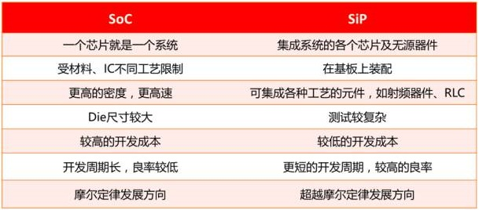

.. _ip:

片上资源
===============
``IP``

.. contents::
    :local:
    :depth: 1

模拟IP
-----------
``SAR ADC`` ``Sigma-delta ADC`` ``Audio CODEC``

`锐成芯微 <https://www.analogcircuit.cn/>`_

射频IP
-----------
``Wi-Fi`` ``BLE``

通信IP
-----------
``USB`` ``MIPI`` ``SerDes`` ``PCIe``

存储IP
-----------
``eNVM`` ``EEPROM``

SIP封装
-----------
``SIP``

.. contents::
    :local:
    :depth: 1

PSRAM
~~~~~~~~~~~

SDRAM
~~~~~~~~~~~
