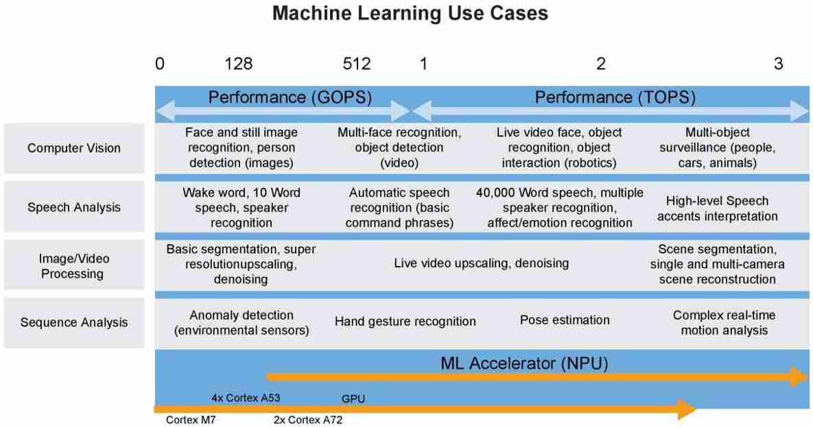

.. _level:

性能
===============

`Level Mark <https://github.com/SoCXin/Level>`_ : :ref:`frequency`/:ref:`CoreMark`/:ref:`Geekbench`

Level1-3主要用于控制，Level4-6可以部署算法，Level7-9为高性能计算

.. contents::
    :local:
    :depth: 1

.. _level1:

Level1
--------------
``Frequency < 60MHz``

.. list-table::
    :header-rows:  1

    * - :ref:`xin`
      - :ref:`architecture`
      - SRAM
      - :ref:`frequency`
      - :ref:`consumption`
      - :ref:`level1`
    * - :ref:`ch549`
      - :ref:`mcs51`
      -
      - 48(MHz)
      -
      - 1

.. _level2:

Level2
--------------
``Frequency < 120MHz``

.. list-table::
    :header-rows:  1

    * - :ref:`xin`
      - :ref:`architecture`
      - SRAM
      - :ref:`frequency`
      - :ref:`consumption`
      - :ref:`level2`
    * - :ref:`gd32v103`
      - :ref:`riscv`
      -
      - 108(MHz)
      -
      - 1

.. _level3:

Level3
--------------
``Frequency < 240MHz``

.. list-table::
    :header-rows:  1

    * - :ref:`xin`
      - :ref:`architecture`
      - :ref:`CoreMark`
      - :ref:`frequency`
      - :ref:`consumption`
      - :ref:`level3`
    * - :ref:`stm32u575`
      - :ref:`cortex_m33`
      - 651
      - 160(MHz)
      -
      - 1
    * - :ref:`stm32f429`
      - :ref:`cortex_m4`
      - 608
      - 180(MHz)
      -
      - 2
    * - :ref:`stm32f407`
      - :ref:`cortex_m4`
      - 566
      - 168(MHz)
      -
      - 3
    * - :ref:`stm32g474`
      - :ref:`cortex_m4`
      - 550
      - 170(MHz)
      -
      - 4
    * - :ref:`rp2040`
      - :ref:`cortex_m0`
      - 425(2)
      - 133(MHz)
      -
      - 5
    * - :ref:`esp32c3`
      - :ref:`esp_rv32`
      - 407
      - 160(MHz)
      -
      -

.. _level4:

Level4
--------------
``CoreMark < 2000``

.. list-table::
    :header-rows:  1

    * - :ref:`xin`
      - :ref:`architecture`
      - :ref:`CoreMark`
      - :ref:`frequency`
      - :ref:`consumption`
      - :ref:`foundry`
    * - :ref:`stm32h7b0`
      - :ref:`cortex_m7`
      - 1414
      - 280(MHz)
      -
      -
    * - :ref:`esp32s3`
      - :ref:`xtensa_lx7`
      - 1182 (2)
      - 240(MHz)
      -
      -
    * - :ref:`esp32`
      - :ref:`xtensa_lx6`
      - 994 (2)
      - 240(MHz)
      -
      -
    * - :ref:`at32f437`
      - :ref:`cortex_m4`
      - 630
      - 288(MHz)
      -
      - 55nm
    * - :ref:`esp32s2`
      - :ref:`xtensa_lx7`
      - 614
      - 240(MHz)
      -
      -
    * - :ref:`w801`
      - :ref:`xt804`
      -
      - 240(MHz)
      -
      -

.. _level5:

Level5
--------------
``CoreMark < 5000``

.. list-table::
    :header-rows:  1

    * - :ref:`xin`
      - :ref:`architecture`
      - :ref:`CoreMark`
      - :ref:`frequency`
      - :ref:`consumption`
      - :ref:`level5`
    * - :ref:`hpm6350`
      - :ref:`riscv`
      - 3390
      - 648(MHz)
      -
      -
    * - :ref:`stm32h745`
      - :ref:`cortex_m7`
      - 3224 (2)
      - 480(MHz)
      -
      -
    * - :ref:`rt1060`
      - :ref:`cortex_m7`
      - 3020
      - 600(MHz)
      -
      -
    * - :ref:`stm32h730`
      - :ref:`cortex_m7`
      - 2778
      - 550(MHz)
      -
      -
    * - :ref:`stm32h750`
      - :ref:`cortex_m7`
      - 2424
      - 480(MHz)
      -
      -

.. _level6:

Level6
--------------
``CoreMark > 5000``

.. list-table::
    :header-rows:  1

    * - :ref:`xin`
      - :ref:`architecture`
      - :ref:`CoreMark`
      - :ref:`frequency`
      - :ref:`consumption`
      -
    * - :ref:`hpm6750`
      - :ref:`riscv`
      - 9220(2)
      - 816(MHz)
      -
      -
    * - :ref:`rt1170`
      - :ref:`cortex_m7`
      - 6468(2)
      - 1.0(GHz)
      -
      -
    * - :ref:`v831`
      - :ref:`cortex_a7`
      - 5000+(2)
      - 800(MHz)
      -
      -

.. _level7:

Level7
--------------
``Geekbench > 1000``

.. _level8:

Level8
--------------
``Geekbench > 2000``

.. _level9:

Level9
--------------
``Geekbench > 4000``

.. list-table::
    :header-rows:  1

    * - :ref:`level9`
      - :ref:`architecture`
      - :ref:`frequency`
      - :ref:`Geekbench`
      - :ref:`consumption`
      - :ref:`foundry`
    * - M1
      -
      -
      -
      -
      -
    * - A15
      -
      -
      -
      -
      -
    * - 8Gen1
      -
      -
      -
      -
      -

.. _level_npu:

NPU
--------------

.. list-table::
    :header-rows:  1

    * - :ref:`level_npu`
      - L1(≤200GOPS)
      - L2(≤500GOPS)
      - L3(≤1 TOPS)
      - L4(≤4 TOPS)
      - L5(≤9 TOPS)
      - L6(Above)
    * - :ref:`v831`
      - 200G
      -
      -
      -
      -
      -
    * - :ref:`eai80`
      -
      - 300G
      -
      -
      -
      -
