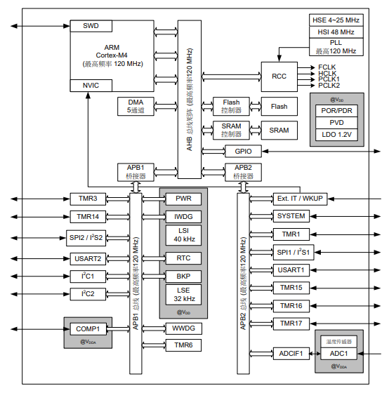
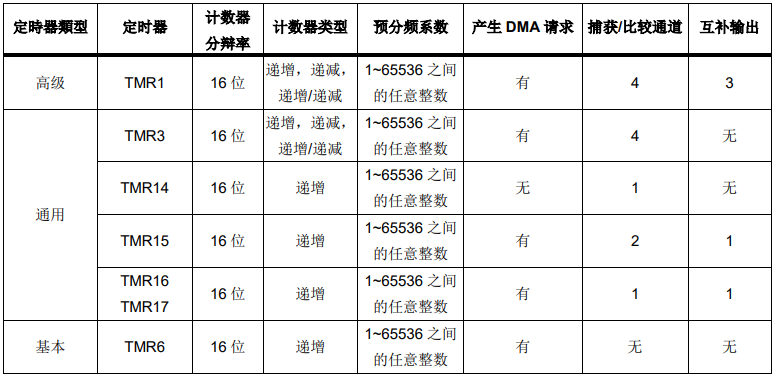
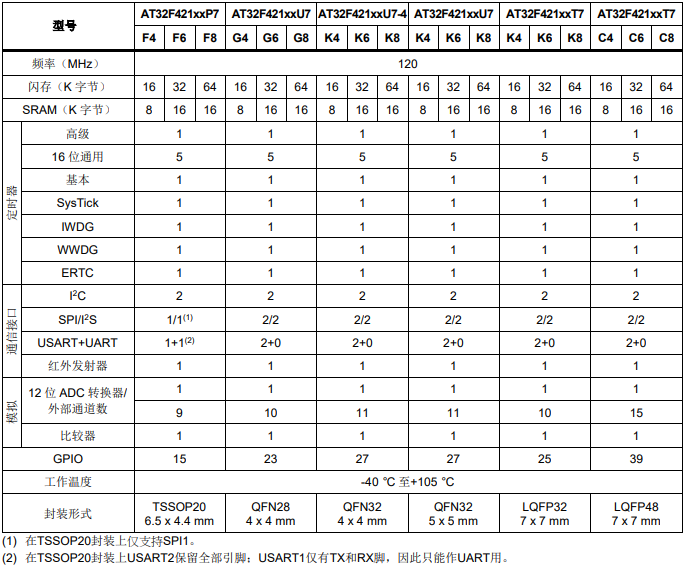

.. _NO_005:
.. _at32f421:

AT32F421
===============

`标签 <https://github.com/SoCXin/AT32F421>`_ : ``Cortex-M4`` ``120MHz`` ``COMP`` ``sLib`` ``ERTC`` ``TSSOP20``

.. contents::
    :local:
    :depth: 1

Xin简介
-----------

`官方资源 <https://www.arterytek.com/cn/product/AT32F421.jsp>`_

规格参数
~~~~~~~~~~~

:ref:`arterytek` :ref:`cortex_m4` 单核 MCU，高达120MHz的CPU运算速度与内建数字信号处理器(DSP)，最高可支持64KB闪存存储器(Flash)及16KB随机存取存储器(SRAM)

片上集成了多达2个USART、2个SPI(可复用I²S)、2个I²C、1个16位高级定时器、5个16位通用定时器，和5通道DMA控制器。 同时还扩展了1个高速轨到轨输入/输出模拟电压比较器，1个采样率高达2M SPS的12位15通道高速ADC。

几乎所有I/O口可容忍5V输入信号，且所有I/O口均为快速I/O，具有多种可选功能还支持端口重映射，极佳的灵活性和易用性满足多种应用需求。

基本参数
^^^^^^^^^^^

* 发布时间：2020年10月
* 参考价格：$0.195
* 制程工艺：55 nm
* 供货周期：
* 处理性能：262.8 :ref:`CoreMark` , :ref:`level2`
* 封装规格：TSSOP20/QFN28/QFN32/LQFP32/LQFP48
* 运行环境：-40~105°C
* RAM容量：16 KB
* Flash容量：64 KB

特征参数
^^^^^^^^^^^

* 120 MHz :ref:`cortex_m4`
* 15ch ADC (12bit 2MSPS)
* 2 x USART
* 2 x I2C + 2 x SPI/I2S
* ERTC (1ppm的分辨率)
* COMP (轨到轨比较器1/4、1/2、3/4Vref)
* sLib安全库 (Security Library)

.. note::
    :ref:`arterytek` 自行开发的 :ref:`arterytek_slib` 可支持密码保护指定范围程序区，方案商烧录核心算法到此区域，提供给下游客户做二次开发，强化了产品本身的安全性、可靠性和二次开发的使用便利度。

芯片架构
~~~~~~~~~~~

功耗参数
^^^^^^^^^^^

* 电压范围：2.3 to 3.6 V
* 功耗范围：
* 温度范围：-40°C to 105°C
* ESD HBM: 6 KV
* ESD CDM: 1000 V

时钟体系
^^^^^^^^^^^^

.. image:: images/AT32F421C.png
    :target: https://www.arterytek.com/cn/product/AT32F421.jsp#Resource

:ref:`at32f421` 系列产品包含最多1个高级定时器(16bit)、5个普通定时器(16bit)、1个基本定时器(16bit)、以及2个看门狗定时器、和1个系统滴答定时器。

Timer
^^^^^^^^^^^

.. _at32f421_tssop20:

TSSOP20
^^^^^^^^^^^

.. image:: images/AT32F421p.png
    :target: https://www.arterytek.com/cn/product/AT32F421.jsp#Resource

.. hint::
    :ref:`at32f421` 封装兼容 :ref:`stm32f030` :ref:`stm32_tssop20`

Xin选择
-----------

.. contents::
    :local:

.. hint::
    :ref:`at32f421` 定位超值产品，主要替代F030、F103、E230、F330等型号，相对对标产品而言拥有更高的制程工艺和性能。

品牌对比
~~~~~~~~~

.. list-table::
    :header-rows:  1

    * - Xin
      - DMIPS
      - RAM
      - FLASH
      - UART
      - ADC
      - TIM
      - COMP
    * - :ref:`at32f421`
      - 150
      - 8/16
      - 16/32/64
      - 2
      - 2MSPS
      - 5+1+1
      - 1
    * - :ref:`stm32f030`
      - 44
      - 4
      - 32/64/128
      - 2
      - 1.0MSPS
      - 5+1
      - NO
    * - :ref:`stm32f103`
      - 90
      - 20
      - 32/64/128
      - 2/4
      - 1.0MSPS
      - 5+1
      - NO
    * - GD32F330
      - 135
      - 4/8/16
      - 16/32/64/128
      - 2
      - 2.6MSPS
      - 5+1+1
      - 1
    * - GD32E230
      - 90
      - 4/8
      - 16/32/64
      - 2
      - 2.6MSPS
      - 5+1+1
      - 1

:ref:`at32f421` 系列与 :ref:`stm32f030` 系列管脚兼容

系列对比
~~~~~~~~~

.. list-table::
    :header-rows:  1

    * - :ref:`ic`
      - DMIPS
      - RAM
      - FLASH
      - UART
      - CAN2.0B
      - USB
      - SPIM
    * - :ref:`at32f421`
      - 150 (120MHz)
      - 8/16
      - 16/32/64
      - 2
      - NO
      - NO
      - NO
    * - AT32F425
      - 120 (96MHz)
      - 20
      - 32/64
      - 4
      - 1
      - OTG
      - NO
    * - :ref:`at32f415`
      - 175 (150MHz)
      - 32
      - 64/128/256
      - 2/3/5
      - 1
      - OTG
      - NO
    * - :ref:`at32f413`
      - 250 (200MHz)
      - 16/32/64
      - 64/128/256
      - 2/3/5
      - 2
      - D/H
      - 16M
    * - :ref:`at32f403`
      - 300 (240MHz)
      - 16/32/64
      - 64/128/256
      - 2/3/5
      - 2
      - D/H
      - 16M

.. note::
    :ref:`arterytek` 目前只有 :ref:`cortex_m4` 单核的 MCU产品，均具备 :ref:`arterytek_slib` 功能，高性能系列才具备 :ref:`arterytek_spim` 功能

型号对比
~~~~~~~~~

.. note::
    TSSOP20封装 :ref:`cortex_m4` 120MHz主频的MCU规格实属少见。:ref:`at32f421` TSSOP20封装上仅支持SPI1，USART1仅有TX和RX脚，因此只能作UART用。

封装对比
^^^^^^^^^^^^

.. list-table::
    :header-rows:  1

    * - :ref:`ic`
      - Price
      - Package
      - Size
      - Interface
    * - AT32F421C
      - ￥3.67
      - LQFP48
      - 7×7mm
      - 35
    * - AT32F421K
      - ￥3.67
      - LQFP32/QFN32
      - 7x7mm/4x4mm
      - 35
    * - AT32F421G
      - ￥3.67
      - QFN28
      - 4x4mm
      - 35
    * - AT32F421F
      - $0.195
      - TSSOP20
      - 6.5x4.4mm
      - 16

Xin应用
-----------

.. warning::
     :ref:`at32f421` 除了高主频并没有配置太多外设，存储资源少，只用于控制通信器件实现数据转发较合适

.. contents::
    :local:

开发板
~~~~~~~~~~~

.. image:: images/B_AT32F421.jpg
    :target: https://item.taobao.com/item.htm?_u=ogas3eu93a4&id=632845784689

示例代码
~~~~~~~~~~~

中断接收
^^^^^^^^^^^^

.. code-block:: bash

    void UART_Print_Init(uint32_t bound)
    {
        /* ----------------- USART1 and USART2 configuration -------------------- */
        USART_StructInit(&USART_InitStructure);
        USART_InitStructure.USART_BaudRate = 9600;
        USART_InitStructure.USART_WordLength = USART_WordLength_8b;
        USART_InitStructure.USART_StopBits = USART_StopBits_1;
        USART_InitStructure.USART_Parity = USART_Parity_No;
        USART_InitStructure.USART_HardwareFlowControl = USART_HardwareFlowControl_None;
        USART_InitStructure.USART_Mode = USART_Mode_Rx | USART_Mode_Tx;

        USART_Init(USART1, &USART_InitStructure);
        USART_Init(USART2, &USART_InitStructure);

        /* Enable Receive and Transmit interrupts */
        USART_INTConfig(USART1, USART_INT_RDNE, ENABLE);
        USART_INTConfig(USART1, USART_INT_TDE, ENABLE);
        USART_INTConfig(USART2, USART_INT_RDNE, ENABLE);
        USART_INTConfig(USART2, USART_INT_TDE, ENABLE);

        USART_Cmd(USART1, ENABLE);
        USART_Cmd(USART2, ENABLE);
    }

    void USART1_NVIC_Config(void)
    {
        NVIC_InitStructure.NVIC_IRQChannel = USART1_IRQn;
        NVIC_InitStructure.NVIC_IRQChannelPreemptionPriority=0 ;
        NVIC_InitStructure.NVIC_IRQChannelSubPriority = 0;
        NVIC_InitStructure.NVIC_IRQChannelCmd = ENABLE;
        NVIC_Init(&NVIC_InitStructure);
    }

    ...

    /* ---- Request to enter STOP mode with regulator in low power mode ----- */
    PWR_EnterSleepMode(PWR_SLEEPEntry_WFI);
    /* ---- Configures system clock after wake-up from STOP ----- */
    SysTick->CTRL |= 0x1;

    ...

    void USART1_IRQHandler(void)
    {
        if(USART_GetITStatus(USART1, USART_INT_RDNE) != RESET)
        {
        }
        if(USART_GetITStatus(USART1, USART_INT_TDE) != RESET)
        {
        }
    }

TIM应用
~~~~~~~~~~~

输入捕获
^^^^^^^^^^^^

.. code-block:: bash

    int main(void)
    {
        /* TMR3 configuration: Input Capture mode ---------------------
            The external signal is connected to TMR3 CH2 pin (PA.07)
            The Rising edge is used as active edge,
            The TMR3 CCR2 is used to compute the frequency value
        ------------------------------------------------------------ */

        /* DMA1 Channel4 Config */
        DMA_Reset(DMA1_Channel4);
        DMA_DefaultInitParaConfig(&DMA_InitStructure);

        DMA_InitStructure.DMA_PeripheralBaseAddr = (uint32_t)TIM3_CCR1_Address;
        DMA_InitStructure.DMA_MemoryBaseAddr = (uint32_t)SRC_Buffer;
        DMA_InitStructure.DMA_Direction = DMA_DIR_PERIPHERALSRC;
        DMA_InitStructure.DMA_BufferSize = 1000;
        DMA_InitStructure.DMA_PeripheralInc = DMA_PERIPHERALINC_DISABLE;
        DMA_InitStructure.DMA_MemoryInc = DMA_MEMORYINC_ENABLE;
        DMA_InitStructure.DMA_PeripheralDataWidth = DMA_PERIPHERALDATAWIDTH_HALFWORD;
        DMA_InitStructure.DMA_MemoryDataWidth = DMA_MEMORYDATAWIDTH_HALFWORD;
        DMA_InitStructure.DMA_Mode = DMA_MODE_CIRCULAR;
        DMA_InitStructure.DMA_Priority = DMA_PRIORITY_HIGH;
        DMA_InitStructure.DMA_MTOM = DMA_MEMTOMEM_DISABLE;

        DMA_Init(DMA1_Channel4, &DMA_InitStructure);
        DMA_INTConfig(DMA1_Channel4,DMA_INT_TC,ENABLE);
        /* DMA1 Channel4 enable */
        DMA_ChannelEnable(DMA1_Channel4, ENABLE);

        /* TMRe base configuration */
        TMR_TimeBaseStructInit(&TMR_TMReBaseStructure);
        TMR_TMReBaseStructure.TMR_Period = SystemCoreClock/1000000/4-1;
        TMR_TMReBaseStructure.TMR_DIV = 0;
        TMR_TMReBaseStructure.TMR_ClockDivision = 0;
        TMR_TMReBaseStructure.TMR_CounterMode = TMR_CounterDIR_Up;

        TMR_TimeBaseInit(TMR1, &TMR_TMReBaseStructure);

        /* Output Compare TMRing Mode configuration: Channel1 */
        TMR_OCStructInit(&TMR_OCInitStructure);
        TMR_OCInitStructure.TMR_OCMode = TMR_OCMode_PWM1;
        TMR_OCInitStructure.TMR_OutputState = TMR_OutputState_Enable;
        TMR_OCInitStructure.TMR_Pulse = (SystemCoreClock/1000000)/2/4-1;
        TMR_OCInitStructure.TMR_OCPolarity = TMR_OCPolarity_High;

        TMR_OC1Init(TMR1, &TMR_OCInitStructure);

        TMR_OC1PreloadConfig(TMR1, TMR_OCPreload_Disable);
        TMR_CtrlPWMOutputs(TMR1,ENABLE);
        /* TMR1 enable counter */
        TMR_Cmd(TMR1, ENABLE);

        TMR_ICStructInit(&TMR_ICInitStructure);
        TMR_ICInitStructure.TMR_Channel = TMR_Channel_1;
        TMR_ICInitStructure.TMR_ICPolarity = TMR_ICPolarity_Rising;
        TMR_ICInitStructure.TMR_ICSelection = TMR_ICSelection_DirectTI;
        TMR_ICInitStructure.TMR_ICDIV = TMR_ICDIV_DIV1;
        TMR_ICInitStructure.TMR_ICFilter = 0x0;

        TMR_ICInit(TMR3, &TMR_ICInitStructure);

        /* Enable the CC1 Interrupt Request */
        TMR_INTConfig(TMR3, TMR_INT_CC1, ENABLE);
        /* Enable the CC1 DMA Request */
        TMR_DMACmd(TMR3,TMR_DMA_CC1,ENABLE);
        TMR_Cmd(TMR3, ENABLE);
        while (1)
        {
        }
    }

    void DMA1_Channel7_4_IRQHandler(void)
    {
        if(DMA_GetFlagStatus(DMA1_FLAG_TC4) == SET)
        {
            TMR3Freq = SystemCoreClock/(SRC_Buffer[500] - SRC_Buffer[499]);
            printf("The external signal frequece is : %d\r\n",TMR3Freq);
            DMA_ClearITPendingBit(DMA1_FLAG_TC4);
        }
    }

ADC应用
~~~~~~~~~~~

温度转换
^^^^^^^^^^^^

.. code-block:: bash

    int main(void)
    {
        /* System clocks configuration */
        RCC_Configuration();
        /*initialize Delay Function*/
        Delay_init();
        /* USART configuration */
        UART_Print_Init(115200);
        /* DMA1 channel1 configuration ----------------------------------------------*/
        DMA_Reset(DMA1_Channel1);
        DMA_DefaultInitParaConfig(&DMA_InitStructure);
        DMA_InitStructure.DMA_PeripheralBaseAddr    = ADC1_DR_Address;
        DMA_InitStructure.DMA_MemoryBaseAddr        = (uint32_t)&ADCConvertedValue;
        DMA_InitStructure.DMA_Direction             = DMA_DIR_PERIPHERALSRC;
        DMA_InitStructure.DMA_BufferSize            = 1;
        DMA_InitStructure.DMA_PeripheralInc         = DMA_PERIPHERALINC_DISABLE;
        DMA_InitStructure.DMA_MemoryInc             = DMA_MEMORYINC_DISABLE;
        DMA_InitStructure.DMA_PeripheralDataWidth   = DMA_PERIPHERALDATAWIDTH_HALFWORD;
        DMA_InitStructure.DMA_MemoryDataWidth       = DMA_MEMORYDATAWIDTH_HALFWORD;
        DMA_InitStructure.DMA_Mode                  = DMA_MODE_CIRCULAR;
        DMA_InitStructure.DMA_Priority              = DMA_PRIORITY_HIGH;
        DMA_InitStructure.DMA_MTOM                  = DMA_MEMTOMEM_DISABLE;
        DMA_Init(DMA1_Channel1, &DMA_InitStructure);
        /* Enable DMA1 channel1 */
        DMA_ChannelEnable(DMA1_Channel1, ENABLE);

        /* ADC1 configuration ------------------------------------------------------*/
        ADC_StructInit(&ADC_InitStructure);
        ADC_InitStructure.ADC_Mode              = ADC_Mode_Independent;
        ADC_InitStructure.ADC_ScanMode          = DISABLE;
        ADC_InitStructure.ADC_ContinuousMode    = ENABLE;
        ADC_InitStructure.ADC_ExternalTrig      = ADC_ExternalTrig_None;
        ADC_InitStructure.ADC_DataAlign         = ADC_DataAlign_Right;
        ADC_InitStructure.ADC_NumOfChannel      = 1;
        ADC_Init(ADC1, &ADC_InitStructure);
        /* ADC1 regular channels configuration */
        ADC_RegularChannelConfig(ADC1, ADC_Channel_TempSensor, 1, ADC_SampleTime_239_5);
        /* Enable ADC1 DMA */
        ADC_DMACtrl(ADC1, ENABLE);

        /* Enables Temperature Sensor and Vrefint Channel */
        ADC_TempSensorVrefintCtrl(ENABLE);

        /* Enable ADC1 */
        ADC_Ctrl(ADC1, ENABLE);

        /* Enable ADC1 reset calibration register */
        ADC_RstCalibration(ADC1);
        /* Check the end of ADC1 reset calibration register */
        while(ADC_GetResetCalibrationStatus(ADC1));

        /* Start ADC1 calibration */
        ADC_StartCalibration(ADC1);
        /* Check the end of ADC1 calibration */
        while(ADC_GetCalibrationStatus(ADC1));

        /* Start ADC1 Software Conversion */
        ADC_SoftwareStartConvCtrl(ADC1, ENABLE);

        while (1)
        {
            Delay_sec(1);
            printf("Temperature: %f deg C\r\n",(ADC_TEMP_BASE-(double)ADCConvertedValue*ADC_VREF/4096)/ADC_TEMP_SLOPE+25);
        }
    }

RTC应用
~~~~~~~~~~~

Tamper
^^^^^^^^^^^

改变 PC13 上的电平，当检测到下降沿时，将触发入侵检测；当发生入侵事件时通过串口打印

.. code-block:: bash

    void ERTC_Config(void)
    {
        NVIC_InitType NVIC_InitStructure;
        EXTI_InitType  EXTI_InitStructure;

        /* Enable the PWR clock */
        RCC_APB1PeriphClockCmd(RCC_APB1PERIPH_PWR, ENABLE);

        /* Allow access to ERTC */
        PWR_BackupAccessCtrl(ENABLE);

        /* Reset BKP Domain */
        RCC_BackupResetCmd(ENABLE);
        RCC_BackupResetCmd(DISABLE);

        /* Enable the LSI OSC */
        RCC_LSICmd(ENABLE);

        /* Wait till LSI is ready */
        while(RCC_GetFlagStatus(RCC_FLAG_LSISTBL) == RESET)
        {
        }
        /* Select the ERTC Clock Source */
        RCC_ERTCCLKConfig(RCC_ERTCCLKSelection_LSI);

        /* Enable the ERTC Clock */
        RCC_ERTCCLKCmd(ENABLE);

        /* Deinitializes the ERTC registers */
        ERTC_Reset();

        /* Wait for ERTC APB registers synchronisation */
        ERTC_WaitForSynchro();

        /* Enable The external line21 interrupt */
        EXTI_ClearIntPendingBit(EXTI_Line19);
        EXTI_InitStructure.EXTI_Line = EXTI_Line19;
        EXTI_InitStructure.EXTI_Mode = EXTI_Mode_Interrupt;
        EXTI_InitStructure.EXTI_Trigger = EXTI_Trigger_Rising;
        EXTI_InitStructure.EXTI_LineEnable = ENABLE;
        EXTI_Init(&EXTI_InitStructure);

        /* Enable TAMPER IRQChannel */
        NVIC_InitStructure.NVIC_IRQChannel =  ERTC_IRQn;
        NVIC_InitStructure.NVIC_IRQChannelPreemptionPriority = 0;
        NVIC_InitStructure.NVIC_IRQChannelSubPriority = 0;
        NVIC_InitStructure.NVIC_IRQChannelCmd = ENABLE;
        NVIC_Init(&NVIC_InitStructure);

        /* Disable the Tamper 1 detection */
        ERTC_TamperCmd(ERTC_TAMP_1, DISABLE);

        /* Clear Tamper 1 pin Event(TAMP1F) pending flag */
        ERTC_ClearFlag(ERTC_FLAG_TP1F);

        /* Configure the Tamper 1 Trigger */
        ERTC_TamperTriggerConfig(ERTC_TAMP_1, ERTC_TamperTrig_FallingEdge);

        /* Enable the Tamper interrupt */
        ERTC_INTConfig(ERTC_INT_TAMP, ENABLE);

        /* Clear Tamper 1 pin interrupt pending bit */
        ERTC_ClearINTPendingBINT(ERTC_INT_TAMP1);

        /* Enable the Tamper 1 detection */
        ERTC_TamperCmd(ERTC_TAMP_1, ENABLE);
    }

    int main(void)
    {
        /* ERTC configuration */
        ERTC_Config();
        /* Write To ERTC Backup Data registers */
        WriteToERTC_BKP_DT(0xA53C);
        /* Check if the written data are correct */
        if(CheckERTC_BKP_DT(0xA53C) == 0)
        {
            /* Turn on LED2 */
        }
        while (1)
        {
        }
    }

    void ERTC_IRQHandler(void)
    {
        if(ERTC_GetFlagStatus(ERTC_FLAG_TP1F) != RESET)
        {
            /* Tamper 1 detection event occurred */
            /* Check if ERTC Backup Data registers are cleared */
            if(IsBackupRegReset() == 0)
            {
                /* OK, ERTC Backup Data registers are reset as expected */
            }
            /* Clear Tamper 1 pin Event pending flag */
            ERTC_ClearFlag(ERTC_FLAG_TP1F);

            /* Disable Tamper pin 1 */
            ERTC_TamperCmd(ERTC_TAMP_1, DISABLE);

            /* Enable Tamper pin */
            ERTC_TamperCmd(ERTC_TAMP_1, ENABLE);
        }
    }

Xin总结
--------------

.. contents::
    :local:

能力构建
~~~~~~~~~~~~~

要点提示
~~~~~~~~~~~~~

* ADC使用APB时钟,只能通过软件实现过采样
* ERTC只支持入侵检测0（tamper0），不支持入侵检测1（tamper1）

问题整理
~~~~~~~~~~~~~

待整理。。。

