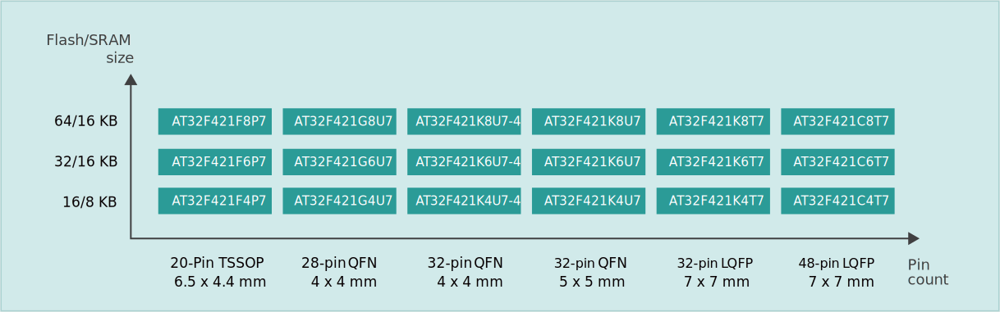

.. _at32f421:

AT32F421
===============

* 关键词：``Cortex-M4`` ``150DMIPS`` ``120MHz`` ``sLib`` ``2 UART`` ``TSSOP20``
* 资源库：`GitHub <https://github.com/SoCXin/AT32F421>`_

.. contents::
    :local:

Xin简介
-----------

:ref:`arterytek` :ref:`cortex_m4` 单核 MCU，超值型ARM® Cortex®-M4微控制器，高达120MHz的CPU运算速度与内建数字信号处理器(DSP)，最高可支持64KB闪存存储器(Flash)及16KB随机存取存储器(SRAM)，片上还集成了多达2个USART、2个SPI(可复用I²S)、2个I²C、1个16位高级定时器、5个16位通用定时器，和5通道DMA控制器。 同时还扩展了1个高速轨到轨输入/输出模拟电压比较器，1个采样率高达2M SPS的12位15通道高速ADC，可充分满足高速数据采集、混合信号处理和工业控制与电机应用要求。 几乎所有I/O口可容忍5V输入信号，且所有I/O口均为快速I/O，具有多种可选功能还支持端口重映射，极佳的灵活性和易用性满足多种应用需求。

搭载了雅特力自行开发的sLib安全库 (Security Library) ，可支持密码保护指定范围程序区，方案商烧录核心算法到此区域，提供给下游客户做二次开发，强化了产品本身的安全性、可靠性和二次开发的使用便利度。

关键特性
~~~~~~~~~

* 120MHz Cortex®-M4
* 工业级温度范围-40~105°C
* sLib执行代码安全库区

芯片架构
~~~~~~~~~~~

.. image:: images/AT32F421S.png
    :target: https://www.arterytek.com/cn/product/AT32F421.jsp#Resource

计算性能
~~~~~~~~~~~~

Xin选择
-----------

.. contents::
    :local:

.. hint::
    :ref:`at32f421` 基于 :ref:`cortex_m4`，定位超值产品，主要替代F030 F103 E230 F330等型号，拥有更高的制程工艺和性能，具有很大的市场潜力。

品牌对比
~~~~~~~~~

主要替代STM32F030,STM32F103,GD32E230,GD32F330等型号，与 :ref:`stm32f030` 管脚兼容

.. list-table::
    :header-rows:  1

    * - Name
      - Mark
      - RAM
      - ROM
      - UART
      - CAN
      - USB
      - Ethernet
    * - :ref:`at32f421`
      - 150 DMIPS
      - 8/16
      - 16/32/64
      - 2
      - NO
      - NO
      - NO
    * - :ref:`stm32f030`
      - 175 DMIPS
      - 32
      - 64/128/256
      - 2/3/5
      - 2.0B
      - USB OTG
      - NO
    * - :ref:`stm32f103`
      - 175 DMIPS
      - 32
      - 64/128/256
      - 2/3/5
      - 2.0B
      - USB OTG
      - NO

型号对比
~~~~~~~~~

:ref:`arterytek` 目前只有 :ref:`cortex_m4` 单核的 MCU产品，均具备 :ref:`arterytek_slib` 功能

.. list-table::
    :header-rows:  1

    * - Name
      - Mark
      - RAM
      - ROM
      - UART
      - CAN
      - USB
      - Ethernet
    * - :ref:`at32f421`
      - 150 DMIPS
      - 8/16
      - 16/32/64
      - 2
      - NO
      - NO
      - NO
    * - :ref:`at32f415`
      - 175 DMIPS
      - 32
      - 64/128/256
      - 2/3/5
      - 2.0B
      - USB OTG
      - NO
    * - :ref:`at32f413`
      - 250 DMIPS
      - 16/32/64
      - 64/128/256
      - 2/3/5
      - 2 x 2.0B
      - USB2.0
      - NO

版本对比
~~~~~~~~~

.. note::
    基于TSSOP20封装的 :ref:`cortex_m4` 120MHz主频的MCU规格实属少见。

Xin应用
-----------

.. contents::
    :local:

.. image:: images/B_AT32F421.jpg
    :target: https://item.taobao.com/item.htm?_u=ogas3eu93a4&id=632845784689

通信网关
~~~~~~~~~~~

.. warning::
     :ref:`at32f421` 除了高主频并没有配置太多外设，存储资源少，只用于控制通信器件实现数据转发较合适

Xin总结
--------------

.. contents::
    :local:

要点提示
~~~~~~~~~~~~~

问题整理
~~~~~~~~~~~~~

