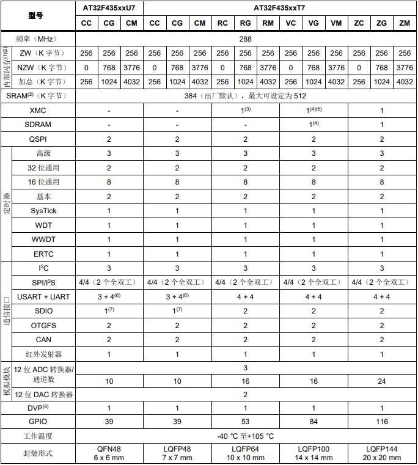

.. _at32f437:

AT32F437
===============

* `Arterytek <https://www.arterytek.com/cn/product/AT32F437.jsp>`_ : :ref:`sar_adc`  :ref:`ethernet`
* `GitHub <https://github.com/SoCXin/AT32F437>`_ : ``Cortex-M4`` ``288 MHz`` ``3x5.33Msps ADC`` ``8 UART`` ``2 CAN`` ``USB2.0`` ``MII/RMII`` ``SPI Flash``

.. contents::
    :local:

Xin简介
-----------

规格参数
~~~~~~~~~~~

基本参数
^^^^^^^^^^^

* 发布时间：
* 参考价格：
* 制程工艺：55nm
* 供货周期：
* 处理性能：630 :ref:`CoreMark` , :ref:`level4`
* 封装规格：LQFP64/LQFP100/LQFP144
* 运行环境：-40~105°C
* RAM容量：128~512 KB
* Flash容量：256/1024/4032 KB

特征参数
^^^^^^^^^^^

* 288 MHz :ref:`cortex_m4`
* 3x 5.33 Msps ADC
* sLib执行代码安全库区
* 16MB SPI Flash memory 扩展
* 4 x USART + 4 x UART
* 2 x CAN 2.0B
* Crystal-less USB2.0
* IEEE 1588 10/100M以太网MAC，专用DMA和4K SRAM，MII/RMII接口

.. hint::
    :ref:`at32f407` 基于 :ref:`cortex_m4` 的高性能产品，拥有丰富的通信外设资源，包括8个串口和以太网MAC，十分适用于网关类产品

芯片架构
~~~~~~~~~~~

.. image:: images/AT32F437s.png
    :target: https://www.arterytek.com/download/RM_AT32F435_437_CH_V2.01.pdf

多达116个I/O端口, 所有I/O口可映像到16个外部中断； 几乎所有I/O口可容忍5V输入信号

所有I/O口均为快速I/O, 寄存器访问速度最高fᴀʜʙ

电源参数
^^^^^^^^^^^

* 电压范围：2.6V ~ 3.6V
* 功耗范围：

时钟体系
^^^^^^^^^^^

Xin选择
-----------

.. contents::
    :local:

品牌对比
~~~~~~~~~

型号对比
~~~~~~~~~

.. list-table::
    :header-rows:  1

    * - :ref:`arterytek`
      - :ref:`CoreMark`
      - SRAM
      - Flash
      - UART
      - CAN2.0B
      - USB
      - Ethernet
    * - :ref:`at32f437`
      -
      - 512
      - 4032
      - 4
      - 1
      - 2 x OTG
      - 10/100M

.. note::
    :ref:`arterytek` 高性能系列标配 :ref:`arterytek_spim` 和 :ref:`arterytek_slib` 功能

.. _at32f435:

AT32F435
^^^^^^^^^^^

版本对比
~~~~~~~~~~~

* LQFP64 10 x 10 mm
* LQFP100 14 x 14 mm
* LQFP144 20 x 20 mm

Xin应用
-----------

以太网
~~~~~~~~~~~

Xin总结
--------------

.. contents::
    :local:

能力构建
~~~~~~~~~~~~~

要点提示
~~~~~~~~~~~~~

问题整理
~~~~~~~~~~~~~

