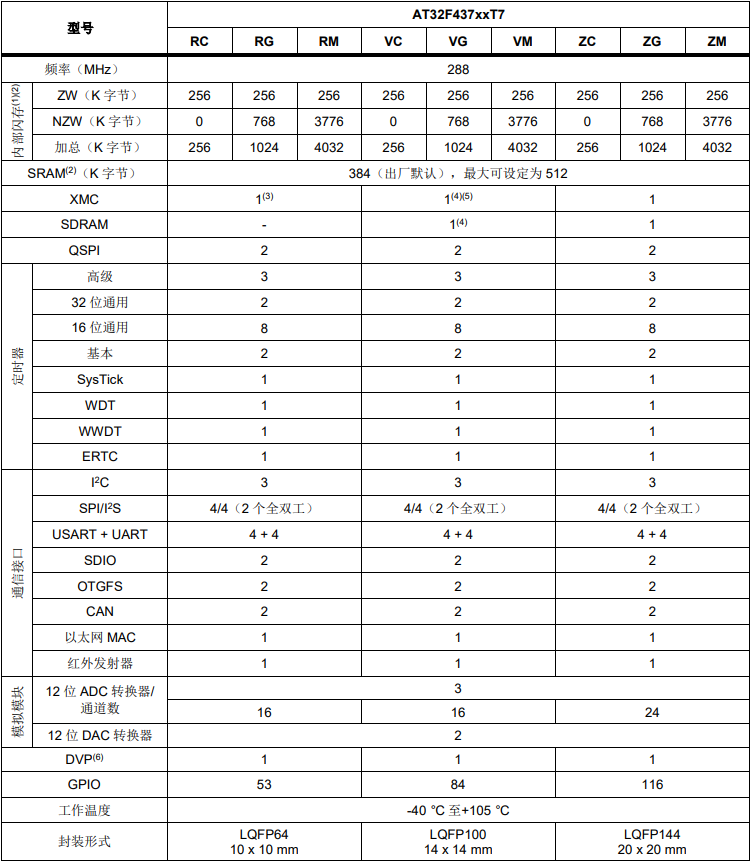

.. _at32f437:

AT32F437
===============

* `Arterytek <https://www.arterytek.com/cn/product/AT32F437.jsp>`_ : ``Cortex-M4`` ``288 MHz`` ``3x5.33Msps ADC`` ``8 UART`` ``2 CAN`` ``USB2.0`` ``MII/RMII`` ``SPI Flash``

.. contents::
    :local:
    :depth: 1

Xin简介
-----------

规格参数
~~~~~~~~~~~

基本参数
^^^^^^^^^^^

* 发布时间：
* 参考价格：￥30
* 制程工艺：55nm
* 供货周期：
* 处理性能：630 :ref:`CoreMark` , :ref:`level4`
* 封装规格：LQFP64/LQFP100/LQFP144
* 运行环境：-40 to 105°C
* RAM容量：128 ~ 512 KB
* Flash容量：256/1024/4032 KB

.. hint::
    片上配置的flash分为两种：ZW = 零等待（zero wait-state），速率可达SYSCLK 288 MHz；NZW = 非零等待（non-zero wait-state）。该系列不同型号都只配置256KB ZW Flash。透过选择字节设置支持内部闪存存储器和SRAM分配使用，以每64 K字节为一个级距配置。

特征参数
^^^^^^^^^^^

* 288 MHz :ref:`cortex_m4`
* 3 x 5.33MSPS ADC (12bit x 16ch)
* 2 x 12bit DAC
* 3 x I²C (支持SMBus/PMBus)
* 4 x SPI / I²S (SPI可达36MHz,其中I²S2/I²S3支持全双工)
* 4 x USART + 4 x UART (支持ISO7816，LIN，IrDA接口和调制解调控制)
* 2 x SDIO
* 2 x QSPI
* 2 x OTG全速控制器, 设备模式时支持无晶振（Crystal-less）
* 2 x CAN 2.0B
* 10/100M以太网MAC，专用DMA和4K SRAM，MII/RMII接口

.. hint::
    :ref:`at32f437` 基于 :ref:`cortex_m4` 的高性能产品，包括8个串口和以太网MAC，尤其是配置3个独立的5.33MSPS ADC

芯片架构
~~~~~~~~~~~

.. image:: images/AT32F437s.png
    :target: https://www.arterytek.com/download/RM_AT32F435_437_CH_V2.01.pdf

多达116个I/O端口, 所有I/O口可映像到16个外部中断； 几乎所有I/O口可容忍5V输入信号

所有I/O口均为快速I/O, 寄存器访问速度最高fᴀʜʙ

电源相关
^^^^^^^^^^^

* 电压范围：2.6V ~ 3.6V
* 功耗范围：

时钟体系
^^^^^^^^^^^

Xin选择
-----------

.. contents::
    :local:

品牌对比
~~~~~~~~~

型号对比
~~~~~~~~~

.. list-table::
    :header-rows:  1

    * - :ref:`arterytek`
      - :ref:`CoreMark`
      - SRAM
      - Flash
      - UART
      - CAN2.0B
      - USB
      - Ethernet
    * - :ref:`at32f437`
      -
      - 512
      - 4032
      - 4
      - 1
      - 2 x OTG
      - 10/100M

.. note::
    :ref:`arterytek` 高性能系列标配 :ref:`arterytek_spim` 和 :ref:`arterytek_slib` 功能

.. _at32f435:

AT32F435
^^^^^^^^^^^

.. image:: images/AT32F435l.png
    :target: https://www.arterytek.com/download/DS/DS_AT32F435_437_V2.01_CH.pdf

版本对比
~~~~~~~~~~~

* LQFP64 10 x 10 mm
* LQFP100 14 x 14 mm
* LQFP144 20 x 20 mm

LQFP64封装XMC仅支持推动8位模式LCD屏。LQFP100封装XMC仅支持存储块1、存储块2、和SDRAM。其中存储块1仅能使用NE1片选支持直接连接复用信号的NOR/PSRAM存储器；存储块2仅能使用NCE2片选支持16位或8位NAND闪存存储器。LQFP100封装没有Port G，因此中断线无法使用。

LQFP100封装XMC透过外加锁存器件可连接非复用信号的PSRAM和SRAM

Xin应用
-----------

`GitHub <https://github.com/SoCXin/AT32F437>`_

以太网
~~~~~~~~~~~

Xin总结
--------------

.. contents::
    :local:

就 :ref:`at32f437` 资源配置和市场定位而言，是存在一定不合理，配置3个12bit 5.33MSPS ADC 是最大市场差异和产品亮点，但是并没有能够与之形成联动的通信外设，100Mbps可能是最接近也是最高速的对上通信端口，如果不能和上层设备互通，依赖本地的高速存储及计算能力，市场应用将很受限。

能力构建
~~~~~~~~~~~~~

要点提示
~~~~~~~~~~~~~

问题整理
~~~~~~~~~~~~~

