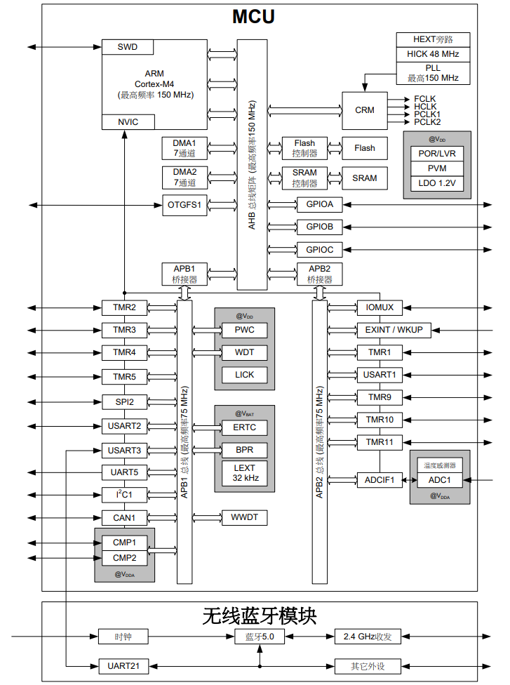
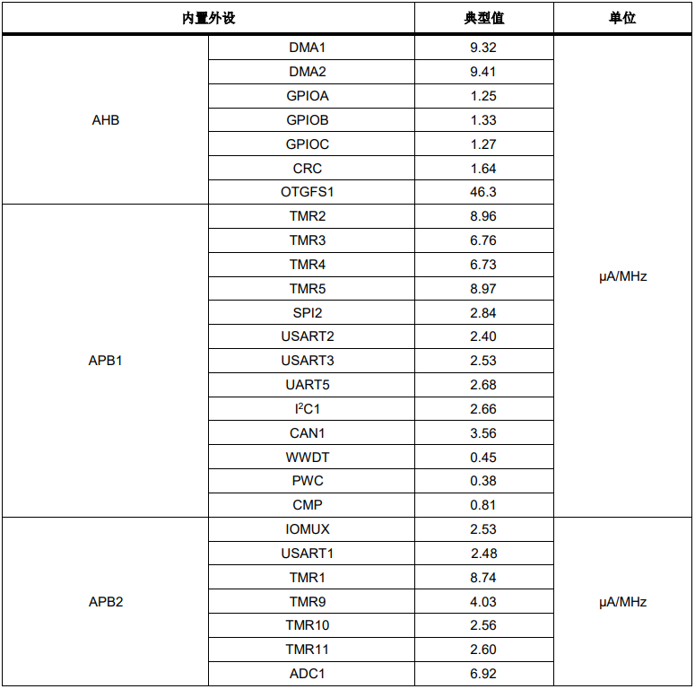

.. _at32wb415:

AT32WB415
===============
`Arterytek <https://www.arterytek.com/>`_ : ``Cortex-M4`` ``150MHz`` ``BLE5.0``

.. contents::
    :local:
    :depth: 1

Xin简介
-----------
`Tags <https://github.com/SoCXin/AT32WB415>`_ : :ref:`ble`

规格参数
~~~~~~~~~~~
`datasheet <https://www.arterytek.com/download/DS/DS_AT32WB415_V2.00_CH.pdf>`_

基本参数
^^^^^^^^^^^

* 发布时间：
* 发布价格：
* 制程工艺：
* 供货周期：
* 处理性能：
* 运行环境：-40°C to 105°C
* 封装规格：:ref:`QFN48`
* RAM容量：32KB
* Flash容量：256KB

特征参数
^^^^^^^^^^^

* 150 MHz :ref:`cortex_m4`

芯片架构
~~~~~~~~~~~

功耗参数
^^^^^^^^^^^

* 电压范围：2.6 to 3.6 V
* 功耗范围：

