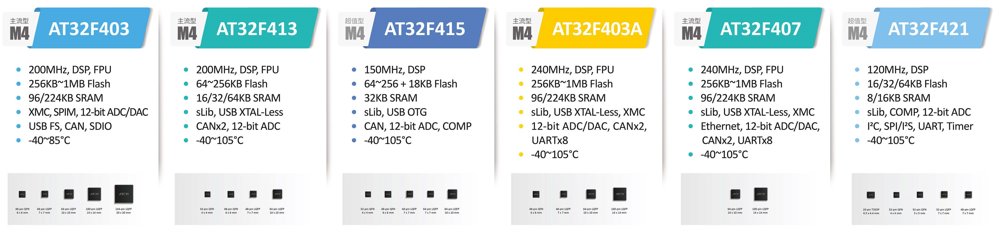

.. _arterytek:

Arterytek
=================

``Cortex-M4`` ``MCU`` ``AT32F421``

.. contents::
    :local:

公司简介
-----------

.. note::
    `雅特力科技 <https://www.arterytek.com/cn/index.jsp>`_ （重庆）有限公司于2016年6月成立，专注于ARM® Cortex®-M4 的32位微控制器研发与创新，拥有领先高端芯片研发技术、完整的硅智财库及专业灵活的整合经验，创造了MCU 业界Cortex®-M4最高CPU主频288MHz运算效能，并致力于成为中国32位微控制器的创新领导者。

商业模式
~~~~~~~~~~~

与21ic、世强元件电商等众多第三方平台建立合作关系，以带动在地研发动能，采用代理销售方式 sales_artery@arterytek.com

* 重庆市九龙坡区科城路60号康田西锦荟1栋10F
* 86-23-6868 8899

技术支持
~~~~~~~~~~~

官方提供少量示例工程，厂商无开发环境，支持KEIL/IAR

技术简介
-----------

.. contents::
    :local:

主频降维打击
~~~~~~~~~~~~~~~

基于 :ref:`cortex_m4` 内核120MHz主频的 :ref:`at32f421` 直接对标 :ref:`cortex_m0` 的入门级产品，公司不多的几个产品系列基本上都是以高主频的方式降维竞争，配备更多的外设资源，让参数看上去十分抢眼。

.. _arterytek_spim:

SPIM存储扩展
~~~~~~~~~~~~~~~

高达16MB外部 SPI Flash memory 扩展(程序执行/数据储存/程序与数据可加密)

XMC接口扩展
~~~~~~~~~~~~~~

支持CF卡、SRAM、PSRAM、NOR和NAND存储器支持并行LCD接口, 兼容8080/6800模式

.. _arterytek_slib:

sLib安全库区
~~~~~~~~~~~~~~~~

* 设定以密码保护主闪存中指定范围的程序区(即安全库区)，软件方案商可将核心算法存放到此区域，以达到保护的功能，其余空白程序区可以提供给终端商客户进行二次开发。
* 安全库区分为指令安全库区(SLIB_CODE)及只读安全库区 (SLIB_READ_ONLY)，可支持整个安全库区设定为指令区，或是设定为唯读区，或是部分指令区与部分唯读区。
* 指令 安全库区(SLIB_CODE)内的程序代码 仅能被 MCU透过 I-Code总线 抓取指令 (仅能被执行)，不能透过D-Code总线以读取数据的方式读取(包含ISP/ICP调适模式以及从内部RAM启动的程序)，以读取数据的方式去访问SLIB_CODE时，读到的数值全都是0x00。
* 唯读安全库区(SLIB_READ_ONLY)可透过I-Code及D-Code总线读取，可以储存代码跟数据，但不能写入。
* 安全库区的程序代码及数据，除非输入正确的密码，否则无法被擦除。在密码不正确时，对安全库区执行写入或擦除，将会在FLASH_STS寄存器的WRPRTFLR位置"1"提出警告。
* 终端用户执行主闪存的整片擦除时，安全库区的程序代码及数据不会被擦除。

产品简介
-----------

.. contents::
    :local:

超值产品
~~~~~~~~~~~
.. toctree::
    :maxdepth: 1

    超高性价比 AT32F421 <AT32F421>
    USB-OTG AT32F415 <AT32F415>

性能产品
~~~~~~~~~~~
.. toctree::
    :maxdepth: 1

    200MHz: AT32F413 <AT32F413>
    240MHz: AT32F403 <AT32F403>
    240MHz: AT32F407 <AT32F407>
    288MHz: AT32F437 <AT32F437>

.. hint::
    2016年成立，2018年正式对外销售芯片，AT32系列高效能MCU，采用55nm制程先进工艺，全系列搭载 :ref:`cortex_m4` 内核，产品系列较少定位清晰。
