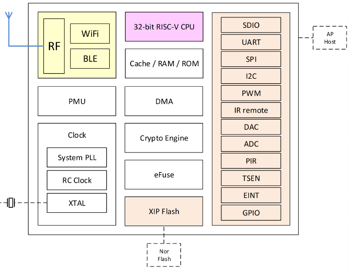

.. _bl602:

BL602
===============

`bouffalolab <https://www.bouffalolab.com/>`_ : ``Wi-Fi`` ``BLE5``

.. contents::
    :local:
    :depth: 1

Xin简介
-----------

BL602/BL604芯片的无线子系统包含2.4G无线电、Wi-Fi 802.11b / g / n和Bluetooth LE 5.0基带/MAC设计。其微控制器子系统包含低功耗32位RISC-V CPU、高速缓存和存储器。电源管理单元可控制低功耗模式。其外围接口包括SDIO，SPI，UART，I2C，IR远程，PWM，ADC，DAC，ACOMP，PIR等，支持灵活的GPIO配置。 BL602共有16个GPIO，而BL604共有23个GPIO。

该系列芯片的无线功能包括：Wi-Fi 802.11 b / g / n；低功耗蓝牙5.0，具有BLE协助的Wi-Fi快速连接，Wi-Fi和BLE共存；Wi-Fi安全WPS / WEP / WPA / WPA2 / WPA3；STA，SoftAP和嗅探模式；多云连接；2.4 GHz射频收发器；集成射频巴伦，PA / LNA。

其安全功能包括：安全启动；安全调试；XIP QSPI即时AES解密（OTFAD）；AES 128/192/256；SHA-1 / 224/256；TRNG（真随机数生成器）；PKA（公钥加速器）。

规格参数
~~~~~~~~~~~

基本参数
^^^^^^^^^^^

* 发布时间：
* 参考价格：
* 制程工艺：
* 供货周期：
* 处理性能：
* 封装规格：QFN32 (16 GPIO)
* 运行环境：-40°C to 85°C
* RAM容量：276KB
* ROM容量：128KB
* Flash容量：

特征参数
^^^^^^^^^^^

* 1Kb eFuse

模拟性能
^^^^^^^^^^^

* 10-bit DAC
* 12-bit ADC

芯片架构
~~~~~~~~~~~

功耗参数
^^^^^^^^^^^

* 电压范围：1.71 to 3.6 V
* 功耗范围：
