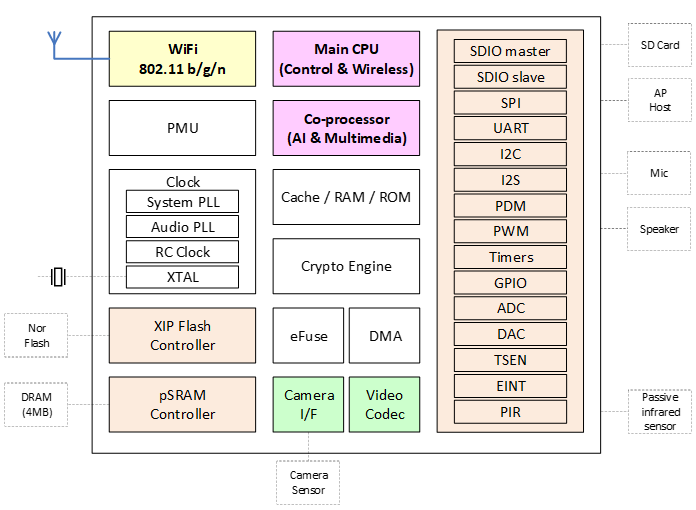

.. _bl608:

BL608
===============

`bouffalolab <https://www.bouffalolab.com/>`_ : ``Wi-Fi`` ``BLE5``

.. contents::
    :local:
    :depth: 1

Xin简介
-----------

.. contents::
    :local:

规格参数
~~~~~~~~~~~

基本参数
^^^^^^^^^^^

* 发布时间：
* 参考价格：
* 制程工艺：
* 供货周期：
* 处理性能：
* 封装规格：QFN56
* 运行环境：-40°C to 85°C
* RAM容量：392KB
* ROM容量：256KB
* Flash容量：

特征参数
^^^^^^^^^^^

* 160 MHz :ref:`cortex_m4`
* 2Kb eFuse

模拟性能
^^^^^^^^^^^

* 10-bit DAC
* 12-bit ADC

芯片架构
~~~~~~~~~~~

功耗参数
^^^^^^^^^^^

* 电压范围：1.71 to 3.6 V
* 功耗范围：

Xin选择
-----------

.. contents::
    :local:

品牌对比
~~~~~~~~~~~~

型号对比
~~~~~~~~~~~~

博流智能的多模无线连接智能语音SoC芯片“BL606P”，单芯片高度集成玄铁C906和E907处理器、SRAM、多模无线连接、音频编码器、屏显和外设接口等，可广泛用于智能语音场景。

版本对比
~~~~~~~~~~~~

.. _bl606:

BL606
^^^^^^^^^^^
