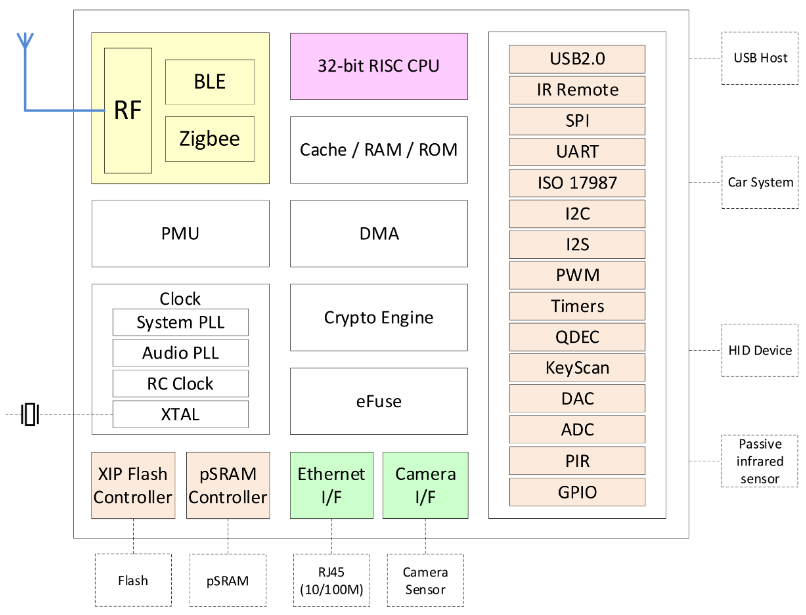

.. _bl702:

BL702
===============
`bouffalolab <https://www.bouffalolab.com/>`_ : ``RISC-V`` ``144MHz`` ``Zigbee`` ``BLE5``

.. contents::
    :local:
    :depth: 1

Xin简介
-----------
`Tags <https://github.com/SoCXin/BL702>`_ : :ref:`ble` / :ref:`zigbee` / :ref:`riscv` / :ref:`sipeed_maix`

.. contents::
    :local:
    :depth: 1

规格参数
~~~~~~~~~~~

无线子系统包含 2.4G 无线电，BLE5.0 和 802.15.4 基带/MAC 设计。

微控制器子系统包含一个低功耗的 32 位 RISC CPU，高速缓存和存储器。电源管理单元控制低功耗模式。此外，还支持各种安全性能。

外围接口包括 USB2.0，以太网，红外遥控器，SPI，UART，ISO 17987，I2C，I2S，PWM，QDEC，KeyScan，ADC，DAC，PIR 和 GPIO。

基本参数
^^^^^^^^^^^

* 发布时间：
* 参考价格：
* 制程工艺：
* 供货周期：
* 处理性能：
* 封装规格：:ref:`QFN32` (15 GPIO)
* 运行环境：-40°C to 85°C
* RAM容量：132KB (QSPI PSRAM)
* ROM容量：192KB
* Flash容量：512KB

特征参数
^^^^^^^^^^^

* 144MHz :ref:`riscv` (3.1 CoreMark/MHz)
* 1Kb eFuse
* USB2.0 FS device interface
* IR remote control interface
* :ref:`ethernet` RMII interface

模拟性能
^^^^^^^^^^^

芯片架构
~~~~~~~~~~~

功耗参数
^^^^^^^^^^^

* 电压范围：1.71 to 3.6 V
* 功耗范围：

Xin选择
-----------

.. contents::
    :local:
    :depth: 1

品牌对比
~~~~~~~~~~~

型号对比
~~~~~~~~~~~

.. _bl706:

BL706
^^^^^^^^^^^

* Camera interface
* :ref:`ethernet` RMII interface
