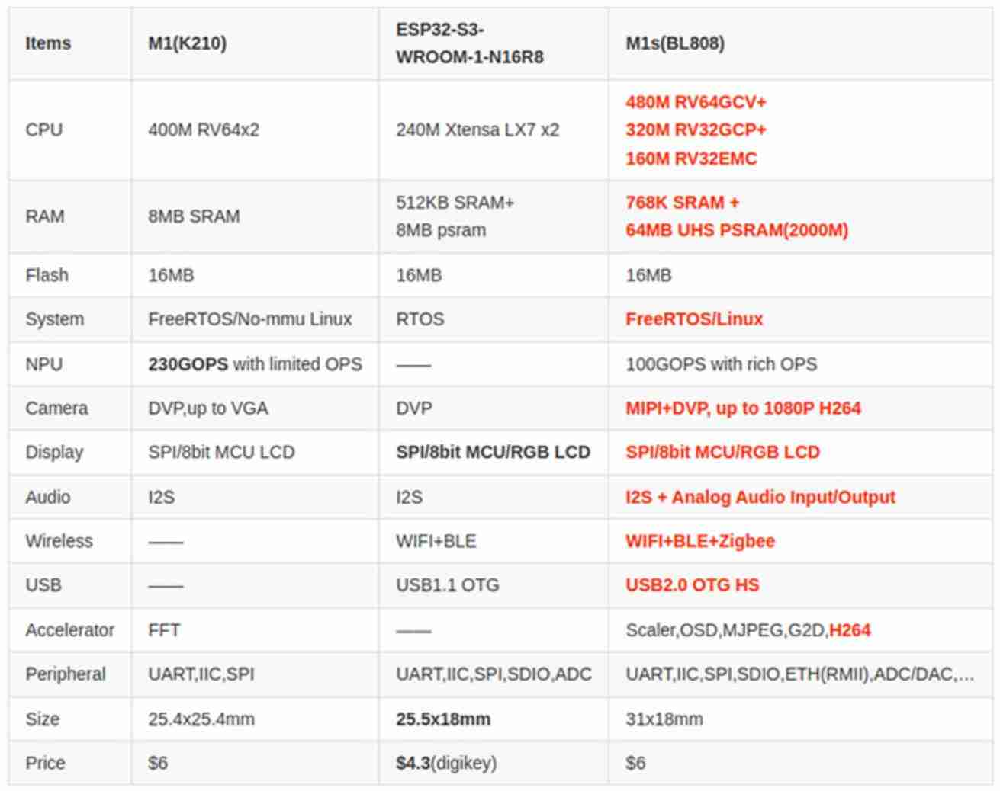

.. _NO_003:
.. _bl808:

BL808
===============

`bouffalolab <https://www.bouffalolab.com/>`_ : ``RV64`` ``Wi-Fi`` ``BLE`` ``USB`` ``NPU`` ``Linux``

.. contents::
    :local:
    :depth: 1

Xin简介
-----------

`Tags <https://github.com/SoCXin/BL808>`_ : :ref:`top` / :ref:`riscv` / :ref:`wifi4` / :ref:`bt` / :ref:`zigbee` / :ref:`usb_hs` / :ref:`sipeed_maix`

.. image:: ./images/BL808.jpg
    :target: https://www.bouffalolab.com/

.. contents::
    :local:
    :depth: 1

规格参数
~~~~~~~~~~~

基本参数
^^^^^^^^^^^

* 发布时间：
* 参考价格：
* 制程工艺：
* 供货周期：
* 处理性能：
* 封装规格：
* 运行环境：
* RAM容量：768KB SRAM + 64MB UHS PSRAM
* ROM容量：
* Flash容量：

特征参数
^^^^^^^^^^^

* 480 MHz :ref:`xt_c906` + 320MHz :ref:`xt_e907` + 160MHz :ref:`xt_e902`
* 100GOPS NPU(BLAI-100)
* MJPEG and H264(Baseline/Main)
* Wi-Fi 802.11 b/g/n :ref:`wifi4`
* Bluetooth 5.x Dual-mode :ref:`bt` + :ref:`ble`
* :ref:`usb_hs` OTG

芯片架构
~~~~~~~~~~~
``三核异构`` ``RISC-V`` ``FreeRTOS`` ``Linux``

BL808是一个三核异构架构的AIoT芯片，采用的都是RISC-V架构，最高时钟频率达480MHz。芯片主要包含无线和多媒体两个子系统。

M0集成Wi-Fi/BT/Zigbee无线子系统，可以实现多种无线连接和数据传输，采用平头哥 :ref:`xt_e907` 320MHz 32-bit RISC-V CPU，采用 5 级流水线结构，支持RISC-V 32/16 位混编指令集，包含64个外部中断源，有4个bits可以用于配置中断优先级。M0 包含 32K 指令 cache 和 16K 数据 cache。

D0集成DVP/CSI/ H264/NPU等视频处理模块，采用平头哥 :ref:`xt_c906` 480MHz 64-bit RISC-V CPU，采用 5 级流水线结构，支持 RISC-V RV64IMAFCV 指令架构，包含67个外部中断源，有 3 个 bits 可以用于配置中断优先级。D0 包含 32K 指 令 cache 和 32K 数据 cache。

BL808内部还有一个LP核，采用的是平头哥E902，主频160MHz。

功耗参数
^^^^^^^^^^^

* 电压范围：
* 功耗范围：

Xin选择
-----------

.. contents::
    :local:
    :depth: 1

品牌对比
~~~~~~~~~~~~
``espressif``

.. list-table::
    :header-rows:  1

    * - :ref:`vendor`
      - :ref:`architecture`
      - :ref:`CoreMark`
      - :ref:`sram`
      - :ref:`bandwidth`
      - :ref:`link_budget`
      - :ref:`package`
    * - :ref:`bl808`
      - :ref:`riscv`
      -
      - 768KB
      -
      -
      -
    * - :ref:`esp32s3`
      - :ref:`xtensa_lx7`
      - 1181
      - 512KB
      - 150 Mbps
      - 118 dBm
      - :ref:`esp_qfn56`
    * - :ref:`aic8800`
      - :ref:`cortex_m4`
      -
      -
      -
      -
      -

型号对比
~~~~~~~~~~~~

.. list-table::
    :header-rows:  1

    * - :ref:`vendor`
      - :ref:`architecture`
      - :ref:`CoreMark`
      - :ref:`sram`
      - :ref:`bandwidth`
      - :ref:`link_budget`
      - :ref:`package`
    * - :ref:`bl808`
      - :ref:`riscv`
      -
      - 768KB
      -
      -
      -
    * - :ref:`bl606p`
      - :ref:`riscv`
      -
      - 700KB
      -
      -
      -

.. _bl606p:

BL606P
^^^^^^^^^^^
``C906`` ``E907`` ``QFN68(8x8)``

BL606P是高度集成的双核 AIoT 边缘计算SOC，具有 Wi-Fi/BT/BLE/Zigbee/Ethernet/USB2.0 六模合一的多模智能网关功能，内置一颗RISC-V 32位高性能CPU，可实现多种无线有线连接和数据传输，提供多样化的连接与传输体验；另有一颗RISC-V 64-bit 超高性能 CPU，提供超高的数据处理算力，可加速智能音箱相关算法。BL606P支持多种安全机制，提供大容量高速缓存和存储器资源，集合多种外设及音频编译码器，为物联网产品提供强大的联网、存储和运算能力，适用于各种智能语音交互设备、智能中控面板，智能网关，和智能音箱等结合人工智能和多模无线有线网关功能的智能物联网应用场景与设备。

BL606P 芯片内部包含多个 RISC-V 处理器，最高时钟频率达480MHz。BL606P包含音频编解码器，具有700KB RAM / 16M pSRAM / 2Kb eFuse存储资源，支持外接Flash。

集成的多种外设和丰富的GPIO管脚，睡眠时~1uA级的低功耗，满足智能音箱、视频监控等各类物联网产品功能需求。

版本对比
~~~~~~~~~~~~
