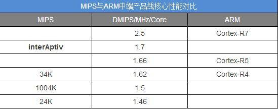

.. _mips:

MIPS
=========

`MIPS <https://github.com/SoCXin/MIPS>`_

.. _tensilica:

Tensilica
--------------

Tensilica 公司的 Xtensa 处理器是一个可以自由装组、可以弹性扩张，并可以自动合成的处理器核心。Xtensa 是第一个专为嵌入式单芯片系统而设计的微处理器。为了让系统设计工程师能够弹性规划、 执行单芯片系统 的各种应用功能，Xtensa 在研发初期就已锁定成一个可以自由装组的架构。

.. note::
    Tensilica公司于2013年3月被Cadence公司以3.8亿的价格收购

.. _xtensa_lx7:

Xtensa LX7
~~~~~~~~~~~~~

`Xtensa LX <https://www.cadence.com/zh_CN/home/tools/ip/tensilica-ip/tensilica-xtensa-controllers-and-extensible-processors/xtensa-lx-processor-platform.html>`_

.. image:: images/XtensaLX7.png
    :target: https://www.pianshen.com/article/64631295742/

.. _xtensa_lx6:

Xtensa LX6
~~~~~~~~~~~~~

7 级流水线架构

.. _1004KEc:

1004KEc
~~~~~~~~~~~~~

.. warning::
    MIPS已明显后劲不足，不过贵在工艺成熟价格便宜，目前低端路由完全离不开它。
