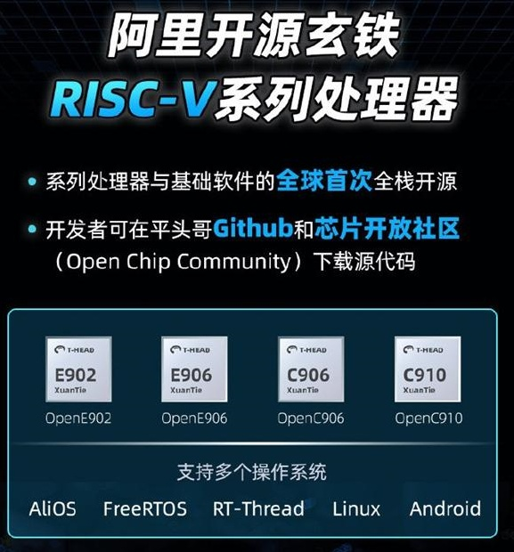

.. _riscv:

RISC-V
==================

``BSD``

.. contents::
    :local:

架构简介
--------------

.. image:: ./images/RISC-V.png
    :target: https://riscv.org/

CPU主要有两大指令集：

* 复杂指令集（Complex Intruction Set Computer，CISC）架构——x86
* 精简指令集（Reduced Intruction Set Computer，RISC）架构——ARM、MIPS和RISC-V

.. note::
    基于精简指令集计算(RISC)原理建立的开放指令集架构(ISA)，V表示为第五代，使用BSD License开源协议。

架构优势
~~~~~~~~~~~~~~

* 模块化：RISC-V将不同的部分以模块化的方式组织在一起，并试图通过一套统一的架构来满足各种不同的应用场景，这种模块化是x86与ARM架构所不具备的。
* 指令数目少：受益于短小精悍的架构以及模块化的特性，RISC-V架构的指令数目非常的简洁。基本的RISC-V指令数目仅有40多条，加上其他的模块化扩展指令也总共只有几十条指令。

.. _rv32:

RV32
--------------

.. _rv64:

RV64
--------------

.. _xt:

XuanTie
--------------

.. _c906:

C906
~~~~~~~~~~~~~~

.. _xt804:

XT804
~~~~~~~~~~~~~~
