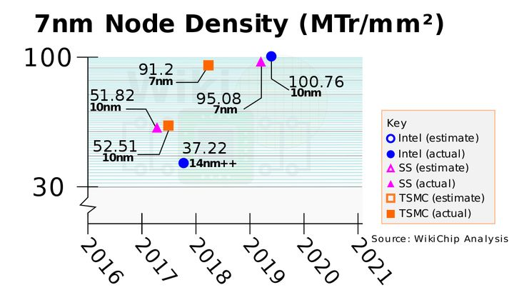

.. _asic:

ASIC
============

FPGA
-------------

.. toctree::
    :maxdepth: 1

    GW1NSR <../A/GW1NSR>

制程工艺
-------------

7nm 制程工艺仅仅只是一个代表某种特定尺寸和技术的商业名称，并不指代实际的 Gate length 或者 half pitch。
每个厂商对于7nm 制程工艺都有不同的Gate pitch 和 Interconnect pitch的定义设计，不同厂商相同制程工艺的产品也不完全具有可比性。

