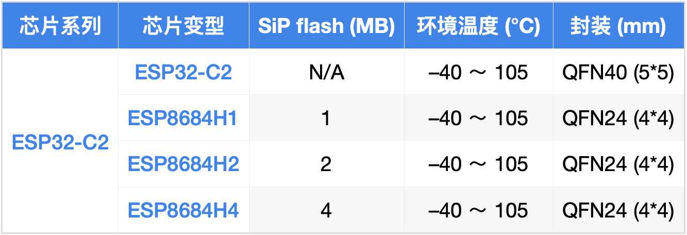

.. _NO_006:
.. _esp32c2:

ESP32C2
================

`标签 <https://github.com/SoCXin/ESP32C2>`_ : ``RISC-V`` ``120MHz`` ``WiFi`` ``BLE5.0`` ``QFN40``

.. contents::
    :local:

Xin简介
-----------

.. image:: ./images/ESP32C2.png
    :target: https://www.espressif.com/zh-hans/news/ESP32-C2

规格参数
~~~~~~~~~~~

ESP32-C2 芯片比 ESP8266 面积更小、性能更强。ESP32-C2 在满足简单物联网应用需求的基础上，进一步优化成本，能够为用户提供一个极具性价比的开发平台。值得一提的是，乐鑫的射频技术实现重要突破，可达到 1024-QAM 技术指标，未来将为客户提供更多高性能的产品选择。

基本参数
^^^^^^^^^^^

* 发布时间：2021-12-23
* 制程工艺：
* 发布价格：
* 工作温度：-40°C to +105°C
* 处理性能：
* RAM容量：272 KB
* Flash容量：576 KB
* 封装规格：QFN40 (5x5mm)

特征参数
^^^^^^^^^^^

* 120 MHz :ref:`riscv`
* Wi-Fi IEEE 802.11b/g/n
* BLE 5.0
* 14 x GPIO

电源参数
^^^^^^^^^^^

* 供电电压：2.3 to 3.6 V

安全特性
~~~~~~~~~~~~~~

.. contents::
    :local:

.. note::
    硬件安全单元十分利于物联网产品设计，特别是对加密算法的支持，在嵌入式领域配置如此多的安全外设，也是十分强大的

ECC 模块
^^^^^^^^^^^^^^^

SHA 模块
^^^^^^^^^^^^^^^

Xin选择
-----------

.. contents::
    :local:

品牌对比
~~~~~~~~~

.. list-table::
    :header-rows:  1

    * - :ref:`vendor`
      - :ref:`architecture`
      - :ref:`CoreMark`
      - SRAM/ROM
      - Characteristics
      - UART/SPI/SDIO
      - Package
    * - :ref:`esp32c2`
      - :ref:`esp_rv32`
      - 300 :ref:`CoreMark`
      - 272KB/576KB
      -
      -
      - QFN40
    * - :ref:`esp32c3`
      - :ref:`esp_rv32`
      - 407 :ref:`CoreMark`
      - 512KB/384KB
      - 1T1R/v5.0
      - 2/3/No
      - :ref:`esp_qfn32`
    * - :ref:`hi3861`
      - :ref:`riscv`
      -
      - 352KB/288KB
      - 72Mbps@HT20
      - 3/2/1
      - QFN32
    * - :ref:`air101`
      - :ref:`riscv`
      -
      - 288KB/1MB
      -
      - 5/2/1
      - QFN32
    * - :ref:`w801`
      - :ref:`xt804`
      -
      - 288KB/1MB
      - 1T1R
      - 6/2/1
      - QFN56

.. list-table::
    :header-rows:  1

    * - :ref:`vendor`
      - :ref:`architecture`
      - :ref:`CoreMark`
      - SRAM/ROM
      - Characteristics
      - UART/SPI/SDIO
      - Package
    * - :ref:`esp32c2`
      - :ref:`esp_rv32`
      -
      - 272KB/576KB
      -
      -
      - QFN40
    * - :ref:`esp32c3`
      - :ref:`esp_rv32`
      -
      - 512KB/384KB
      -
      -
      - QFN32
    * - :ref:`esp8625`
      - :ref:`esp_rv32`
      -
      - 512KB/384KB
      -
      -
      - QFN28
    * - :ref:`ch573`
      - :ref:`riscv`
      -
      - 18KB/512KB
      -
      -
      - QFN28

型号对比
~~~~~~~~~

.. contents::
    :local:

.. list-table::
    :header-rows:  1

    * - :ref:`vendor`
      - :ref:`architecture`
      - :ref:`CoreMark`
      - SRAM/ROM
      - WiFi
      - BLE
      - UART/SPI/IO
      - Package
    * - :ref:`esp32c2`
      -
      -
      - 272KB/576KB
      - 1024-QAM
      - v5.0
      - 1/2/14
      - QFN40
    * - :ref:`esp32c3`
      -
      -
      - 400KB/384KB
      - 256-QAM
      - v5.0
      - 1/3/22
      - :ref:`esp_qfn32`

版本对比
~~~~~~~~~

Xin应用
-----------

.. contents::
    :local:

开发板
~~~~~~~~~~

编译工具
~~~~~~~~~

开发框架
~~~~~~~~~

ESP-IDF
^^^^^^^^^^^

Arduino
^^^^^^^^^^^^

`Arduino <https://docs.os-q.com/arduino>`_

应用笔记
~~~~~~~~~

Xin总结
--------------

.. contents::
    :local:

能力构建
~~~~~~~~~~~~~

要点提示
~~~~~~~~~~~~~

问题整理
~~~~~~~~~~~~~

