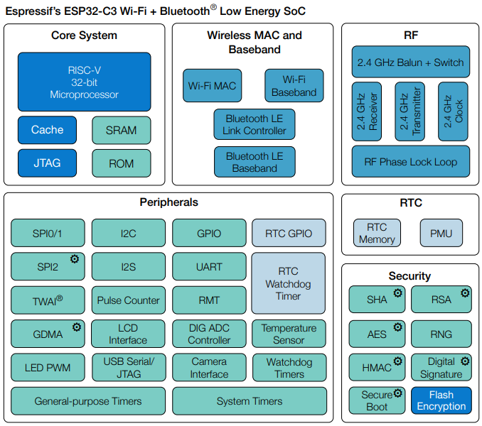
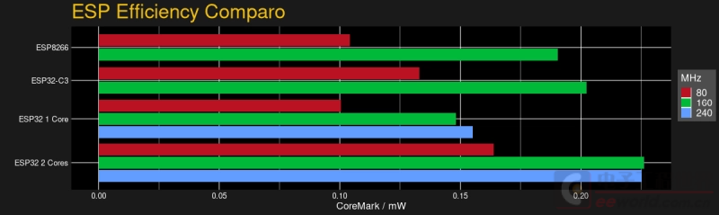
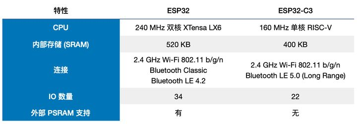
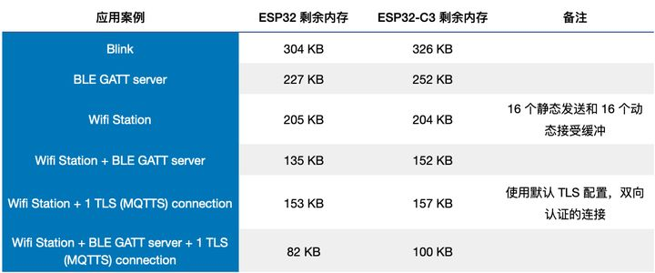
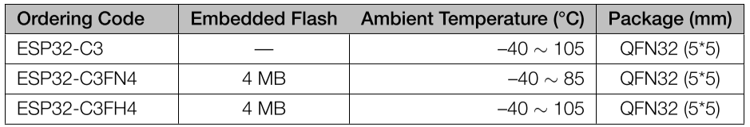
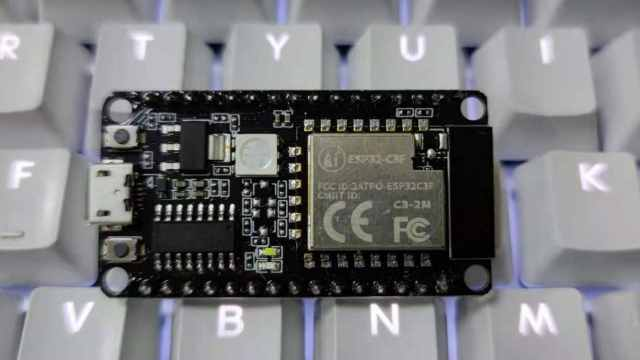

.. _NO_006:
.. _esp32c3:

ESP32-C3
================

* 关键词：``RISC-V`` ``160MHz`` ``BLE5.0`` ``WiFi`` ``QFN32``
* 资源池：`GitHub <https://github.com/SoCXin/ESP32C3>`_ , `Gitee <https://gitee.com/socxin/ESP32C3>`_

.. contents::
    :local:

Xin简介
-----------

规格参数
~~~~~~~~~~~

基本参数
^^^^^^^^^^^

* 发布时间：
* 制程工艺：45 nm
* 工作温度：-40°C to +105°C
* 处理性能：407.22 :ref:`CoreMark`
* RAM容量：400 KB (TCM)
* Flash容量：384 KB
* 封装规格：:ref:`esp_qfn32` (5x5mm)

特征参数
^^^^^^^^^^^

* 160 MHz :ref:`riscv`
* Wi-Fi IEEE 802.11b/g/n
* BLE 5.0，支持Mesh (Bluetooth Mesh)
* TWAI 控制器
* 22  x GPIO

电源参数
^^^^^^^^^^^

* 供电电压：2.3 to 3.6 V

计算性能
~~~~~~~~~~~~~~

.. image:: ./images/ESP.png

安全特性
~~~~~~~~~~~~~~

内置安全硬件，硬件加密加速器可支持 AES-128/256、Hash、RSA、HMAC，RNG

.. contents::
    :local:

.. note::
    硬件安全单元十分利于物联网产品设计，特别是对加密算法的支持，在嵌入式领域配置如此多的安全外设，也是十分强大的

RSA 模块
^^^^^^^^^^^^^^^

基于 RSA-3072 的标准身份验证方案，确保在设备上运行受信任的应用程序。该功能可阻止设备运行烧录在 flash 中的恶意程序。
安全启动需要快速高效地进行，以满足即时启动设备（如球泡灯）的需求，ESP32-C3 的安全启动方案仅在设备启动过程中增加了不到 100 ms 的时间开销。

AES 模块
^^^^^^^^^^^^^^^

基于 AES-128-XTS 算法的 flash 加密方案，确保应用程序与配置数据在 flash 中保持加密状态。
flash 控制器支持执行加密的应用程序固件，这不仅为存储在 flash 中的敏感数据提供了必要保护，还防止了运行时由于固件更改造成的 TOCTTOU (time-of-check-to-time-of-use) 攻击。

TEE 模块
^^^^^^^^^^^^^^^

世界控制器模块提供了两个互不干扰的执行环境。根据配置，世界控制器使用可信执行环境 (TEE) 或权限分离机制。
如果应用程序固件需要处理敏感的安全数据（如 DRM 服务），则可以利用世界控制器模块，在安全区域处理数据。

数字签名
^^^^^^^^^^^^^^^

ESP32-C3 的数字签名外设，可以通过固件不可访问的私钥生成数字签名。同样地，其 HMAC 外设也可以生成固件不可访问的加密摘要。
目前，大多数物联网云服务使用基于 X.509 证书的身份验证，数字签名外设保护了定义设备身份的私钥。这样一来，即使出现软件漏洞，它也能为设备身份提供强大的保护

Xin选择
-----------

.. contents::
    :local:

.. hint::
    :ref:`esp32c3` 发布于2020年12月1日，是乐鑫基于RISC-V内核设计的MCU产品

品牌对比
~~~~~~~~~

对比W806
^^^^^^^^^^^^

.. list-table::
    :header-rows:  1

    * - :ref:`list`
      - Core
      - Performance
      - SRAM/ROM
      - WiFi/BLE
      - UART/SPI/SDIO
      - Package
    * - :ref:`esp32c3`
      - :ref:`esp_rv32`
      - 407 :ref:`CoreMark`
      - 512KB/384KB
      - 1T1R/v5.0
      - 2/3/No
      - :ref:`esp_qfn32`
    * - :ref:`w806`
      - :ref:`xt804`
      - 300 :ref:`DMIPS`
      - 288KB/1MB
      - 1T1R
      - 6/2/1
      - :ref:`w806_qfn56`
    * - :ref:`hi3861`
      - :ref:`riscv`
      -
      - 352KB/288KB
      - 72Mbps@HT20
      - 3/2/1
      - QFN32

.. note::
    ESP32-C3 和 W806 相比封装更小，扩展能力和计算能力规格更低，支持BLE 5.0, 更偏向无线数据节点，后者配置更多的IO，更多的UART,以及16bit SD ADC和SDIO接口，更偏向有针对性的，更复杂的终端网关设备

型号对比
~~~~~~~~~

.. contents::
    :local:

.. list-table::
    :header-rows:  1

    * - :ref:`list`
      - Core
      - DMIPS
      - RAM
      - WiFi
      - BLE
      - USB
      - MAC
    * - :ref:`esp32`
      - Dual LX6
      - 600 DMIPS
      - 520 KB
      - 802.11 b/g/n
      - BT/BLE v4.2
      - NO
      - 100M
    * - :ref:`esp32s3`
      - Dual LX7
      - 600 DMIPS
      - 512 KB
      - 802.11 b/g/n
      - BLE v5.0
      - USB1.1 OTG
      - NO
    * - :ref:`esp32c3`
      - RV32IMC
      - 200 DMIPS
      - 400 KB
      - 802.11 b/g/n
      - BLE v5.0
      - NO
      - NO

对比ESP8266
^^^^^^^^^^^^

与2014年发布的ESP8266相比，ESP32-C3更像是ESP32的简化版，QFN32(5*5)封装与ESP8266EX一致，价格也对标

.. image:: ./images/C3vsESP8266.png
    :target: https://blog.csdn.net/fengfeng0328/article/details/112437659

`ESP8266EX <https://github.com/SoCXin/ESP8266>`_ 不足：

* eFUSE不开放
* RF信号质量不够高
* DTIM保活功耗较高
* 内存较小，无法支撑复杂的应用场合
* 缺少硬件加密、没有安全启动和Flash加密，RSA耗时较长，TLS握手需要3-4秒

对比ESP8685
^^^^^^^^^^^^

对比ESP32
^^^^^^^^^^^^

ESP32-C3没有对 IRAM 和 DRAM 进行静态划分。SRAM 的前 16 KB 被配置为 cache 专用。与 ESP32 不同的是，ESP32-C3 的 IRAM 和 DRAM 地址在相同方向递增。
基于应用需求，链接器脚本可将所需的空间配置为 IRAM，其后便为 DRAM 空间。因此相比 ESP32 来说，ESP32-C3 的存储空间使用效率更高。

.. note::
    ESP32-C3的蓝牙子系统不要求其存储必须为某固定位置的连续空间。反之，它使用标准的系统堆来分配存储空间，因此应用可以在需要的时候打开或禁用蓝牙。要实现这一点，仅需确保堆中有足够的存储空间即可。

版本对比
~~~~~~~~~

量产芯片版本包括：

Xin应用
-----------

.. contents::
    :local:

开发板
~~~~~~~~~~

编译工具
~~~~~~~~~

开发框架
~~~~~~~~~

ESP-IDF
^^^^^^^^^^^

支持ESP32C3需要release/v4.3及以上版本 :ref:`esp_idf` ，围绕 ESP32-C3构建固件，需要安装一些必备工具包括 Python、Git、交叉编译器、CMake 和 Ninja等。

Arduino
^^^^^^^^^^^^

`Arduino <https://docs.os-q.com/arduino>`_

应用笔记
~~~~~~~~~

WiFi Mesh
^^^^^^^^^^^

LittlevGL
^^^^^^^^^^^

ESP32-C3支持QSPI 适合4.3寸以下，SPI QSPI，MCU（8080）接口的屏。

开源方案
~~~~~~~~~

如果你要探索一些开源项目，可能时常遇到基于 `PlatformIO <https://platformio.org/platforms/ststm32>`_ 构建的工程，通过跨平台编译，直接在编辑器中集成，可以云端部署，比常用的IDE拥有更多的灵活性。

* `ESP-IDF <https://github.com/espressif/esp-idf>`_
* `arduino-esp32 <https://github.com/espressif/arduino-esp32/>`_
* `RUST API <https://github.com/imheresamir/esp32c3>`_

Xin总结
--------------

.. contents::
    :local:

能力构建
~~~~~~~~~~~~~

.. note::
    相对传统的MCU使用的强大IDE环境，最大的槽点就是缺乏高度集成的工具环境，ESP-IDF的编译效率较低，文件修改后编译非常耗时

要点提示
~~~~~~~~~~~~~

问题整理
~~~~~~~~~~~~~

