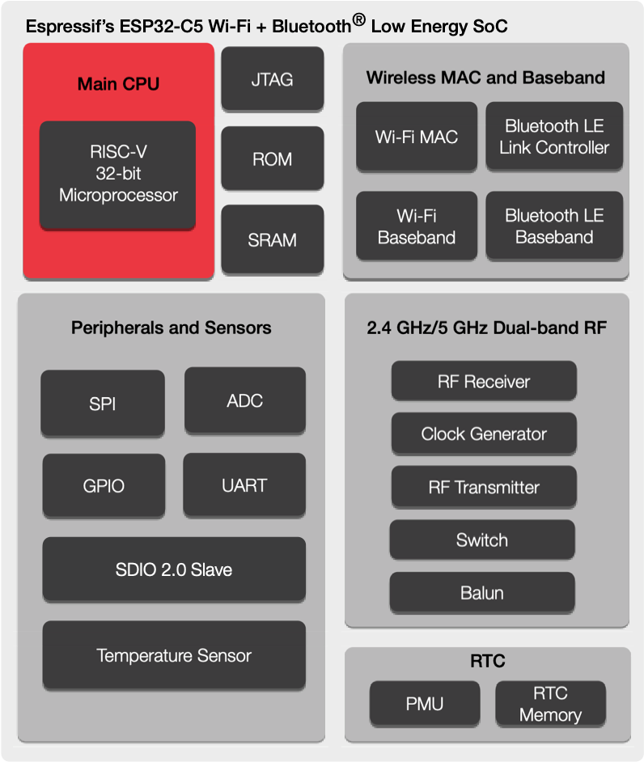

.. _esp32c5:

ESP32C5
================

* `espressif <https://www.espressif.com/>`_ : ``RISC-V`` ``240MHz`` ``Wi-Fi`` ``1024-QAM``
* `Tags <https://github.com/SoCXin/ESP32C5>`_ : :ref:`wifi6` / :ref:`ble` / :ref:`riscv`

.. contents::
    :local:
    :depth: 1

Xin简介
-----------

规格参数
~~~~~~~~~~~

提供了对 2.4&5 GHz 双频 Wi-Fi 6 (802.11ax) 的支持，并向下兼容 802.11b/g/n。为优化和提升物联网设备性能，ESP32-C5 能够实现对 802.11ax 20 MHz 带宽，以及对 802.11b/g/n 20/40 MHz 带宽的支持。

基本参数
^^^^^^^^^^^

* 发布时间：2022年6月
* 参考价格：
* 制程工艺：
* 供货周期：
* 处理性能：
* 封装规格：
* 运行环境：-40°C to 105°C
* RAM容量：400 KB
* ROM容量：384 KB
* Flash容量：2/4 MB

特征参数
^^^^^^^^^^^

* 240 MHz :ref:`riscv`
* 802.11ax 20 MHz，802.11b/g/n 20/40 MHz

芯片架构
~~~~~~~~~~~

电源参数
^^^^^^^^^^^

* 供电电压：2.3 to 3.6 V
* 功耗范围：

安全特性
~~~~~~~~~~~~~~

ECC 模块
^^^^^^^^^^^^^^^

SHA 模块
^^^^^^^^^^^^^^^

Xin选择
-----------

.. contents::
    :local:

品牌对比
~~~~~~~~~

型号对比
~~~~~~~~~

版本对比
~~~~~~~~~

