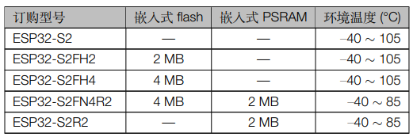

.. _esp32s2:

ESP32S2
================

`GitHub <https://github.com/SoCXin/ESP32-S2>`_ : ``Xtensa LX7`` ``240 MHz`` ``Wi-Fi`` ``USB1.1 OTG`` ``ULP`` ``Touch`` ``DVP`` ``DAC`` ``QFN56``

.. contents::
    :local:

Xin简介
-----------

`EEMBC CoreMark 472.81 (240 x 1.97CoreMark/MHz) <https://www.eembc.org/viewer/?benchmark_seq=13418>`_

.. image:: ./images/ESP32S2.png
    :target: https://docs.espressif.com/projects/esp-idf/zh_CN/latest/esp32s2/get-started/index.html

`datasheet <https://www.espressif.com/sites/default/files/documentation/esp32-s2_datasheet_cn.pdf>`_

规格参数
~~~~~~~~~~~

.. list-table::
    :header-rows:  1

    * - :ref:`esp32s2`
      - GPIO
      - UART
      - SPI
      - I2C
      - I2S
      - PWM
      - ADC
      - DAC
      - :ref:`esp_usb`
      - :ref:`esp32s2_wifi`
    * - :ref:`esp_qfn56`
      - 43
      - 2
      - 4
      - 2
      - 1
      - 8
      - 20ch(12b)
      - 2ch(8b)
      - 1.1(OTG)
      - 150Mbps

基本信息
^^^^^^^^^^^

* 发布时间：2019年7月22日
* 参考价格：$1.32
* 制程工艺：:ref:`tsmc_40nm`
* 供货周期：至2032年
* 处理性能：613.8 :ref:`CoreMark` , :ref:`level4`
* 运行环境：-40°C to 105°C
* 封装规格：:ref:`esp_qfn56` (7x7mm)
* RAM容量：320 KB (PSRAM ≤ 2MB)
* ROM容量：128 KB
* Flash容量：0/2/4 MB (≤1GB)

特征参数
^^^^^^^^^^^

* 240 MHz :ref:`xtensa_lx7`
* PicoRV32 :ref:`esp32s2_ulp` 8 KB SRAM
* :ref:`esp32s2_wifi`
* :ref:`esp_usb`
* :ref:`esp32_can`
* 4 Kbit eFuse
* 1× 16bit DVP, 1× 8bit LCD
* 2x 13bit SAR ADC
* 2x 8bit DAC
* 2× UART
* 43× GPIO

.. warning::
    ESP32-S2 为单核WiFi MCU， ``不支持蓝牙``，支持TOF，并且配置有8bit DAC，软件开始增加RainMaker支持

芯片架构
~~~~~~~~~~~

电源参数
^^^^^^^^^^^

* 电压范围：2.3 to 3.6 V
* 功耗范围：

.. _esp32s2_ulp:

ULP
^^^^^^^^^^^^^^
``RISC-V`` ``PicoRV32`` ``FSM`` ``8KB SRAM`` ``17.5MHz``

电源管理单元，五种功耗模式，超低功耗协处理器 (ULP)：

* ULP-RISC-V 协处理器
* ULP-FSM 协处理器

连接能力
~~~~~~~~~~~~~~

.. _esp32s2_throughput:

Throughput
^^^^^^^^^^^^^^^

.. _esp32s2_wifi:

WiFi
^^^^^^^^^^^^^^^
``802.11b/g/n`` ``21dBm`` ``150Mbps`` ``HT40``

在 2.4 GHz 频带支持 20 MHz 和 40 MHz 频宽，支持 1T1R 模式，数据速率高达 150 Mbps

* 天线分集
* 802.11 mc FTM
* 支持外部功率放大器

.. _esp_usb:

USB
^^^^^^^^^^^^^^
``USB 1.1 OTG`` ``<12Mbps``

安全特性
~~~~~~~~~~~~~~

内置安全硬件，4096 bit OTP，硬件加密加速器可支持 AES-128/256、Hash、RSA、HMAC，RNG

.. contents::
    :local:

RSA 模块
^^^^^^^^^^^^^^^
``RSA-4096``

AES 模块
^^^^^^^^^^^^^^^
``XTS-AES-128`` ``XTS-AES-256``

基于 AES-128-XTS 算法的 flash 加密方案，确保应用程序与配置数据在 flash 中保持加密状态。
flash 控制器支持执行加密的应用程序固件，这不仅为存储在 flash 中的敏感数据提供了必要保护，还防止了运行时由于固件更改造成的 TOCTTOU (time-of-check-to-time-of-use) 攻击。

数字签名
^^^^^^^^^^^^^^^

可以通过固件不可访问的私钥生成数字签名。同样地，其 HMAC 外设也可以生成固件不可访问的加密摘要。
目前，大多数物联网云服务使用基于 X.509 证书的身份验证，数字签名外设保护了定义设备身份的私钥。这样一来，即使出现软件漏洞，它也能为设备身份提供强大的保护

Xin选择
-----------

.. contents::
    :local:

品牌对比
~~~~~~~~~~~~

无线通信
^^^^^^^^^^^^

.. list-table::
    :header-rows:  1

    * - :ref:`wifi`
      - :ref:`architecture`
      - :ref:`CoreMark`
      - SRAM/ROM
      - Wireless
      - UART/SPI/SDIO
      - Package
    * - :ref:`esp32s2`
      - :ref:`xtensa_lx7`
      - 613.8
      - 320K/128K
      - WiFi(150Mbps)
      - 2/4/0
      - :ref:`esp_qfn56`
    * - :ref:`hi3861`
      - :ref:`riscv`
      -
      - 352KB/288KB
      - WiFi(72Mbps)
      - 3/2/1
      - QFN32
    * - :ref:`w800`
      - :ref:`xt804`
      -
      - 288KB/2MB
      -
      - 6/2/1
      - QFN32

通用控制
^^^^^^^^^^^^
``MCU`` ``USB`` ``CAN`` ``DAC`` ``GPIO=43``

.. list-table::
    :header-rows:  1

    * - :ref:`espressif`
      - :ref:`architecture`
      - :ref:`CoreMark`
      - SRAM/ROM
      - USB
      - DAC
      - SDIO
      - Package
    * - :ref:`esp32s2`
      - :ref:`xtensa_lx7`
      - 613.8
      - 320K/128K
      - FS
      - 8bit
      - 0
      - :ref:`esp_qfn56`
    * - :ref:`w806`
      - :ref:`xt804`
      -
      - 288K/20K
      - 0
      -
      - 1
      - QFN56
    * - :ref:`stm32f407`
      - :ref:`cortex_m4`
      - 566
      - 192K/512K
      - HS+FS
      - 12bit
      - 1
      - LQFP100
    * - :ref:`at32f403`
      - :ref:`cortex_m4`
      -
      - 224K/512K
      - FS
      - 12bit
      - 2
      - 48/64/100

.. note::
    :ref:`esp32s2` 定位MCU，就计算性能而言 :ref:`esp32s2` 的 613.8 :ref:`CoreMark` 略高于 :ref:`stm32f429` 的 608 :ref:`CoreMark`

型号对比
~~~~~~~~~~~~

.. list-table::
    :header-rows:  1

    * - :ref:`espressif`
      - :ref:`esp_core`
      - :ref:`CoreMark`
      - SRAM/ROM
      - Wireless
      - DAC/PWM
      - :ref:`esp32_eth`/:ref:`esp_usb`/:ref:`esp32_can`
      - Package
    * - :ref:`esp32s2`
      - :ref:`xtensa_lx7`
      - 613.8
      - 320K/128K
      - WiFi
      - 2(8bit)/8
      - 1.1OTG+CAN
      - :ref:`esp_qfn56`
    * - :ref:`esp32`
      - :ref:`xtensa_lx6`
      - 994.26
      - 520K/448K
      - WiFi+BLE
      - 2(8bit)/18
      - ETH(mac)+CAN
      - :ref:`esp_qfn48`

    * - :ref:`esp32s3`
      - :ref:`xtensa_lx7`
      - 1181.6
      - 512K/384K
      - WiFi+BLE
      - 0/10
      - 1.1OTG+CAN
      - :ref:`esp_qfn56`
    * - :ref:`esp32c3`
      - :ref:`esp_rv32`
      - 407.22
      - 400K/384K
      - WiFi+BLE
      - 0/6
      - CAN
      - :ref:`esp_qfn32`

`芯片系列对比 <https://docs.espressif.com/projects/esp-idf/zh_CN/latest/esp32s3/hw-reference/chip-series-comparison.html>`_

.. hint::
    :ref:`esp32s2` 在 :ref:`esp32` 基础上移除了蓝牙增加了USB OTG， :ref:`xtensa_lx7` 单核相较 :ref:`esp32s3` 有保留DAC

版本对比
~~~~~~~~~

Xin应用
-----------

.. contents::
    :local:

开发板
~~~~~~~~~~

.. image:: ./images/B_ESP32S2.jpg
    :target: https://item.taobao.com/item.htm?spm=a1z09.2.0.0.4cb32e8dCPqAi3&id=641754177657&_u=vgas3eue654

开发框架
~~~~~~~~~~

ESP-IDF
^^^^^^^^^^^^
``IDF ≥ v4.2``

:ref:`esp_idf` 从v4.2版本后开始支持 :ref:`esp32s2` ，使用时优选仓库 `esp-idf(v4.4) <https://github.com/espressif/esp-idf/tree/release/v4.4>`_ ，集成众多功能组件，由官方提供支持保证，是商业化应用开发最好选择。

Arduino
^^^^^^^^^^^^

:ref:`esp_arduino` 提供低门槛开发环境，现已支持Arduino IDE2.0

PlatformIO
^^^^^^^^^^^^

:ref:`pio` 提供便捷的开发环境，在此基础上升级的 :ref:`qio` 针对该平台单独优化，提供更全面的资源整合框架 `P512 <https://docs.os-q.com/P512>`_

应用方案
~~~~~~~~~~

.. _esp_usb_cam:

USB Camera
^^^^^^^^^^^^

在乐鑫开源的 `esp-iot-solution <https://github.com/espressif/esp-iot-solution/tree/usb/add_usb_solutions/examples/usb/host>`_ 有提供相应的USB应用方案，其中的USB Host方案包括：

* usb_camera_lcd_display
* usb_camera_sd_card
* usb_camera_wifi_transfer
* usb_cdc_4g_module

.. _esp_usb_pd:

USB PD
^^^^^^^^^^^^

:ref:`usb_pd` (USB Power Delivery)功率传输协议，通过USB线缆提供高效的能源传输方式，是当下USB应用非常值得探索的实践。

内置12位ADC可以监控USB TYEP-C接口的CC线，精确测量CC线上的压差，实现USB连接、拔除、传输方向的检测判断。

DAC可输出控制

`tinyusb <https://github.com/hathach/tinyusb>`_ 被整合在 :ref:`esp_idf` 项目组件中

.. code-block:: bash

    int main(void)
    {

    }

Xin总结
-------------

.. contents::
    :local:

能力构建
~~~~~~~~~~~~~

问题整理
~~~~~~~~~~~~~

应用总结
~~~~~~~~~~~~~

:ref:`esp32s2` 的市场定位为MCU，在当下的市场竞争中存在一定的短板，就低端应用的性价比而言，资源和接受度不及 :ref:`esp8266`

与 :ref:`esp32`、:ref:`esp32s3` 相比配置没有太多亮点，但因为和这两者生态兼容，可以作为这两者的一种补充型号。
