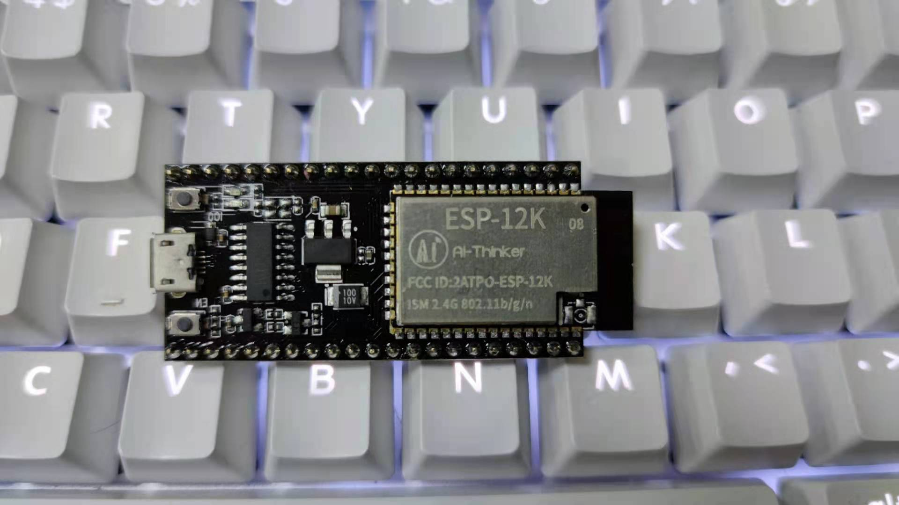

.. _esp32s2:

ESP32-S2
================

* 关键词：``Xtensa LX7`` ``240MHz`` ``QFN48`` ``Wi-Fi`` ``USB OTG`` ``ULP``
* 资源池：`GitHub <https://github.com/SoCXin/ESP32-S2>`_

.. contents::
    :local:

Xin简介
-----------

.. image:: ./images/ESP32S2.png
    :target: https://www.espressif.com/zh-hans/products/socs/ESP32-S2

关键特性
~~~~~~~~~~~~~

* 320 KB SRAM，128 KB ROM，16 KB RTC
* 1 GB external flash
* Wi-Fi IEEE 802.11b/g/n，HT40 150 Mbps
* USB OTG
* 2 × UART
* 43 × GPIO

.. warning::
    ESP32-S2为单核WiFi MCU，没有蓝牙

安全特性
~~~~~~~~~~~~~~

内置安全硬件

Xin选择
-----------

.. contents::
    :local:

.. hint::
    :ref:`esp32s2` 发布于2019年，在:ref:`esp32` 基础上移除了蓝牙，增加了USB OTG，Xtensa LX7单核

编译工具
~~~~~~~~~

开发框架
~~~~~~~~~

ESP-IDF
^^^^^^^^^^

Arduino
^^^^^^^^^^

Xin应用
--------------

.. contents::
    :local:

tinyUSB
~~~~~~~~~~

.. code-block:: bash

    int main(void)
    {

    }

开源方案
~~~~~~~~~

* `ESP-IDF <https://github.com/espressif/esp-idf>`_
* `arduino-esp32 <https://github.com/espressif/arduino-esp32/>`_

Xin总结
--------------

重点提示
~~~~~~~~~~~~~~

问题整理
~~~~~~~~~~~~~

esp32s2现在的外部ram无法使用，模块出的psram纯属摆设，现在sdk还没修复，估计这个是硬件bug。
