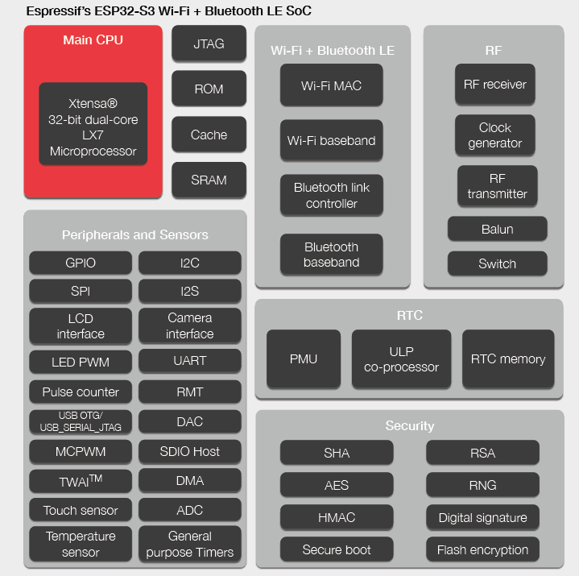
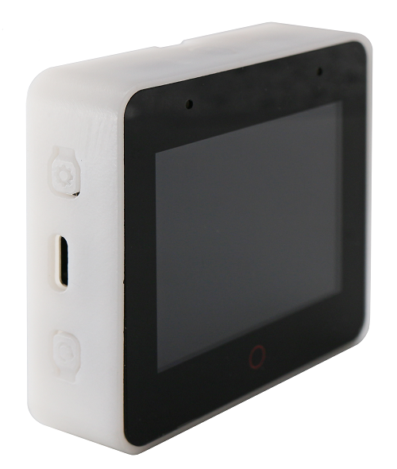
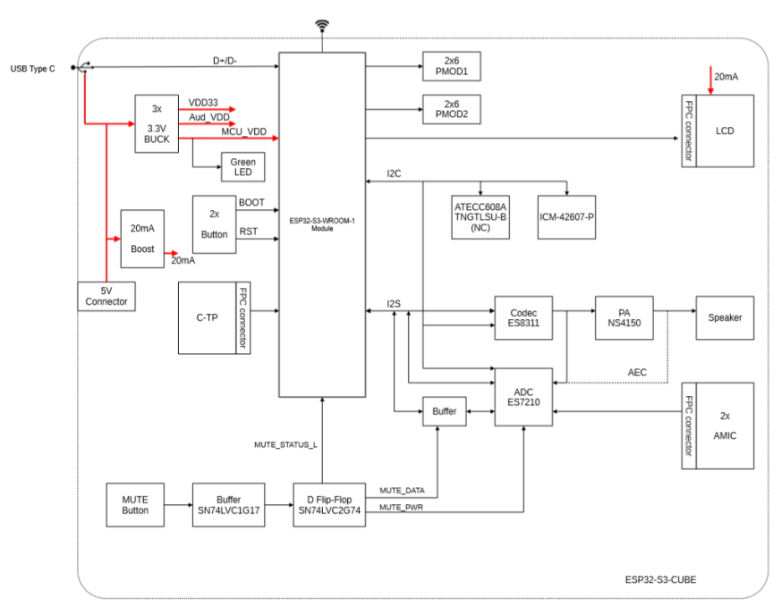

.. _NO_015:
.. _esp32s3:

ESP32S3
================

* 关键词：``Xtensa LX7`` ``Dual Core`` ``240MHz`` ``WiFi`` ``BLE5.0`` ``USB OTG`` ``TWAI`` ``QFN56``
* 代码库：`GitHub <https://github.com/SoCXin/ESP32S3>`_ , `IDF指南 <https://docs.espressif.com/projects/esp-idf/zh_CN/latest/esp32s3/get-started/index.html>`_

.. contents::
    :local:

Xin简介
-----------

.. contents::
    :local:

规格参数
~~~~~~~~~~~

ESP32-S3作为乐鑫现役旗舰产品，双核240MHz配置高于传统MCU，基于wireless连接能力实现对传统MCU的降维打击。

* 芯片大小 (die size)：:ref:`esp32c3` < :ref:`esp32s2` < :ref:`esp32s3` < :ref:`esp32`

基本参数
^^^^^^^^^^^

* 发布时间：2020年12月31日
* 发布价格：
* 制程工艺：40 nm
* 供货周期：
* 处理性能：613.8 :ref:`CoreMark`, 1181.6 :ref:`CoreMark` (Dual)
* RAM容量：512 KB (TCM)
* Flash容量：384 KB

限定参数
^^^^^^^^^^^

* 电压范围：2.3 to 3.6 V
* 功耗范围：
* 温度范围：-40°C to 105°C
* 封装规格：:ref:`esp_qfn56`

特征参数
^^^^^^^^^^^

* 240 MHz :ref:`esp_lx7` Dual Core
* :ref:`esp_ulp`
* :ref:`esp_wifi` + :ref:`esp_ble`
* :ref:`esp_usb`
* :ref:`esp_can`
* 4 Kbit eFuse
* 1 × 16bit DVP, 1 × 16bit LCD
* 2 × SDIO 主机
* 44 x GPIO，JTAG 接口
* 2x 12bit 100KSPS ADC (20ch)

.. note::
    ESP32-S3增加了用于加速神经网络计算和信号处理等工作的向量指令 (vector instructions)

计算性能
~~~~~~~~~~~~~~

.. _esp_pie:

PIE
^^^^^^^^^^^^^^^

为了提高特定 AI 和 DSP (Digital Signal Processing) 算法的运算效率，ESP32-S3 中新增了一组扩展指令。处理器指令拓展 (PIE) 支持以下特性：

* 新增 128-bit 位宽通用寄存器
* 128-bit 位宽的向量数据操作，包括：乘法、加法、减法、累加、移位、比较等
* 合并数据处理指令与加载/存储运算指令
* 非对齐 128-bit 带宽的向量数据
* 取饱和操作

安全特性
~~~~~~~~~~~~~~

内置安全硬件，4096 bit OTP，硬件加密加速器可支持 AES-128/256、Hash、RSA、HMAC，RNG

.. contents::
    :local:

RSA 模块
^^^^^^^^^^^^^^^

基于 RSA-3072 的标准身份验证方案，确保在设备上运行受信任的应用程序。该功能可阻止设备运行烧录在 flash 中的恶意程序。
安全启动需要快速高效地进行，以满足即时启动设备（如球泡灯）的需求，ESP32-C3 的安全启动方案仅在设备启动过程中增加了不到 100 ms 的时间开销。

AES 模块
^^^^^^^^^^^^^^^

基于 AES-128-XTS 算法的 flash 加密方案，确保应用程序与配置数据在 flash 中保持加密状态。
flash 控制器支持执行加密的应用程序固件，这不仅为存储在 flash 中的敏感数据提供了必要保护，还防止了运行时由于固件更改造成的 TOCTTOU (time-of-check-to-time-of-use) 攻击。

TEE 模块
^^^^^^^^^^^^^^^

世界控制器模块提供了两个互不干扰的执行环境。根据配置，世界控制器使用可信执行环境 (TEE) 或权限分离机制。
如果应用程序固件需要处理敏感的安全数据（如 DRM 服务），则可以利用世界控制器模块，在安全区域处理数据。

数字签名
^^^^^^^^^^^^^^^

可以通过固件不可访问的私钥生成数字签名。同样地，其 HMAC 外设也可以生成固件不可访问的加密摘要。
目前，大多数物联网云服务使用基于 X.509 证书的身份验证，数字签名外设保护了定义设备身份的私钥。这样一来，即使出现软件漏洞，它也能为设备身份提供强大的保护

.. note::
    硬件安全单元十分利于物联网产品设计，特别是对加密算法的支持，在嵌入式领域配置如此多的安全外设，也是十分强大的

Xin选择
-----------

.. contents::
    :local:

品牌对比
~~~~~~~~~

.. list-table::
    :header-rows:  1

    * - :ref:`list`
      - Performance
      - SRAM/ROM
      - Characteristics
      - UART/SPI/SDIO
      - Package
    * - :ref:`esp32s3`
      - 1181 :ref:`CoreMark`
      - 512KB/384KB
      - USB FS OTG
      - 3/2/1
      - :ref:`esp_qfn56`
    * - :ref:`w801`
      - 300 :ref:`DMIPS`
      - 288KB/2MB
      - 16-bit ADC
      - 6/2/1
      - QFN56

对比W801
^^^^^^^^^^^

两者的封装规格相同，主频配置基本相同，差异主要在： :ref:`esp32s3` 是双核带有USB，  :ref:`w801` 拥有更多外设数量

型号对比
~~~~~~~~~

.. list-table::
    :header-rows:  1

    * - :ref:`list`
      - Core
      - DMIPS
      - RAM
      - WiFi
      - BLE
      - USB
      - MAC
    * - :ref:`esp32`
      - :ref:`xtensa_lx6`
      - 600 DMIPS
      - 520 KB
      - b/g/n
      - BLE v4.2
      - X
      - 100M
    * - :ref:`esp32s2`
      - :ref:`xtensa_lx7`
      - 300 DMIPS
      - 520 KB
      - b/g/n
      - BLE v5.0
      - X
      - X
    * - :ref:`esp32s3`
      - :ref:`xtensa_lx7`
      - 600 DMIPS
      - 512 KB
      - b/g/n
      - BLE v5.0
      - USB1.1 OTG
      - X

`芯片系列对比 <https://docs.espressif.com/projects/esp-idf/zh_CN/latest/esp32s3/hw-reference/chip-series-comparison.html>`_

版本对比
~~~~~~~~~

Xin应用
--------------

.. contents::
    :local:

硬件平台
~~~~~~~~~

ESP-S3-EYE
^^^^^^^^^^^^^^^^

ESP32-S3-BOX
^^^^^^^^^^^^^^^^

除了智能语音助手以外，还集触摸屏控制、传感器、红外控制器和智能网关等多功能于一体，拥有完善的 SDK 和丰富的例程。

开发框架
~~~~~~~~~

ESP-WHO
^^^^^^^^^^^

.. image:: https://github.com/espressif/esp-who/blob/master/img/architecture_en.drawio.svg
    :target: https://github.com/espressif/esp-who

.. _esp_skainet:

ESP-Skainet
^^^^^^^^^^^^^^

``WakeNet``

`ESP-Skainet <https://github.com/espressif/esp-skainet>`_ 是乐鑫针对语音控制设备推出的智能语音助手。
它不依赖云连接，可以完全实现离线运行，在本地乐鑫 SoC 上即可进行唤醒词检测和语音命令词（短语）识别。
ESP-Skainet 集成多种声学算法，如语音活动检测、声学回声消除、降噪和波束成形等，提供了增强的声学性能。

Xin总结
--------------

.. contents::
    :local:

能力构建
~~~~~~~~~~~~~

.. note::
    相对传统的MCU使用的强大IDE环境，最大的槽点就是缺乏高度集成的工具环境，ESP-IDF的编译效率较低，文件修改后编译非常耗时

要点提示
~~~~~~~~~~~~~

问题整理
~~~~~~~~~~~~~

