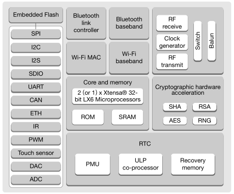
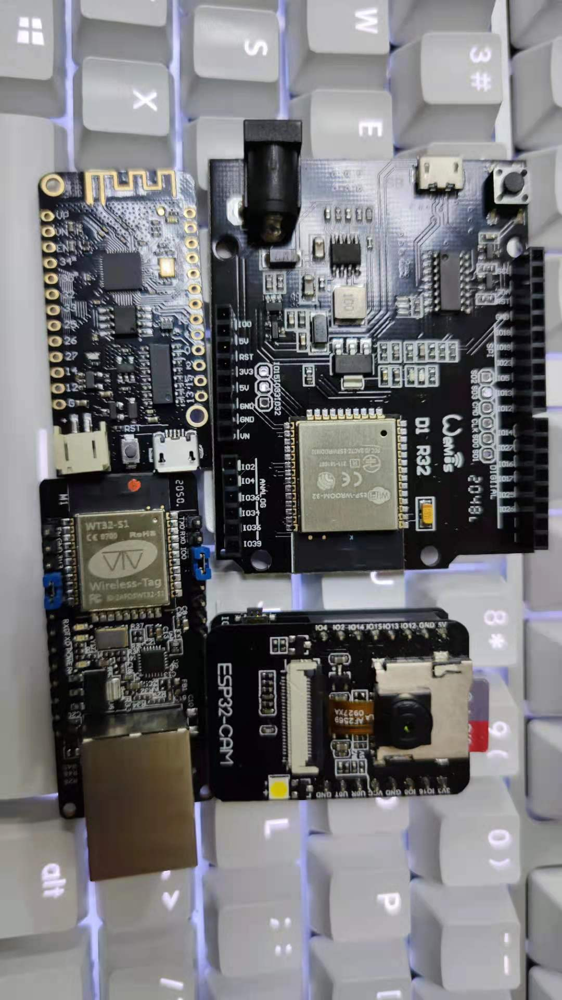

.. _espressif_esp32:

ESP32
===============

:ref:`espressif` :ref:`cortex_m4` Dual Core SoC，资源仓库 `GitHub <https://github.com/SoCXin/ESP32>`_

.. contents:: 目录索引
    :local:

Xin推荐
-----------

性能：``240MHz`` 、``600DMIPS``

内嵌了数学运算加速器，具有丰富的内置数模外设，运放、比较器、DA、AD等，硬件加密使用的是AES-256，带有双安全存储区域。G4系列典型应用之一正是电机控制。

``关键特性``
~~~~~~~~~~~~~~

* Xtensa® LX6 240 MHz,40nm, 600 MIPS（ESP32-S0WD 200 MIPS，ESP32-D2WD 400 MIPS）
* 520 KB SRAM (TCM)，448 KB ROM
* 1T1R 802.11 b/g/n WiFi，802.11n速度可达 150 Mbps
* BLE v4.2 +12 dBm，–97dBm
* 3 x UART
* CAN
* Host SD/eMMC/SDIO
* Slave SDIO/SPI
* IEEE 1588 MAC
* 硬件加密单元： AES/RSA/ECC
* 霍尔传感器

Xin对比
-----------

竞品分析
~~~~~~~~~

型号对比
~~~~~~~~~

Xin实践
-----------

开发工具
~~~~~~~~~~~

源圈OS-Q通过先验证的方式，集成了更多可信赖资源 `PlatformIO STM32G4 Enhanced <https://github.com/OS-Q/P511>`_ 可以作为一个启动模板，作为一个开源编译体系便于多系统下开发。

示例代码
~~~~~~~~~~~

1. 基于STM32CubeMX生成HAL库工程

.. code-block:: bash

    uint8_t RxData;     //中断接收串口1数据
    void HAL_UART_RxCpltCallback(UART_HandleTypeDef *huart)
    {
        if(&huart1 == huart) {
            HAL_UART_Receive_IT(huart, &RxData, 1);
        }
    }

    void HAL_TIM_PeriodElapsedCallback(TIM_HandleTypeDef *htim)
    {
        if(htim==(&htim17)) //定时器中断函数
        {
            g_run_tick++;
        }
    }

    int main(void)
    {
        /* USER CODE BEGIN 2 */
        HAL_UART_Receive_IT(&huart1, &RxData, 1);   //中断接收使能
        HAL_TIM_PWM_Start(&htim16,TIM_CHANNEL_1);   //PWM输出使能
        HAL_TIM_Base_Start_IT(&htim17);             //定时器使能
        /* USER CODE END 2 */
        while (1)
        {
            /* USER CODE BEGIN 3 */
            HAL_GPIO_TogglePin(LED_GPIO_Port, LED_Pin);
            HAL_Delay(500);
        }
        /* USER CODE END 3 */
    }

开源项目
~~~~~~~~~

如果你要探索一些开源项目，可能时常遇到基于 `PlatformIO <https://platformio.org/platforms/ststm32>`_ 构建的工程，通过跨平台编译，直接在编辑器中集成，可以云端部署，比常用的IDE拥有更多的灵活性。

* `ESP-IDF <https://github.com/espressif/esp-idf>`_

Xin总结
--------------

``重点提示``
~~~~~~~~~~~~~

``使用槽点``
~~~~~~~~~~~~~

