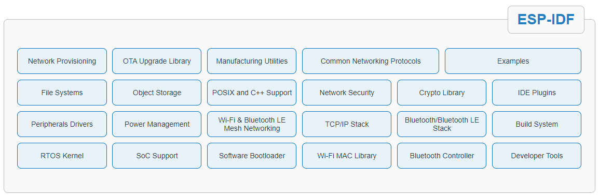
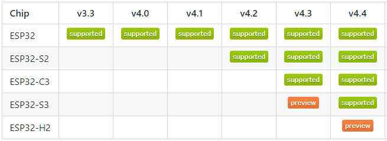
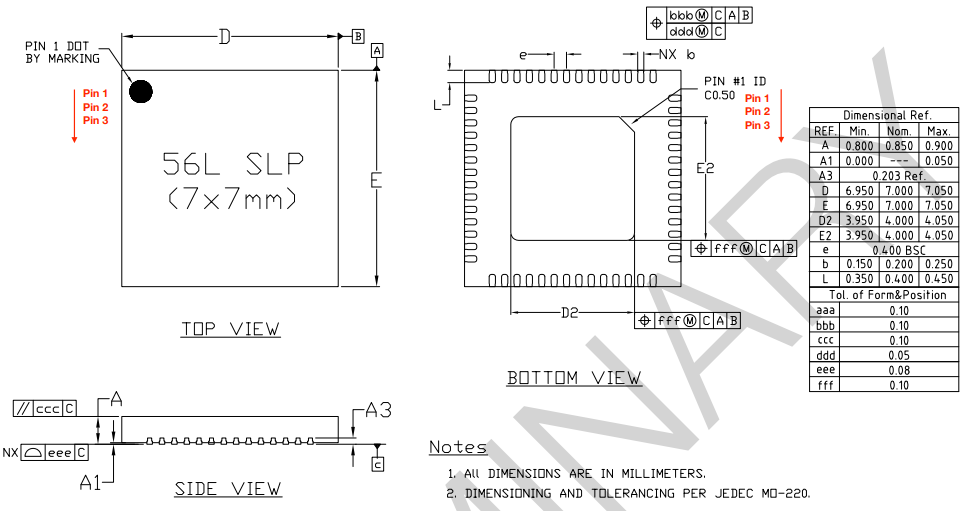
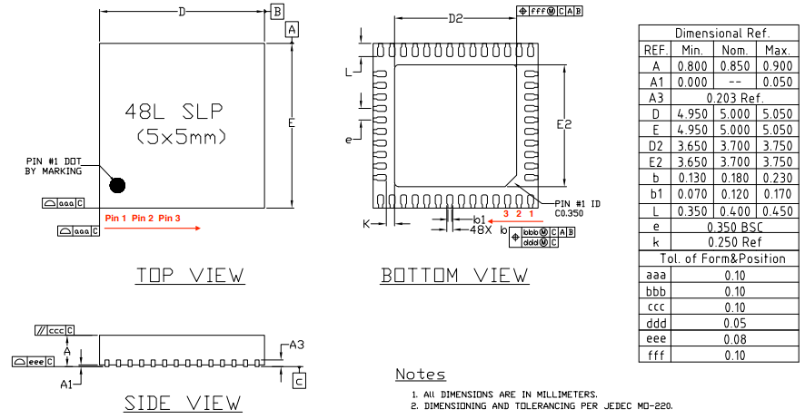
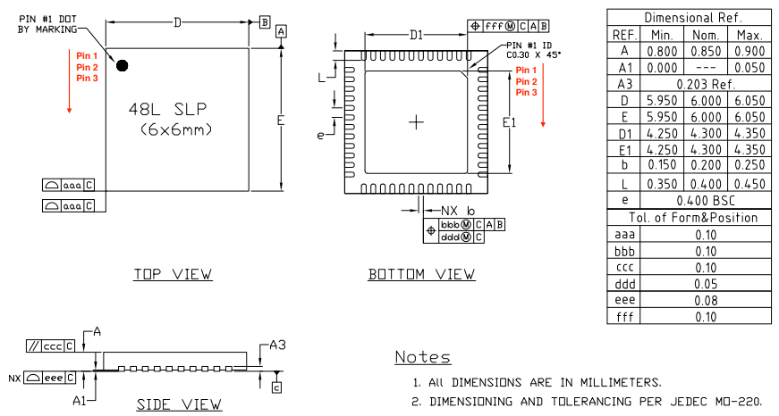

.. _espressif:

Espressif
==============

``Xtensa-LX7`` ``Xtensa-LX6`` ``RISC-V`` ``WiFi`` ``BT/BLE``  ``ESP32`` ``ESP8266`` ``Arduino``

公司简介
-----------

`乐鑫科技 <http://www.espressif.com>`_ (股票代码：688018)是一家全球化的无晶圆厂半导体公司，成立于 2008 年，总部位于中国上海张江，主营 Wi-Fi&BLE AIoT SoC及相关解决方案。

.. note::
    乐鑫伴随物联网崛起，就早期狭义的技术实现而言物联网≈ESP32/ESP8266，入门经典莫过于：STM32F103C8 & ESP8266

.. contents::
    :local:

核心优势
~~~~~~~~~~~~

乐鑫Espressif所有芯片的内核架构都基于非Arm方案，并且从工具链到开发框架都走自己特色之路，所以在资源整合和解决方案方面投入更加积极，在一定程度上规避了生态短板，直接通过方案输出的方式赋能下游。

所以选择Espressif的核心优势在于：软硬件生态垂直整合赋能，通过芯片设计获得安全边界，通过硬件形态多样化和应用案例多样化促进市场推广，上游厂商多投入，可以降低用户开发应用成本，甚至可以达到研发资源共享，特别是基于Arm和RISC-V方案无法形成有效解决方案联盟前，单厂商的垂直整合资源的方案效率更高。

技术路线
~~~~~~~~~~~~

相较于现下国产芯片厂商硬件思维不同，乐鑫更愿意通过软件方案实现切入到足够细分的领域，所以在芯片设计上偏向于通用性，在软件开发上扩展更多可能性。

相关思考
~~~~~~~~~~~~

乐鑫并没有基于Arm内核，也没有IDE开发厂商，开发所依赖资源碎片化且变化更新快，导致使用时同步学习成本高(下游工程师的噩梦)，而对于用量大的产品或大客户，往往都需要相对稳定和确定；

乐鑫Espressif相对其他MCU厂商而言，更积极开源，也拥有大量的开源学习资源，但是这些资源的商业产业化价值有限(大部分是Arduino)，独家芯片的强绑定关系和与Cortex内核不兼容的生态，难以给予客户安全感；

乐鑫成名作品ESP8266基于非典型MIPS架构LX106内核，开发依赖资源和开发模式上和传统MCU是有区别的，凭借完全开源的策略，让开发者获得了无与伦比的自由度，从而在开源社区积累了大量的拥趸，但这些方案并没有随着乐鑫的产品更新脚步同步到新产品上，导致继任者如ESP32-C3、ESP32-S3并没有获得同样的吸引力。

随着更多厂商拥抱开源，且更有市场针对性的产品设计（乐鑫产品设计策略和应用开发策略偏向于大一统），将分流走很多客户和开发者。

产品简介
-----------

.. list-table::
    :header-rows:  1

    * - :ref:`espressif`
      - Architecture
      - :ref:`CoreMark`
      - SRAM/ROM
      - WiFi / BLE
      - :ref:`esp_usb`/ :ref:`esp_can`
      - UART/SPI/I2C
      - More
    * - :ref:`esp32`
      - :ref:`xtensa_lx6`
      - 994.2
      - 520KB/448KB
      - HT40 / 4.2
      - X / √
      - 3/4/2
      - :ref:`ethernet`
    * - :ref:`esp32s2`
      - :ref:`xtensa_lx7`
      - 613.8
      - 320KB/128KB
      - HT40 / X
      - OTG / X
      - 2/4/2
      - 
    * - :ref:`esp32s3`
      - :ref:`xtensa_lx7`
      - 1181.6
      - 512KB/384KB
      - HT40 / 5.0
      - OTG / √
      - 3/4/2
      - 
    * - :ref:`esp32c3`
      - :ref:`esp_rv32`
      - 407.2
      - 400KB/384KB
      - HT40 / 5.0
      - X / √
      - 2/3/1
      - 
    * - :ref:`esp32c2`
      - :ref:`esp_rv32`
      -
      - 272KB/576KB
      - √ / 5.0
      - X / X
      - 2/3/1
      -
    * - :ref:`esp32h2`
      - :ref:`esp_rv32`
      -
      - 400KB/384KB
      - X / 5.0
      - X / X
      - 3/4/2
      - Matter

.. note::
    在中国的MCU芯片市场，目前有两家具有对比性的厂商： :ref:`espressif` 和 :ref:`wch` ，在产品附加值上就是前者更注重软件生态反哺，后者注重硬件差异覆盖协同。

高性能路线
~~~~~~~~~~~~

这一分类下，主要是多核产品，更多围绕AIoT战略，凭借丰富的软件生态资源实现向上突破。

.. toctree::
    :maxdepth: 1

    ESP32 <ESP32>
    ESP32S3 <ESP32-S3>

.. note::
    就目前已有的软硬件生态资源而言，:ref:`esp32` 依然占据较大的优势，主要在于ESP32-S3任然是以降本为核心，芯片的性能相对提升了了，而升级力度不够导致庞大的开源生态没有足够动力去做适配，离开丰富的开源生态导致开发成本提高。

性价比路线
~~~~~~~~~~~~

.. toctree::
    :maxdepth: 1

    ESP32C3 <ESP32-C3>
    ESP32C2 <ESP32-C2>

新领域探索
~~~~~~~~~~~~

.. toctree::
    :maxdepth: 1

    ESP32S2(USB-OTG) <ESP32-S2>
    ESP32H2 (802.15.4) <ESP32-H2>

技术简介
-----------

.. contents::
    :local:

.. _esp_core:

内核架构
~~~~~~~~~~~~

.. contents::
    :local:

.. _esp_lx6:

Xtensa LX6
^^^^^^^^^^^^^^

``MIPS`` ``Xtensa LX6``

基于 :ref:`xtensa_lx6` MIPS内核

.. _esp_lx7:

Xtensa LX7
^^^^^^^^^^^^^^

``MIPS`` ``Xtensa LX7``

基于 :ref:`xtensa_lx7` MIPS内核，五级流水线架构，支持高达 240 MHz 的时钟频率

* 16 位/24 位指令集提供高代码密度
* 32 位定制化指令集及 128 位宽数据总线，提供高运算性能
* 支持单精度浮点运算单元 (FPU)
* 支持 32 位乘法器、32 位除法器
* 非缓存 GPIO 指令
* 支持六级 32 个中断
* 支持 windowed ABI，64 个物理通用寄存器
* 支持带 TRAX 压缩模块的 trace 功能，最大 16 KB 的记录存储器 (trace memory)
* 用于调试的 JTAG 接口

.. _esp_rv32:

RISC-V
^^^^^^^^^^^^^^

.. _esp_ulp:

ULP
^^^^^^^^^^^^^^

``RISC-V`` ``8KB SRAM`` ``17.5MHz``

电源管理单元，五种功耗模式，超低功耗协处理器 (ULP)：

* ULP-RISC-V 协处理器
* ULP-FSM 协处理器

开发框架
~~~~~~~~~~~~

.. contents::
    :local:

.. _esp_arduino:

Arduino
^^^^^^^^^^^^^^

.. _esp_idf:

ESP-IDF
^^^^^^^^^^^^^^

ESP-IDF 是乐鑫官方的物联网开发框架，适用于 ESP32、ESP32-S 和 ESP32-C 系列 SoC。它基于 C/C++ 语言提供了一个自给自足的 SDK。

.. _esp_adf:

ESP-ADF
^^^^^^^^^^^^^^

`ESP-ADF <https://github.com/espressif/esp-adf>`_  用于开发各类音频应用，还提供多种语音平台的连接服务，方便用户直连云平台开发语音产品。

.. _esp_now:

ESP-NOW
^^^^^^^^^^^^^^

`ESP-NOW简介 <https://docs.espressif.com/projects/esp-idf/zh_CN/latest/esp32s3/api-reference/network/esp_now.html>`_

由乐鑫定义的 Wi-Fi 通信协议，采用 CCMP 方法保护供应商特定动作帧的安全，ESP-NOW 广泛应用于智能照明、远程控制、传感器等领域。

标准相关
~~~~~~~~~~~~

.. _esp_matter:

Matter
^^^^^^^^^^^^^^

Matter 成立于 2019 年，由连接标准联盟（Connectivity Standards Alliance，前称 Zigbee Alliance）发起并领导，旨在提高不同厂商智能家居产品间的兼容性和互操作性。

是一个统一的智能家居互联标准，能够为家庭自动化项目提供安全可靠的无线连接。

.. _esp_package:

封装规格
~~~~~~~~~~~~

.. contents::
    :local:

.. _esp_qfn56:

QFN56
^^^^^^^^^^^^^^

.. _esp_qfn48:

QFN48
^^^^^^^^^^^^^^

.. _esp_qfn32:

QFN32
^^^^^^^^^^^^^^

.. image:: ./images/ESP32C3P.png
    :target: https://www.espressif.com/sites/default/files/documentation/esp32-c3_datasheet_cn.pdf

