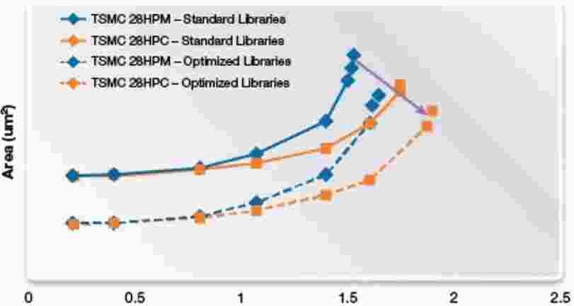

.. _foundry:

Foundry
===============

.. list-table::
    :header-rows:  1

    * - Process
      - :ref:`tsmc`
      - :ref:`samsung`
      - :ref:`gf`
      - :ref:`umc`
      - :ref:`smic`
      - :ref:`skywater`
    * - 5nm
      - 2021
      -
      -
      -
      -
      -
    * - 7nm
      -
      -
      -
      -
      -
      -
    * - 12nm
      -
      -
      -
      -
      -
      -

.. contents::
    :local:
    :depth: 1

.. _tsmc:

TSMC
-----------

`台积电 <https://www.tsmc.com>`_ 成立于1987年，总部台湾新竹，是全球第一家专业积体电路制造服务（晶圆代工foundry）企业，总部与主要工厂位于中国台湾省的新竹市科学园区。

荷兰飞利浦公司持股14%，中国台湾行政院持股12%

.. _tsmc_process:

Process
~~~~~~~~~~~
``4nm`` ``28nm`` ``40nm``

.. contents::
    :local:
    :depth: 1

.. _tsmc_n4p:

N4P
^^^^^^^^^^^
``4nm``

2021年10月26日，台积电宣布推出N4P制程工艺

.. _tsmc_28nm:

N28(28nm)
^^^^^^^^^^^
``28nm`` ``28HPC`` ``HPC+``

台积电（TSMC）28HPC/HPC+工艺相对于28LP/HP/HPL/HPM，能更好的控制全局慢速和全局快速（SSG，FFG）工艺角，因此可以提高系统级芯片（SoC）性能。

台积电28nm先后衍生出了LP、HPM、HPC、HPC+四种版本

.. _tsmc_40nm:

N40(40nm)
^^^^^^^^^^^
``40nm``

.. _tsmc_location:

Location
~~~~~~~~~~~

.. _samsung:

SAMSUNG
-----------------
``3D FinFET``

.. _gf:

GlobalFoundries
-----------------
``FinFET``

`格罗方德 <https://gf.com/>`_ 成立于2009年3月，总部纽约，由AMD拆分而来、与阿联酋阿布扎比先进技术投资公司(ATIC)和穆巴达拉发展公司(Mubadala)联合投资成立的半导体制造企业。

.. _gf_process:

Process
~~~~~~~~~~~
``12nm`` ``28nm`` ``40nm``

.. _gf_location:

Location
~~~~~~~~~~~

.. _umc:

UMC
-----------

`联华电子 <https://www.umc.com/zh-CN/Home/Index>`_ 成立于1980年，总部台湾新竹

.. _umc_process:

Process
~~~~~~~~~~~
``28nm`` ``40nm``

.. _umc_location:

Location
~~~~~~~~~~~

.. _smic:

SMIC
-----------
``中国大陆规模最大、技术水准最高、世界排名第四的晶片代工企业``

`中芯国际SMIC <https://www.smics.com/>`_ 成立于2000年(开曼群岛)，总部上海张江，是国内首个能提供28纳米先进制程技术的企业,第一代14纳米FinFET技术取得了突破性进展，并于2019年第四季度进入量产，代表了中国大陆自主研发集成电路的最先进水平。

.. contents::
    :local:
    :depth: 1

.. _smic_process:

Process
~~~~~~~~~~~
``28nm``

.. _smic_location:

Location
~~~~~~~~~~~
``上海`` ``北京`` ``天津`` ``深圳``

.. _skywater:

SkyWater
-----------

`SkyWater工厂 <https://www.skywatertechnology.com/>`_ 最初由位于明尼苏达州的Control Data Corporation（CDC）在1980年代建立。CDC晶圆厂于1991年被赛普拉斯半导体公司收购。

在赛普拉斯时代，该工厂进行了多次扩建和升级，在2000年代末一直与摩尔定律保持同步，并以位于美国的生产设施与亚洲的晶圆厂竞争而闻名。SkyWater于2017年从赛普拉斯（Cypress）拆分出来，得到了明尼苏达州Oxbow Industries的私募股权支持。

2017年从赛普拉斯半导体公司中分离出来的SkyWater收购了位于明尼苏达州布卢明顿市的赛普拉斯公司（如今的英飞凌）的工厂，开启了Foundry业务之路。

SkyWater是唯一一家美国国内的纯代工公司，因此它是美国国防部可信赖的代工计划的一部分，以在美国境内提供安全的供应来源。

2020年11月12日，Google与SkyWater和Efabless合作，实现定制ASIC的开源制造。Google赞助的开源多项目晶圆（MPW）航天飞机将接受设计提交，这些航天飞机将在SkyWater上运行。

Google 将这项计划名为 `Open MPW Shuttle Program <https://developers.google.com/silicon>`_ ，允许任何人利用开源 PDK 和其他开源 EDA 工具来提交开源集成电路设计，Google 会为他们免费制造，不会收取任何费用。

芯片制造是在SkyWater 130nm 工艺（SKY130）上完成

Process
~~~~~~~~~~~
``130nm`` ``90nm``

其业务始于130nm，而今年开始提供90nm服务。而IBM和英特尔早在2002年就开始首次生产90 nm芯片，TSMC于2004年推出直径300 mm的晶圆。但SkyWater仍在使用200毫米晶圆。

Skywater正在为D-Wave的量子计算机制造量子比特
