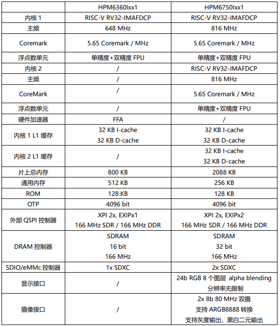
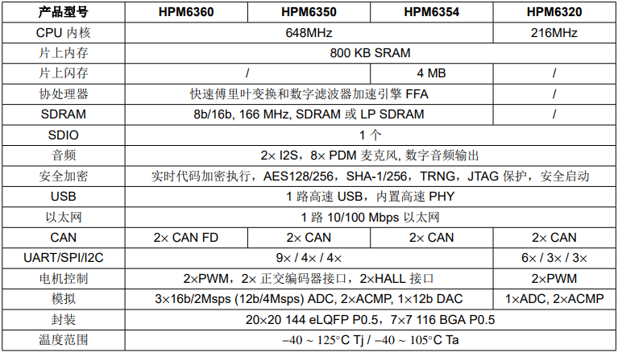

.. _hpm6350:

HPM6350
===============

`HPMicro <https://www.hpmicro.com>`_ : ``RISC-V`` ``DSP`` ``FFA`` ``3390 CoreMark @648MHz`` ``￥28``

.. image:: https://github.com/SoCXin/HPM6750/workflows/sdk/badge.svg
    :target: https://github.com/SoCXin/hpm_sdk
.. image:: https://github.com/SoCXin/HPM6750/workflows/demo/badge.svg
    :target: https://github.com/SoCXin/HPM6750

.. contents::
    :local:
    :depth: 1

Xin简介
-----------

.. contents::
    :local:

规格参数
~~~~~~~~~~~

基本参数
^^^^^^^^^^^

* 发布时间：2022年4月
* 参考价格：￥28
* 制程工艺：
* 供货周期：
* 处理性能：3390 :ref:`CoreMark`(1710 :ref:`DMIPS`) , :ref:`level5`
* 封装规格：LQFP144 / BGA116(7x7mmP0.5)
* 运行环境：-40°C to 105/125°C
* RAM容量：800KB
* Flash容量：

特征参数
^^^^^^^^^^^

* 648 MHz :ref:`andes_d45`
* 2x USB HS OTG (w/PHY)
* 10/100 Mbps :ref:`ethernet`
* 3x 16-bit ADC @2Msps
* 12-bit DAC

模拟性能
^^^^^^^^^^^

.. image:: ./images/HPM6350adc.png

芯片架构
~~~~~~~~~~~

:ref:`performance` : :ref:`cortex_m85`(6.28 Coremark/MHz) > :ref:`andes_d45` (5.65 Coremark/MHz) > :ref:`cortex_m7`(5.29 Coremark/MHz)

.. image:: ./images/HPM6350s.png
    :target: http://www.hpmicro.com/product/summary.html?id=79841baf-170a-4870-8571-cdc299987bf6

功耗参数
^^^^^^^^^^^

* 电压范围：3.0 to 3.6 V
* 功耗范围：

Xin选择
-----------

.. contents::
    :local:

品牌对比
~~~~~~~~~

型号对比
~~~~~~~~~

版本对比
~~~~~~~~~

.. _hpm6340:

HPM6340
^^^^^^^^^^^
``LQFP144`` ``1.5 uA`` ``90uA/MHz`` ``202207量产``
