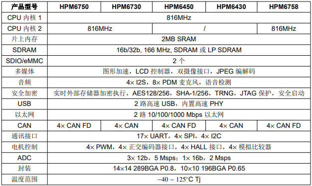

.. _hpm6750:

HPM6750
===============

`标签 <https://github.com/SoCXin/HPM6750>`_ : ``RISC-V`` ``800MHz`` ``16 bit ADC``

.. contents::
    :local:
    :depth: 1

Xin简介
-----------

.. image:: ./images/HPM6750s.png
    :target: https://www.hpmicro.com/product/summary.html?id=d7fdb78f-1fa5-43be-be08-b97b405b65f0

.. contents::
    :local:
    :depth: 1

规格参数
~~~~~~~~~~~

基本参数
^^^^^^^^^^^

* 发布时间：2022年4月
* 参考价格：￥40
* 制程工艺：
* 供货周期：
* 处理性能：9220 :ref:`CoreMark`, 4651 :ref:`DMIPS`
* 封装规格：289BGA(14×14 0.8P)/196BGA(10×10 0.65P)
* 运行环境：-40°C to 105/125°C
* RAM容量： 2088 KB
* ROM容量：
* Flash容量：

特征参数
^^^^^^^^^^^

* 816 MHz :ref:`riscv` Dual Core
* 支持多种外部存储器：QSPI/OSPI NOR Flash, PSRAM, HyperRAM/HyperFlash, 16b/32b SDRAM 166 MHz, SD卡和eMMC
* 显示设备：24位RGB LCD控制器，1366 x 768，60fps，双目摄像头，2D图形加速和JPEG编解码
* 通讯接口：2个高速USB OTG，集成PHY，2个千兆网口，4个CAN FD，17个UART，4个SPI，4个I2C
* 电机系统：4组共32路PWM输出，精度达2.5ns，4个正交编码器接口和4个霍尔传感器接口
* 模拟外设：3 个 12 位高速 ADC 5MSPS，1 个 16 位高精度 ADC2MSPS，4 个模拟比较器，多达 28 个模拟输入通道
* 安全：集成 AES-128/256, SHA-1/256 加速引擎，支持固件软件签名认证、加密启动和加密执行

芯片架构
~~~~~~~~~~~

功耗参数
^^^^^^^^^^^

* 电压范围：1.71 to 3.6 V
* 功耗范围：

Xin选择
-----------

.. contents::
    :local:

品牌对比
~~~~~~~~~

型号对比
~~~~~~~~~

版本对比
~~~~~~~~~

