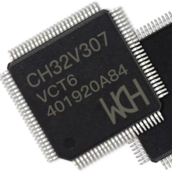
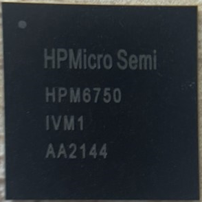
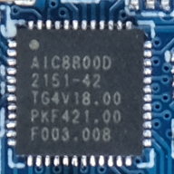
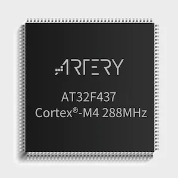
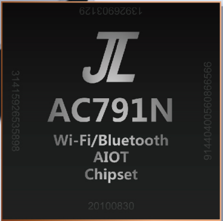

2022 Xin
-------------

==================  ==================  ==================  ==================
|January|_          |February|_         |March|_            |April|_
------------------  ------------------  ------------------  ------------------
`January`_          `February`_         `March`_            `April`_
------------------  ------------------  ------------------  ------------------
|May|_              |June|_             |July|_             |August|_
------------------  ------------------  ------------------  ------------------
`May`_              `June`_             `July`_             `August`_
------------------  ------------------  ------------------  ------------------
|September|_        |October|_          |November|_         |December|_
------------------  ------------------  ------------------  ------------------
`September`_        `October`_          `November`_         `December`_
==================  ==================  ==================  ==================

.. |January| image:: images/rp2040.png
.. _January: ../miscellaneous/RP2040.html

.. |February| image:: images/esp32c6.png
.. _February: ../espressif/ESP32-C6.html

.. _March: ../wch/CH32V307.html

.. |April| image:: images/MM32F527.png
.. _April: ../mindmotion/MM32F527.html

.. _May: ../high/HPM6750.html

.. _June: ../miscellaneous/AIC8800M.html

.. _July: ../arterytek/AT32F437.html

.. |August| image:: images/nRF7002.png
.. _August: ../nordic/nRF7002.html

.. _September: ../jieli/AC7916.html

.. |October| image:: images/BK7256.png
.. _October: ../bekencorp/BK7256.html

.. |November| image:: images/ax620a.jpg
.. _November: ../high/AX620A.html

.. |December| image:: images/bl606p.png
.. _December: ../bouffalolab/BL808.html

01-RP2040
~~~~~~~~~~~~

:ref:`rp2040`

02-ESP32C6
~~~~~~~~~~~~
``Wi-Fi6`` ``BLE`` ``Thread`` ``Matter``

:ref:`esp32c6` 支持三协议 :ref:`wifi6` , :ref:`ble` , :ref:`802_15_4`

03-CH32V307
~~~~~~~~~~~~
``RISC-V4C`` ``144MHz`` ``USB`` ``Ethernet`` ``10Mbps(PHY)`` ``BLE5.3`` ``QFN28``

:ref:`ch32v307`

04-MM32F527
~~~~~~~~~~~~~~
``STAR-MC1`` ``120MHz``

:ref:`mm32f527`

05-HPM6750
~~~~~~~~~~~~
``RISC-V`` ``816MHz`` ``Dual Core`` ``16bit ADC @2Msps``

:ref:`hpm6750` 在MCU领域的性能足以封神

06-AIC8800M
~~~~~~~~~~~~
``RISC-V`` ``Wi-Fi6`` ``BT5.0`` ``USB HS``

:ref:`aic8800`

07-AT32F437
~~~~~~~~~~~~~~
``Cortex-M4 @ 288 MHz`` ``3x5.33Msps ADC`` ``8 UART`` ``CAN`` ``USB2.0`` ``MII/RMII``

:ref:`at32f437`

08-nRF7002
~~~~~~~~~~~~
``Wi-Fi6`` ``BLE`` ``Thread`` ``Matter`` ``802.11a/b/g/n/ac/ax``

:ref:`nrf7002`

09-AC7916
~~~~~~~~~~~~~~
``RISC-V`` ``320MHz`` ``Bluetooth`` ``SDRAM`` ``QFN48``

:ref:`ac7916`

10-BK7256
~~~~~~~~~~~~~~
``Wi-Fi6`` ``BT5.0``

:ref:`bk7256`

11-AX620A
~~~~~~~~~~~~~~
``Cortex-A7`` ``Quad Core`` ``NPU 3.6Tops int8``

:ref:`ax620a`

12-BL808
~~~~~~~~~~~~~~
``bouffalolab`` ``三核异构RISC-V`` ``FreeRTOS`` ``Linux`` ``Wi-Fi`` ``BT+BLE`` ``100G NPU``

:ref:`bl808`
