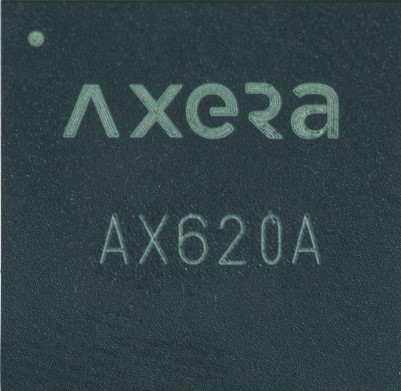

2022年度
-------------

==================  ==================  ==================  ==================
|January|_          |February|_         |March|_            |April|_
------------------  ------------------  ------------------  ------------------
`January`_          `February`_         `March`_            `April`_
------------------  ------------------  ------------------  ------------------
|May|_              |June|_             |July|_             |August|_
------------------  ------------------  ------------------  ------------------
`May`_              `June`_             `July`_             `August`_
------------------  ------------------  ------------------  ------------------
|September|_        |October|_          |November|_         |December|_
------------------  ------------------  ------------------  ------------------
`September`_        `October`_          `November`_         `December`_
==================  ==================  ==================  ==================

.. |January| image:: images/rp2040.jpg
.. _January: ../miscellaneous/RP2040.html

.. |February| image:: ../espressif/images/espressif.png
.. _February: ../miscellaneous/RP2040.html

.. |March| image:: ../espressif/images/espressif.png
.. _March: ../miscellaneous/RP2040.html

.. |April| image:: ../espressif/images/espressif.png
.. _April: ../miscellaneous/RP2040.html

.. |May| image:: ../espressif/images/espressif.png
.. _May: ../miscellaneous/RP2040.html

.. |June| image:: ../espressif/images/espressif.png
.. _June: ../miscellaneous/RP2040.html

.. |July| image:: ../espressif/images/espressif.png
.. _July: ../miscellaneous/RP2040.html

.. |August| image:: ../espressif/images/espressif.png
.. _August: ../miscellaneous/RP2040.html

.. |September| image:: ../espressif/images/espressif.png
.. _September: ../miscellaneous/RP2040.html

.. |October| image:: ../espressif/images/espressif.png
.. _October: ../miscellaneous/RP2040.html

.. |November| image:: ../espressif/images/espressif.png
.. _November: ../miscellaneous/RP2040.html

.. _December: ../high/AX620A.html

.. contents::
    :local:
    :depth: 1

01-RP2040
~~~~~~~~~~~~

:ref:`rp2040` 聚集了足够多的开发资源和使用方式，同时解决了芯片的供应和价格问题，其商用价值将大大增加，通过逐步上市的产品将进一步提高相关产品的定义基线。

02-ESP32C2
~~~~~~~~~~~~
``Wi-Fi``

:ref:`esp32c2` 就是你能用上的最便宜的 :ref:`wifi`

03-ESP32H2
~~~~~~~~~~~~

:ref:`esp32h2` 就是你快用上的最高效的 :ref:`matter`

04-CH32V307
~~~~~~~~~~~~
``RISC-V4C`` ``144MHz`` ``USB`` ``Ethernet`` ``10Mbps(PHY)`` ``BLE5.3`` ``QFN28``

:ref:`ch32v307` 非常强大的通信配置，开发板和芯片也可以买到了

05-HPM6750
~~~~~~~~~~~~
``RISC-V`` ``816MHz`` ``Dual Core`` ``16bit ADC @2Msps``

:ref:`hpm6750` 在MCU领域的性能足以封神

06-AIC8800M
~~~~~~~~~~~~
``RISC-V`` ``Wi-Fi6`` ``BT5.0`` ``USB HS``

:ref:`aic8800`

07-AT32F437
~~~~~~~~~~~~~~
``Cortex-M4 @ 288 MHz`` ``3x5.33Msps ADC`` ``8 UART`` ``CAN`` ``USB2.0`` ``MII/RMII``

:ref:`at32f437`

08-HPM6350
~~~~~~~~~~~~~~
``RISC-V`` ``DSP`` ``FFA`` ``3390 CoreMark`` ``648MHz`` ``￥28``

:ref:`hpm6350`

09-AC7916
~~~~~~~~~~~~~~
``RISC-V`` ``320MHz`` ``Bluetooth`` ``SDRAM`` ``QFN48``

:ref:`ac7916`

10-BK7256
~~~~~~~~~~~~~~
``Wi-Fi6`` ``BT5.0`` 

:ref:`bk7256`

11-AX620A
~~~~~~~~~~~~~~
``Cortex-A7`` ``Quad Core`` ``NPU 3.6Tops int8``

:ref:`ax620a`

12-K230
~~~~~~~~~~~~~~
``kendryte`` ``RISC-V`` ``C908`` ``Dual Core`` ``KPU``

:ref:`k230`
