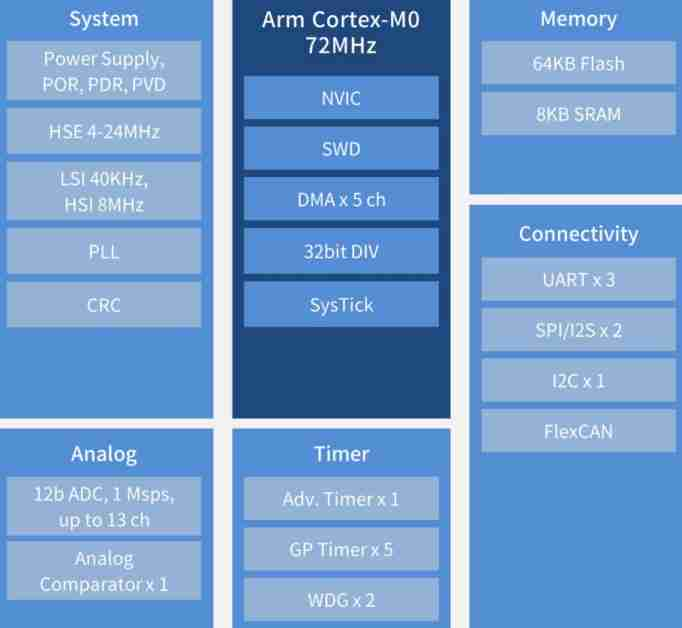

.. _mm32a0140:

MM32A0140
============

`mindmotion <https://www.mindmotion.com.cn/>`_ : ``Cortex-M0`` ``72MHz`` ``AEC-Q100 Grade 1``

.. contents::
    :local:
    :depth: 1

Xin简介
-----------
`Tags <https://github.com/SoCXin/MM32A0140>`_ : :ref:`aec_q100`

规格参数
~~~~~~~~~~~

基本参数
^^^^^^^^^^^

* 发布时间：
* 参考价格：
* 制程工艺：
* 供货周期：
* 封装规格：:ref:`LQFP48`/:ref:`LQFP32`/:ref:`QFN32`/:ref:`TSSOP20`
* 处理性能：? :ref:`CoreMark`
* 运行环境：-40°C to +125°C
* RAM容量：8 KB
* Flash容量：64 KB

特征参数
^^^^^^^^^^^

* 72 MHz :ref:`cortex_m0`
* 1 个 12 位 ADC、1 个比较器
* 1 个 16 位高级定时器、1 个 16 位和 1 个 32 位通用定时器、3 个 16 位基本定时器
* 1 个 I2C 接口、 2 个 SPI 或 I2S 接口、 3 个 UART 接口（支持 LIN）、 1 个 FlexCAN 接口
* +/-6kV ESD HBM，+/-300mA LU @Ta 125C

电源参数
^^^^^^^^^^^

* 供电电压: 2.0 to 5.5 V
* 运行功耗:

芯片架构
~~~~~~~~~~~

Xin选择
-----------

.. contents::
    :local:
    :depth: 1

品牌对比
~~~~~~~~~

系列对比
~~~~~~~~~

版本对比
~~~~~~~~~
