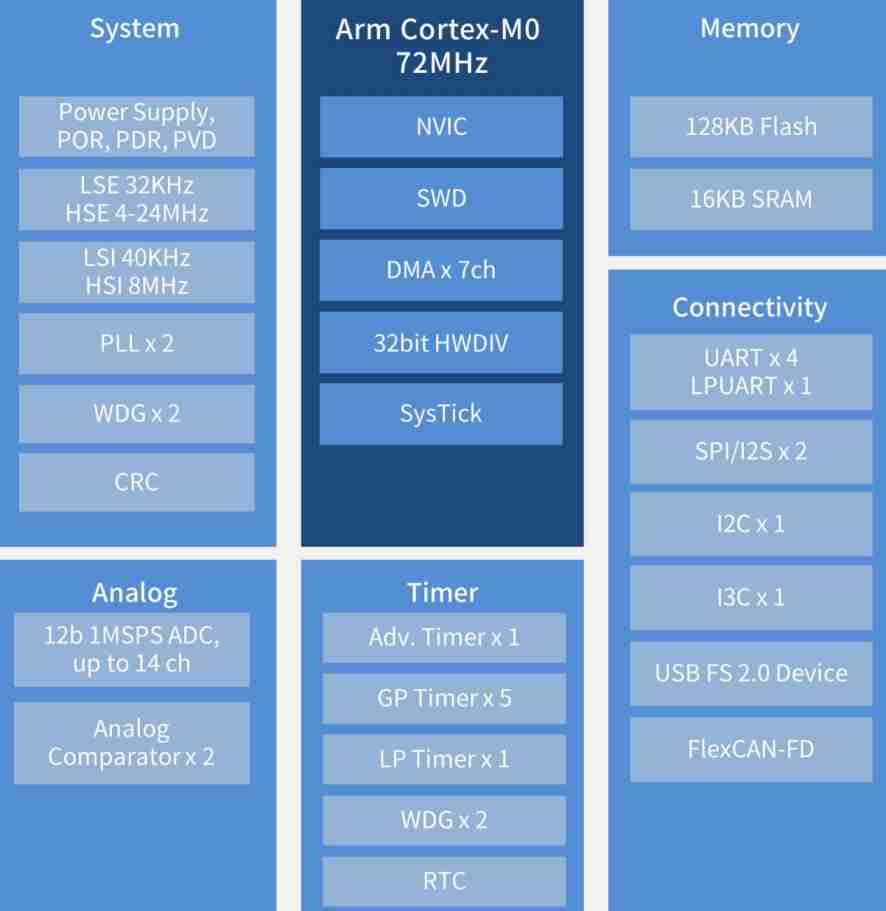

.. _mm32f016:

MM32F016
============

`mindmotion <https://www.mindmotion.com.cn/>`_ : ``Cortex-M0`` ``72MHz``

.. contents::
    :local:
    :depth: 1

Xin简介
-----------
`Tags <https://github.com/SoCXin/MM32F016>`_ : :ref:`low`

规格参数
~~~~~~~~~~~

基本参数
^^^^^^^^^^^

* 发布时间：2022-12-20
* 参考价格：
* 制程工艺：
* 供货周期：
* 封装规格：:ref:`LQFP64`/:ref:`LQFP48`/:ref:`QFN32`
* 处理性能：? :ref:`CoreMark`
* 运行环境：-40°C to +85°C
* RAM容量：16 KB
* Flash容量：128 KB

特征参数
^^^^^^^^^^^

* 72 MHz :ref:`cortex_m0`
* 1 个 12位 SAR ADC，14 个外部通道，高达 1MSPS 采样率
* 2 个比较器
* 1 个 16 位高级定时器、5 个 16 位或 32 位普通定时器、1 个低功耗定时器
* 1 个 RTC 模块
* 多达 5 个 UART （包括 1 路 LPUART）接口，2 个 SPI 或 I2S 接口，1 个 I2C 接口
* 1 个 I3C 从机接口，高达 12.5 Mbps
* 1 个 USB 设备接口，配备独立时钟，适用于小至 5x5 mm2 的封装
* 1 个 FlexCAN-FD 接口，配备独立时钟，适用于小至 4x4 mm2 的封装

电源参数
^^^^^^^^^^^

* 供电电压: 2.0 to 5.5 V
* 运行功耗:

芯片架构
~~~~~~~~~~~

Xin选择
-----------

.. contents::
    :local:
    :depth: 1

品牌对比
~~~~~~~~~

系列对比
~~~~~~~~~

版本对比
~~~~~~~~~
