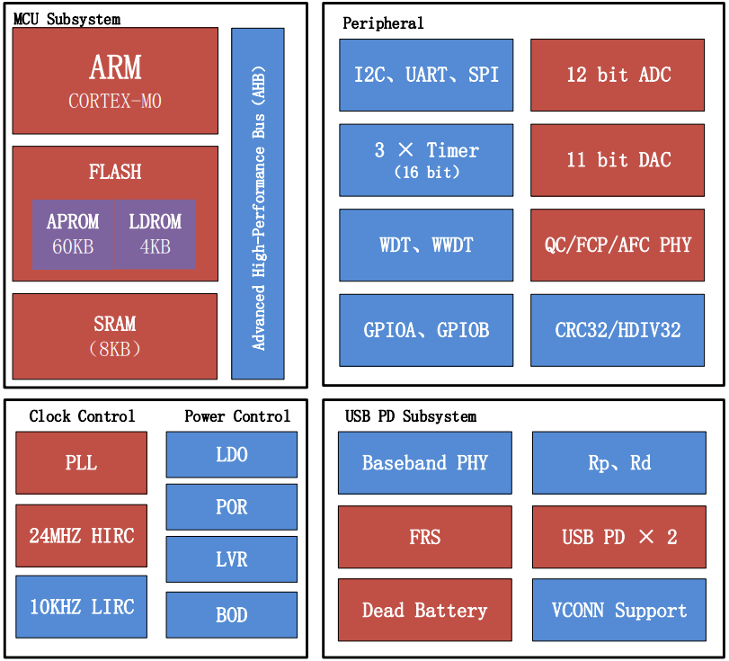

.. _cs32g020:

CS32G020
===============

`标签 <https://github.com/SoCXin/CS32G020>`_ : ``Cortex-M0`` ``48MHz`` ``PD3.0`` ``FRS`` ``QC4.0+``

.. contents::
    :local:

Xin简介
-----------

规格参数
~~~~~~~~~~~

基本参数
^^^^^^^^^^^

* 供电电压：2.5 to 5.5V
* 工作温度：-40 °C to 105 °C
* 封装规格：QFN24/QFN32
* 处理性能：45 :ref:`DMIPS`
* RAM容量：8 KB
* Flash容量：64 KB

特征参数
^^^^^^^^^^^

* :ref:`cortex_m0` 48 MHz
* 2组CC接口，支持USB PD3.0双向通信协议，支持PPS
* 2组DP/DM接口，支持QC4.0+、SCP、FCP、AFC协议
* CC口可配置的RP和RD
* CC口支持21V耐压
* 内置2个高压（21V）控制口
* 支持快速角色交换（FRS）
