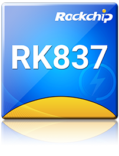

.. _rk837:

RK837
===============

`GitHub <https://github.com/SoCXin/RK837>`_ : ``Cortex-M0`` ``240MHz`` ``USB PD 3.0`` ``QC4+``

.. contents::
    :local:
    :depth: 1

Xin简介
-----------

.. contents::
    :local:

规格配置
~~~~~~~~~~~

基本参数
^^^^^^^^^^^

* 发布时间：
* 发布价格：
* 工作温度：-40°C to +125°C
* 处理性能：
* RAM容量：2KB
* Flash容量：56KB
* 封装规格：

特征参数
^^^^^^^^^^^

* :ref:`cortex_m0`
* CC1,CC2,DP,DM For Type-C Port
* 内置10通道电压ADC
* 内置1通道电流ADC

电源参数
^^^^^^^^^^^

* 供电电压：3.0 to 3.6 V

封装规格
~~~~~~~~~~~

