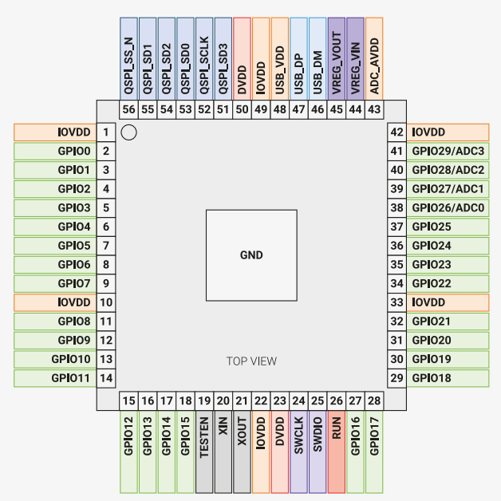

.. _NO_001:
.. _rp2040:

RP2040
===============

`GitHub <https://github.com/SoCXin/RP2040>`_ : ``Raspberry Pi`` ``Cortex-M0`` ``Dual Core`` ``133MHz`` ``USB OTG`` ``QFN56`` ``$0.7`` ``MicroPython``

.. contents::
    :local:

Xin简介
-----------

.. image:: ./images/RP2040.png
    :target: https://www.raspberrypi.org/documentation/microcontrollers/rp2040.html

`datasheet <https://datasheets.raspberrypi.org/rp2040/rp2040-datasheet.pdf>`_

规格参数
~~~~~~~~~~~

基本参数
^^^^^^^^^^^

* 发布时间：2021年1月
* 参考价格：$0.7 ($2380/3400)
* 制程工艺：:ref:`tsmc_40nm` (2mm²)
* 供货周期：
* 处理性能：157 :ref:`CoreMark` (125MHz) , :ref:`level3`
* 封装规格：QFN56 (7×7mm)
* 运行环境：-40°C to 85°C/125°C
* RAM容量：264 KB
* Flash容量：128/256 KB (16MB QSPI)

特征参数
^^^^^^^^^^^

* 133 MHz :ref:`cortex_m0` Dual Core
* USB 1.1 OTG with UF2
* 8x :ref:`rp2040_pio`
* 2× UART, 2 × SPI , 2 × I2C
* 30 x GPIO (4 AIN)
* 16 PWM channels

芯片架构
~~~~~~~~~~~

功耗参数
^^^^^^^^^^^

* 电压范围：1.71 to 3.6 V
* 功耗范围：

时钟架构
^^^^^^^^^^^^^

.. image:: ./images/RP2040clk.png
    :target: https://datasheets.raspberrypi.org/rp2040/rp2040-datasheet.pdf

.. _rp2040_pio:

PIO模块
^^^^^^^^^^^^^

RP2040中有2个相同的PIO块,每个PIO块都有专用的连接到总线结构,GPIO和中断控制器,每个块有四个状态机,可以独立执行顺序程序来操作GPIO和传输数据。

与通用处理器不同的是,PIO状态机对IO的专业化程度很高(highly specialised),它注重确定性,精确的时序,并与固定功能硬件紧密结合。PIO状态机可以动态地配置和重新配置,以实现许多不同的接口,自由度很高。

PIO可以支持多种IO标准包括:

* 8080/6080 并行接口
* I2C
* I2S
* SDIO
* SPI/DSPI/QSPI
* UART
* DPI/VGA (利用电阻网络)

.. image:: ./images/RP2040PIO.png
    :target: https://www.taterli.com/7568/

.. note::
    PIO状态机是与GPIO完全不同的实现，在芯片接口上开放了更高的自由度，在一定程度上实现了软件定义硬件。

Xin选择
-----------

.. contents::
    :local:

.. note::
    RP2040从性价比和生态资源上都具有后发优势，继STM32F103C8、ESP8266之后成为开源硬件项目的基准平台。

* MicroPython
* Cortex Dual Core
* PIO状态机
* USB 1.1 OTG UF2
* $0.7

.. hint::
    ADC配置过弱，和STM32新产品相比无法凸显出作为MCU定位的核心价值；和STM32产品相比，定位低端性能过剩，定位高端则接口过少，缺少成熟商用化工具和IDE支持；

品牌对比
~~~~~~~~~~~

就双核MCU配置而言，市场比较罕见，ST双核都是定位较高端的，ESP32双核SoC侧重通信连接是一个强力的对手。

系列对比
~~~~~~~~~~~

RP2040目前没有更多系列

版本对比
~~~~~~~~~~~

:ref:`rp2040` 包含两个子系列，分别为支持无晶振USB FS device的RP2040xxU系列，不支持USB的 RP2040xxN(1.8V-3.6V)/RP2040x4NR(1.8V-5.5V)。预期在Arduino和Micropython生态资源上拥有无与伦比的优势。

Xin应用
-----------

.. contents::
    :local:

开发框架
~~~~~~~~~~~

C++
^^^^^^^^^^^^^

Arduino
^^^^^^^^^^^^^

MicroPython
^^^^^^^^^^^^^

`Editor <https://github.com/robert-hh/Micropython-Editor>`_

应用方案
~~~~~~~~~~~

.. _rp2040_tflite:

TensorFlow Lite Micro
^^^^^^^^^^^^^^^^^^^^^^^^
``TensorFlow``

`pico-tflmicro <https://github.com/raspberrypi/pico-tflmicro>`_

项目案例
~~~~~~~~~~~

logic-analyzer
^^^^^^^^^^^^^^^^^^

`logic-analyzer <https://github.com/gamblor21/rp2040-logic-analyzer>`_

grblHAL
^^^^^^^^^^^^^^^^^^

`grblHAL RP2040 <https://github.com/grblHAL/RP2040>`_

.. _rp2040_vga:

VGA
^^^^^^^^^^^^^^^^^^

.. image:: ./images/RP2040vga.png
    :target: https://datasheets.raspberrypi.org/rp2040/hardware-design-with-rp2040.pdf

Xin总结
--------------

.. contents::
    :local:

能力构建
~~~~~~~~~~~~~

RP2040 提供所有常用接口：硬件 UART、SPI 和 I2C 控制器、USB 1.1 和四通道 ADC。而可编程 I/O (PIO) 子系统使 RP2040 脱颖而出，支持包括 SDIO、DPI、I2S，甚至 DVI-D 在内的软件实现协议。

其中，一个完全连接的交换机将 ARM 内核和 DMA 引擎连接到六个独立的 RAM 组，使得用户可以充分利用系统的性能。

要点提示
~~~~~~~~~~~~~

用户可以使用一个内核运行应用程序代码，另一个内核监督硬件；也可以使用 FreeRTOS 或 MicroPython 在两个内核上运行应用程序代码。

问题整理
~~~~~~~~~~~~~

