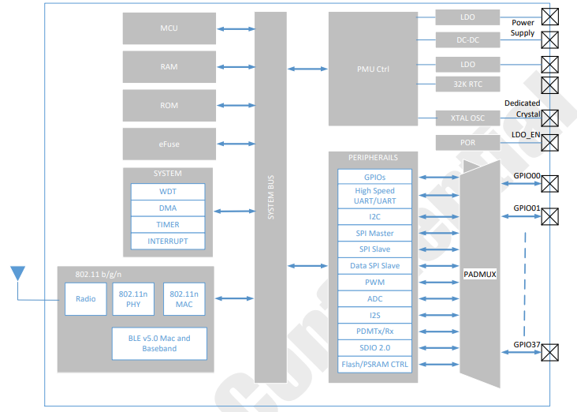
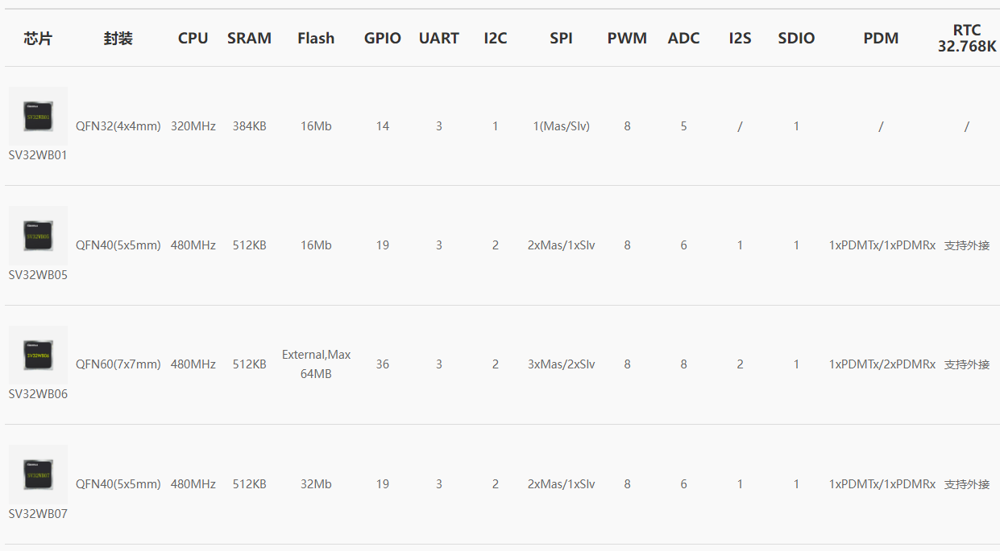

.. _sv32wb0:

SV32WB0
===============

* `icomm-semi <http://www.icomm-semi.com/>`_ : ``WiFi`` ``BT5.0`` ``22nm``
* `Tags <https://github.com/SoCXin/SV32WB0>`_ : :ref:`wifi4` / :ref:`bt`

.. contents::
    :local:
    :depth: 1

Xin简介
-----------

规格配置
~~~~~~~~~~~

基本参数
^^^^^^^^^^^

* 发布时间：
* 发布价格：
* 工作温度：-40°C to +125°C
* 处理性能：
* RAM容量：2KB
* Flash容量：56KB
* 封装规格：

特征参数
^^^^^^^^^^^

* SV32WB0x Combo Connectivity MCU.Fully integrated Wi-Fi and BLE Combo SoC for IoT Applications
* Supports calibration algorithm to handle non-ideal effects from CMOS RF block
* Integrated on-chip Power Management Unit (PMU) support 3.3~5V input
* A 2304b e-fuse block for storing chip-specific information
* Internal 32.768 KHz RC clock with calibration
* STA, SoftAP and Sniffer modes supported, concurrent AP + STA supported
* WFA features: WEP/WPA/WPA2/WPA3; WMM
* 802.11 b/g/n,BLE 5.0
* High Speed UART: support RX/TX/RTSN/CTSN, 4 pins,baud rate up to 4.8 Mbps
* UART: Support RX/TX, 2 pins,baud rate up to 921600 bps
* SDIO 2.0: 1bit/4bits mode supported,support Clock up to 50MHz

电源参数
^^^^^^^^^^^

* 供电电压：3.0 to 3.6 V

封装规格
~~~~~~~~~~~

