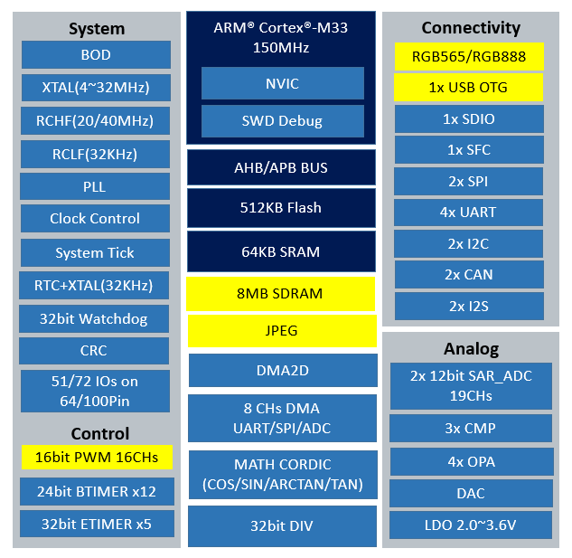

.. _swm32s:

SWM32S
===============

`Synwit <https://www.synwit.cn/>`_ : ``Cortex-M4`` ``120MHz`` ``800×480`` ``QFP64``
* `Tags <https://github.com/SoCXin/SWM320>`_ : :ref:`hmi`

.. contents::
    :local:
    :depth: 1

Xin简介
-----------

.. image:: ./images/SWM32S.jpg
    :target: https://www.synwit.cn/gaishu189/

规格参数
~~~~~~~~~~~

.. contents::
    :local:

规格参数
~~~~~~~~~~~

基本参数
^^^^^^^^^^^

* 发布时间：
* 参考价格：
* 制程工艺：
* 供货周期：
* 处理性能：? :ref:`CoreMark` , :ref:`level2`
* 封装规格：QFP64
* 运行环境：-40°C to 85°C
* RAM容量： 128KB + 8MB (SDRAM)
* Flash容量：512KB

特征参数
^^^^^^^^^^^
``RGB565``

* 120 MHz :ref:`cortex_m4`
* 免费使用 LittlevGL 软件库, 轻松创建图形软件（SUD）,支持各式液晶显示模块（LCM）
* 1个RGB565接口
* I2C*2、SPI*2、 UART*4、CAN*1、SDIO*1
* 6个32位高级定时器

模拟性能
^^^^^^^^^^^

* 2x 12-bit SAR ADC (9ch)

芯片架构
~~~~~~~~~~~

功耗参数
^^^^^^^^^^^

* 电压范围：2.0 to 3.6 V
* 功耗范围：

多种省电工作模式支持低功耗应用的需求

时钟体系
^^^^^^^^^^^

Xin选择
-----------
.. contents::
    :local:

品牌对比
~~~~~~~~~~~~

型号对比
~~~~~~~~~~~~

.. _swm34s:

SWM34S
^^^^^^^^^^^
``QFP64/QFP100``

* 150 MHz :ref:`cortex_m33`
* 1个RGB565接口(64Pin)，1个RGB888接口(100Pin)
* JPEG硬件解码器，DMA2D
* USB OTG*1、I2C*2、SPI*2、 UART*4、I2S*2、CAN*2、SDIO*1
* 5个32位高级定时器
* 3个比较器，4个运放，1个DAC

.. _swm19s:

SWM19S
^^^^^^^^^^^
``QFP48``

.. image:: ./images/SWM19S.jpg
    :target: https://www.synwit.cn/gaishu/

* 60 MHz :ref:`cortex_m0`
* Flash: 120KB, SRAM: 20KB
* 1个QSPI, 4线SPI，可快速读外挂Flash数据，速度可达120Mb/S
* I2C*2、SPI*1、UART*4
* 4 个 24位基本定时器和 4个 32 位高级定时器
* 1 个 12 位8通道的SAR ADC
* 3个比较器，4个运放

版本对比
~~~~~~~~~~~~

