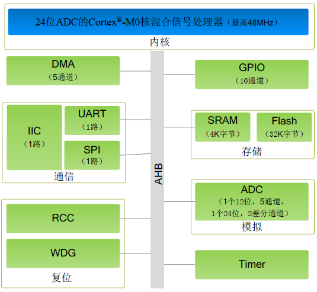

.. _zml165:

ZML165
===============

`ZLG <https://www.zlgmcu.com/>`_ : ``Cortex-M0`` ``48MHz`` ``24bit Σ-∆ ADC`` ``QFN20``

.. contents::
    :local:
    :depth: 1

Xin简介
-----------

规格参数
~~~~~~~~~~~

ZML165 包括1个16位通用定时器、1个32 位通用定时器、1个高级PWM 定时器、1 个 UART 接口、1个I2C接口、1个SPI接口。除此之外，内部还有一个24 位Σ -Δ型模数转换器，拥有2个差分输入通道，模拟输入通道信号增益可软件配置，支持宽动态范围信号输入，采用QFN20封装。

基本参数
^^^^^^^^^^^

* 发布时间：
* 参考价格：￥15
* 制程工艺：
* 供货周期：
* 处理性能：
* 封装规格：:ref:`QFN20` (4x4mm)
* 运行环境：-40°C to 85°C
* RAM容量：4KB
* Flash容量：32KB

特征参数
^^^^^^^^^^^

* 2ch 24bit Σ-∆ ADC

芯片架构
~~~~~~~~~~~~

* 供电电压：3.0 to 5.5 V

Xin选择
-----------

.. contents::
    :local:

品牌对比
~~~~~~~~~~

型号对比
~~~~~~~~~~

.. image:: ./images/ZML165l.png
    :target: https://www.zlgmcu.com/zlgiotmcu/zlgiotmcu/product/id/27.html

.. _zml166:

ZML166
^^^^^^^^^^^
`GitHub <https://github.com/SoCXin/ZML166>`_ ``USB-FS Device`` ``PGA`` ``24bit Σ-∆ ADC`` ``QFN32``

1个高级PWM 定时器、2个UART 接口、1个I2C接口、1个SPI接口和1个USB接口。除此之外，内部还有一个24 位Σ -Δ型模数转换器，拥有5个模拟输入通道，可两两任意配置成差分输入通道，模拟输入通道信号增益可软件配置，支持宽动态范围信号输入，采用QFN32体积封装。

* 参考价格：$2
* 5ch 24bit Σ-∆ ADC
* USB-FS Device
* QFN32(5x5x0.75mm)
