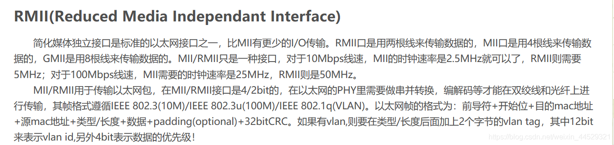

.. _sip:

集成Xin
====================

.. contents::
    :local:

.. _eth_phy:

ETH-PHY
-------------

芯片集成以太网PHY器件，不再需要外部连接PHY芯片

.. list-table::
    :header-rows:  1

    * - :ref:`list`
      - Core
      - RAM
      - Flash
      - :ref:`eth_mac`
      - :ref:`eth_phy`
      - Package
    * - :ref:`ch563`
      - :ref:`arm7`
      - 64 KB
      - 224 KB
      - 100M
      - 100M
      - LQFP64M(10x10)
    * - :ref:`W7500P`
      - :ref:`cortex_m0`
      - 16+32 KB
      - 128 KB
      - 10M
      - 10M
      - TQFP64(7x7)

.. hint::
    在封装内同时集成以太网MAC+PHY，集成以太网phy发热巨大影响芯片稳定性，特别是空间足够的情况下需要慎重考量。

.. _eth_phy_tiny:

ETH-Tiny
~~~~~~~~~~~~~

.. list-table::
    :header-rows:  1

    * - :ref:`list`
      - Core
      - RAM
      - Flash
      - USB
      - BLE
      - :ref:`eth_phy`
      - Package
    * - :ref:`ch32v208`
      - :ref:`wch_riscv4c`
      - 64KB
      - 128KB
      - 2 x H/D
      - 5.1
      - 10M
      - :ref:`qfn28`
    * - :ref:`ch579`
      - :ref:`cortex_m0`
      - 32KB
      - 250KB
      - H/D
      - 4.2
      - 10M
      - :ref:`qfn28`

.. _qfn28:

QFN28
^^^^^^^^^^^

.. image:: ./images/QFN28.png

.. hint::
    如果在受限的体积内实现以太网功能，QFN28是个不错的选择。

.. _eth_phy_chip:

PHY Chip
~~~~~~~~~~~~~~

LAN8720
^^^^^^^^^^^

LAN8742与LAN8720比较看，两者管脚兼容，LAN8742是LAN8720 的升级版，多了一个MCO管脚，其他的芯片特性一样，寄存器配置完全一样。

LAN8742和LAN8720的默认地址却是0x00

DP83848
^^^^^^^^^^^

DP83848芯片，支持MII模式和RMII模式；而LAN8742，和LAN8720，只支持RMII模式；另外，三者之间的，寄存器是一样的。

DP83848的默认地址，是0x01

.. _eth_mac:

ETH-MAC
~~~~~~~~~~~~~~

 ``MII/RMII``

.. _rmii:

RMII
^^^^^^^^^^^

.. _usb_phy:

USB-PHY
-------------

.. _usb_hs_phy:

USB-HS-PHY
~~~~~~~~~~~~~

``USB HS PHY`` ``480Mbps``

芯片集成USB2.0 HS PHY器件实现高速通信(480Mbps)，在该细分领域上 :ref:`st` 的STM32F7系列部分型号有USB2.0 PHY集成的方案。

.. list-table::
    :header-rows:  1

    * - :ref:`list`
      - Core
      - RAM
      - Flash
      - :ref:`usb_hs_phy`
      - :ref:`eth_phy`
      - :ref:`eth_mac`
    * - :ref:`ch563`
      - :ref:`arm7`
      - 64 KB
      - 224 KB
      - 480M
      - 100M
      - 1000M
    * - :ref:`ch32f207`
      - :ref:`cortex_m3`
      - 64 KB
      - 256 KB
      - 480M
      - 100M
      - 1000M
    * - :ref:`ch32v307`
      - :ref:`wch_riscv4a`
      - 64 KB
      - 256 KB
      - 480M
      - 100M
      - 1000M

.. _usb_ss_phy:

USB-SS-PHY
~~~~~~~~~~~~~

``USB SS PHY`` ``5Gbps``

.. list-table::
    :header-rows:  1

    * - :ref:`list`
      - Core
      - USB Num
      - USB Type
      - :ref:`usb_hs_phy`
      - :ref:`usb_ss_phy`
      - USB Hub
    * - :ref:`ch569`
      - :ref:`wch_riscv3a`
      - 1
      - OTG
      - √
      - √
      - √

