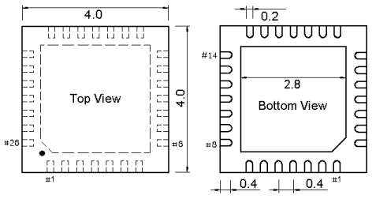

.. _spec:

创新Xin榜
====================

.. note::
    特色榜单收录非常具有创新性，或者非常具有创造性的产品

.. contents::
    :local:

通信相关
-------------

tiny PHY
~~~~~~~~~~~~~
.. hint::
    在小封装内同时集成以太网MAC+PHY

.. list-table::
    :header-rows:  1

    * - Name
      - Core
      - RAM
      - Flash
      - USB
      - BLE
      - Ethernet
      - Package
    * - :ref:`ch32v208`
      - :ref:`wch_riscv4c`
      - 64KB
      - 128KB
      - 2 x H/D
      - 5.1
      - 10M
      - :ref:`qfn28`
    * - :ref:`ch579`
      - :ref:`cortex_m0`
      - 32KB
      - 250KB
      - H/D
      - 4.2
      - 10M
      - :ref:`qfn28`

.. _qfn28:

QFN28
^^^^^^^^^^^

计量相关
-------------

24bit ADC
~~~~~~~~~~~~~

.. toctree::
    :maxdepth: 1

    CS32A039 <../M/CS32A039>
    ZML165 <../M/ZML165>

.. list-table::
    :header-rows:  1

    * - Name
      - Core
      - RAM
      - Flash
      - USB
      - BLE
      - Ethernet
      - Package
    * - :ref:`ch32v208`
      - :ref:`wch_riscv4c`
      - 64KB
      - 128KB
      - 2 x H/D
      - 5.1
      - 10M
      - :ref:`qfn28`
    * - :ref:`ch579`
      - :ref:`cortex_m0`
      - 32KB
      - 250KB
      - H/D
      - 4.2
      - 10M
      - :ref:`qfn28`

.. warning::
    单芯片集成的高精度ADC外设采样率往往不高
