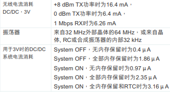

.. _nrf52840:

nRF52840
============

* 关键词：``BLE`` ``NFC``
* 资源库：`GitHub <https://github.com/SoCXin/nRF52840>`_ , `官方资源 <https://www.nordicsemi.com/Products/nRF52840>`_

.. contents::
    :local:

Xin简介
-----------

nRF52840 SoC是nRF52系列中最先进的一员。它可以满足需要协议并发性、丰富外围设备和复杂应用所面临的挑战。它为闪存和RAM提供了充足的内存，而这些正是高要求应用的必备条件。

nRF52840是具有完全协议并发能力的多协议SoC。它支持低功耗蓝牙、蓝牙Mesh、Thread、Zigbee、802.15.4、ANT和2.4 GHz专有协议栈。

nRF52840基于带有浮点单元的32位ARM® Cortex™-M4 CPU，主频为64 MHz。内置NFC-A标签用于简化的配对和支付解决方案。本芯片内置ARM TrustZone® CryptoCell密码算法单元，可独立于CPU高效执行密码算法任务。它有许多数字外设和接口，如高速SPI和QSPI接口，用于连接到外部闪存和显示器，PDM和I2S连接数字麦克风和音频；还有一个全速USB设备，用于数据传输和作为电源为电池充电。

通过精密的片上自适应电源管理系统，实现了极低的功耗。

规格参数
~~~~~~~~~~~

基本参数
^^^^^^^^^^^

* 发布时间：
* 发布价格：
* 制程工艺：
* 供货周期：
* 处理性能：
* RAM容量：256 KB
* Flash容量：1 MB
* 封装规格：:ref:`qfn28` (4x4mm) / :ref:`wch_qfn48`

特征参数
^^^^^^^^^^^

* 64 MHz :ref:`cortex_m4` with FPU
* 2.4 GHz Transceiver，2 Mbps, 1 Mbps, Long Range，+8 dBm TX Power
* Bluetooth Low Energy, Bluetooth mesh
* ANT, 802.15.4, Thread, Zigbee
* 128-bit AES CCM, ARM CryptoCell
* NFC-A
* USB 2.0

芯片架构
~~~~~~~~~~~

功耗参数
^^^^^^^^^^^

连接能力
~~~~~~~~~~~~~~

BLE
^^^^^^^^^^^^^^^

.. image:: ./images/nRF52840BLE.png
    :target: https://www.nordicsemi.com/Products/nRF52840

NFC
^^^^^^^^^^^^^^^

USB
^^^^^^^^^^^^^^^
