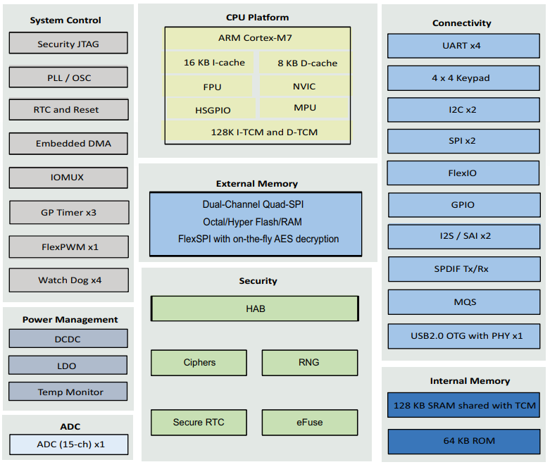
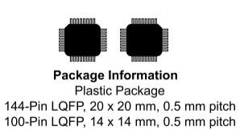

.. _rt1010:

RT1010
=============
`NXP <https://www.nxp.com.cn>`_ : ``Cortex-M7`` ``500MHz``

.. contents::
    :local:
    :depth: 1

Xin简介
-----------
`Tags <https://github.com/SoCXin/RT1010>`_ : :ref:`top` / :ref:`adc` / :ref:`usb_hs`

`datasheet <https://www.nxp.com.cn/docs/en/data-sheet/IMXRT1010IEC.pdf>`_

规格参数
~~~~~~~~~~~

基本参数
^^^^^^^^^^^

* 发布时间：
* 供电电压：
* 工作温度：-40°C to +105°C
* 处理性能：1284 :ref:`DMIPS`, 3020 :ref:`CoreMark`
* RAM容量：1 MB
* Flash容量：
* 封装规格：LQFP80/LQFP100

特征参数
^^^^^^^^^^^

* 500 MHz :ref:`cortex_m7`

.. note::
    :ref:`rt1010` 作为降配版本和普惠产品，并没有太多出众的地方

Xin选择
-----------

.. contents::
    :local:

品牌对比
~~~~~~~~~

作为一颗更纯粹的MCU，主要卖点是 :ref:`cortex_m7` ，没有家族赋能和外设配置优势，可选择一些高主频的 :ref:`cortex_m4` 方案，或者其他定位高性能的强内核产品 :ref:`top`

型号对比
~~~~~~~~~

RT1010 相对 :ref:`rt1020` 去掉了以太网和CAN配置，同时相关配置的资源减半，拥有较小的LQFP80封装

.. image:: ./images/RT.png
    :target: https://www.nxp.com/products/processors-and-microcontrollers/arm-microcontrollers/i-mx-rt-crossover-mcus:IMX-RT-SERIES

