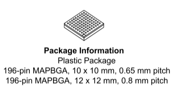
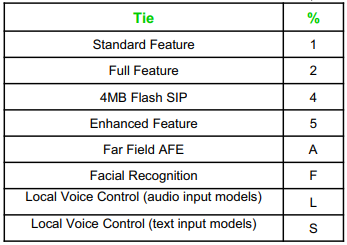

.. _rt1060:

RT1060
=============

`标签 <https://github.com/SoCXin/RT1060>`_ : ``Cortex-M7`` ``600MHz`` ``USB-HS-PHY`` ``ETH-MAC-100``

.. contents::
    :local:

Xin简介
-----------

.. image:: ./images/RT1060.png
    :target: https://www.nxp.com/products/processors-and-microcontrollers/arm-microcontrollers/i-mx-rt-crossover-mcus/i-mx-rt1060-crossover-mcu-with-arm-cortex-m7-core:i.MX-RT1060

`datasheet <https://www.nxp.com.cn/docs/en/data-sheet/IMXRT1010IEC.pdf>`_

规格参数
~~~~~~~~~~~

基本参数
^^^^^^^^^^^

* 发布时间：
* 供电电压：
* 工作温度：-40°C to +105°C
* 处理性能：1284 :ref:`DMIPS`, 3020 :ref:`CoreMark`
* RAM容量：1 MB
* Flash容量：
* 封装规格：BGA196

特征参数
^^^^^^^^^^^

* 600 MHz :ref:`cortex_m7`

Xin选择
-----------

.. contents::
    :local:

品牌对比
~~~~~~~~~

典型的竞品为 :ref:`st` 高性能H7系列：

* :ref:`stm32h730` 支持32位SDRAM，:ref:`rt1060` 仅支持16位SDRAM
* :ref:`stm32h730` 有JPEG硬解，分辨率1024*768，:ref:`rt1060` 支持的分辨率是1368*768
* :ref:`rt1060` USB-HS (PHY)
* :ref:`rt1060` 带 ``双网口`` 可以作为网关中继， :ref:`stm32h750` 系列仅一个，都不带PHY

系列对比
~~~~~~~~~~

RT1060系列相对RT1050系列主要差异在于RAM资源和以太网数量，后者只有前者的一半

.. image:: ./images/NXPRT.png
    :target: https://www.nxp.com/products/processors-and-microcontrollers/arm-microcontrollers/i-mx-rt-crossover-mcus:IMX-RT-SERIES

型号对比
~~~~~~~~~

RT1060系列包括RT1062、RT1064等常用型号

.. image:: ./images/RT1060l.png
    :target: https://www.nxp.com/docs/en/nxp/data-sheets/IMXRT1060CEC.pdf

.. note::
    RT1062在开源领域的参与度还是蛮高的。

.. _rt1064:

RT1064
^^^^^^^^^^^
