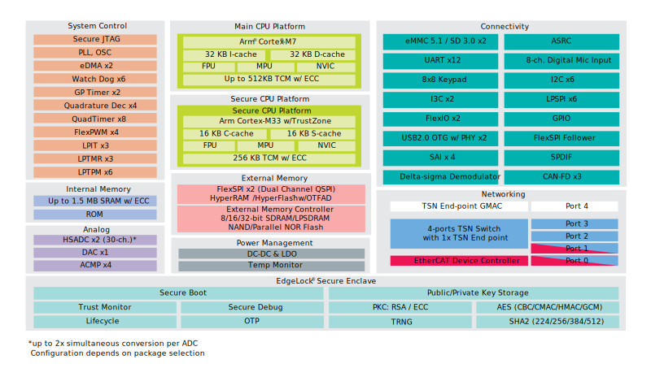

.. _rt1170:

RT1170
=============

`GitHub <https://github.com/SoCXin/RT1170>`_ : ``Cortex-M7`` ``Cortex-M4`` ``Dual Core`` ``1 GHz``

.. contents::
    :local:
    :depth: 1

Xin简介
-----------

.. image:: ./images/RT1170.png
    :target: https://www.nxp.com.cn/products/processors-and-microcontrollers/arm-microcontrollers/i-mx-rt-crossover-mcus/i-mx-rt1170-crossover-mcu-family-first-ghz-mcu-with-arm-cortex-m7-and-cortex-m4-cores:i.MX-RT1170

`datasheet <https://www.nxp.com.cn/docs/en/data-sheet/IMXRT1170CEC.pdf>`_

规格参数
~~~~~~~~~~~

基本参数
^^^^^^^^^^^

* 发布时间：
* 参考价格：
* 制程工艺：
* 供货周期：
* 处理性能：6468 :ref:`CoreMark` , :ref:`level6`
* 封装规格：MAPBGA289 (14x14x0.8 mm)
* 运行环境：-40°C to 85°C
* RAM容量：2 MB
* Flash容量：

特征参数
^^^^^^^^^^^

* 1 GHz :ref:`cortex_m7`
* 400 MHz :ref:`cortex_m4`
* 2x Gb ENET，带AVB和TSN

Xin选择
-----------

.. contents::
    :local:
    :depth: 1

品牌对比
~~~~~~~~~~

.. list-table::
    :header-rows:  1

    * -
      - :ref:`architecture`
      - :ref:`CoreMark`
      - SRAM
      - USB/NET
      - :ref:`level_npu`
      - :ref:`consumption`
      - Package
    * - :ref:`rt1170`
      - :ref:`cortex_m7`
      - 6468
      - 2 MB
      - 2xHS/2xGb
      -
      -
      - BGA289
    * - :ref:`hpm6750`
      - :ref:`riscv`
      - 9220
      - 2 MB
      - 2xHS/2xGb
      -
      -
      - BGA289

系列对比
~~~~~~~~~~

.. _rt1180:

RT1180
^^^^^^^^^^^

跨界MCU系列包括千兆时间敏感网络（TSN）交换机，支持实时丰富的网络集成，可处理时间敏感和工业实时通信。i.MX RT1180支持多种协议，桥接实时以太网和Industry 4.0系统之间的通信。

该系列集成先进的EdgeLock安全区域，基于800 MHz Cortex-M7和240 MHz Cortex-M33双核架构，可实现设计灵活性。

* 800 MHz :ref:`cortex_m7`
* 240 MHz :ref:`cortex_m33` (可选)
* 1.5 MB SRAM
* 289MAPBGA/144MAPBGA

型号对比
~~~~~~~~~~

.. image:: ./images/RT1170list.png
    :target: https://www.nxp.com.cn/products/processors-and-microcontrollers/arm-microcontrollers/i-mx-rt-crossover-mcus:IMX-RT-SERIES
