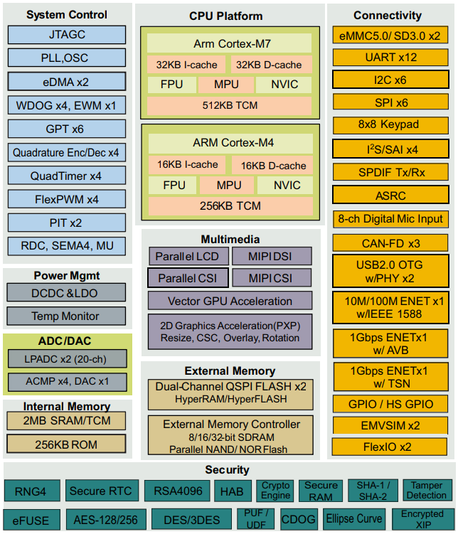
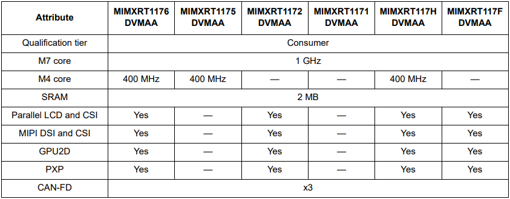

.. _rt1170:

RT1170
=============

`GitHub <https://github.com/SoCXin/RT1170>`_ : ``Cortex-M7`` ``Cortex-M4`` ``Dual Core`` ``1 GHz``

.. contents::
    :local:

Xin简介
-----------

`datasheet <https://www.nxp.com.cn/docs/en/data-sheet/IMXRT1170CEC.pdf>`_

规格参数
~~~~~~~~~~~

基本参数
^^^^^^^^^^^

* 发布时间：
* 参考价格：
* 制程工艺：
* 供货周期：
* 处理性能：6468 :ref:`CoreMark` , :ref:`level6`
* 封装规格：MAPBGA289 (14x14x0.8 mm)
* 运行环境：-40°C to 85°C
* RAM容量：2 MB
* Flash容量：

特征参数
^^^^^^^^^^^

* 1 GHz :ref:`cortex_m7`
* 400 MHz :ref:`cortex_m4`
* 2x Gb ENET，带AVB和TSN

Xin选择
-----------

.. contents::
    :local:

品牌对比
~~~~~~~~~~

系列对比
~~~~~~~~~~

型号对比
~~~~~~~~~~

