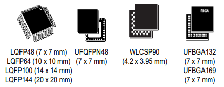
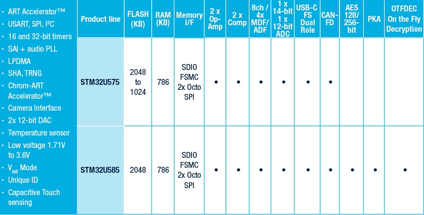

.. _stm32u575:

STM32U575
===============

* `ST <https://www.st.com>`_ : ``Cortex-M33`` ``160MHz`` ``2.5MSPS-14bit-ADC`` ``USB FS OTG`` ``USB PD`` ``512B OTP`` ``40nm``
* `Tags <https://github.com/SoCXin/STM32U575>`_ : :ref:`ulp`

:ref:`stm32l412` --> :ref:`stm32l5` --> :ref:`stm32u575`

.. contents::
    :local:
    :depth: 1

Xin简介
-----------

`EEMBC:4.07 CoreMark/MHz <https://www.eembc.org/viewer/?benchmark_seq=13317>`_

.. image:: ./images/STM32U575.jpg
    :target: https://www.st.com/content/st_com/zh/products/microcontrollers-microprocessors/stm32-32-bit-arm-cortex-mcus/stm32-ultra-low-power-mcus/stm32u5-series/stm32u575-585/stm32u575cg.html

Ultra-low-power with FPU Arm Cortex-M33 with Trust Zone, MCU 160 MHz with 1Mbytes of Flash memory

规格参数
~~~~~~~~~~~

STM32U5 的定义是一个低功耗旗舰级产品线，最大的3个特点：

* 超低功耗
* 在超低功耗平台上提升了性能，是基于高性能和超低功耗两者结合的集合
* 增强了安全可靠方面的功能，适合IoT 应用

基本参数
^^^^^^^^^^^

* 发布时间：
* 参考价格：
* 制程工艺：40 nm
* 供货周期：
* 处理性能：651 :ref:`CoreMark` (240 :ref:`DMIPS` ) , :ref:`level3`
* 封装规格：LQFP48/QFN48/LQFP64/WLCSP90/LQFP100/UFBGA132/LQFP144/UFBGA169
* 运行环境：-40°C to 85/125°C
* RAM容量：786 KB
* Flash容量：1/2 MB

特征参数
^^^^^^^^^^^

* 160 MHz :ref:`cortex_m33`
* 535 :ref:`ulp_cp`
* 149 :ref:`ulp_pp`
* 133000 SecureMark-TLS
* 2x 12bit DAC
* 2x PGA

芯片架构
~~~~~~~~~~~

.. image:: images/STM32U575s.png
    :target: https://www.st.com/content/st_com/zh/products/microcontrollers-microprocessors/stm32-32-bit-arm-cortex-mcus/stm32-ultra-low-power-mcus/stm32u5-series/stm32u575-585/stm32u575cg.html

功耗参数
^^^^^^^^^^^

* 电压范围：1.71 to 3.6 V
* 功耗范围：
* 运行功耗: 19 µA/MHz
* 关断模式下110 nA
* 待机模式300 nA
* 停机模式3下为1.7 µA，具有16 KbB的SRAM可访问
* 停机模式2下为6.6 µA，全部具有786 KBb的SRAM可访问

.. image:: ./images/STM32U575Pwr.png
    :target: https://www.st.com/zh/microcontrollers-microprocessors/stm32u5-series.html

Xin选择
-----------

.. contents::
    :local:

品牌对比
~~~~~~~~~

系列对比
~~~~~~~~~

.. _stm32l5:

STM32L5
^^^^^^^^^^^

.. image:: ./images/STM32L5.png
    :target: https://www.st.com/zh/microcontrollers-microprocessors/stm32l5-series.html

STM32L5系列 110 MHz :ref:`cortex_m33` (443 CoreMark)，并将其面向Armv8-M架构的TrustZone与意法半导体安全实现方案相结合。

512 KB的（双Bank）闪存和256 KB的SRAM，通过采用新型内核和全新的意法半导体 ART Accelerator™（现在也支持外部存储器）。

7个封装类型（LQFP48、QFN48、LQFP64、WLCSP81、LQFP100、UFBGA132、LQFP144），还支持高达125°C的工作环境温度。

* 关断模式下17 nA
* 在停止模式3µA，具有全SRAM和外设状态保持能力，能够在5µs内唤醒
* 激活模式下电流低至62 µA/MHz

版本对比
~~~~~~~~~

Xin应用
-----------

.. contents::
    :local:

硬件平台
~~~~~~~~~~~~~

NUCLEO-U575ZI-Q
^^^^^^^^^^^^^^^^^^

.. image:: ./images/B_STM32U575.png
    :target: https://item.taobao.com/item.htm?spm=a1z0d.6639537.1997196601.310.4dd27484uTziYx&id=659070612428
