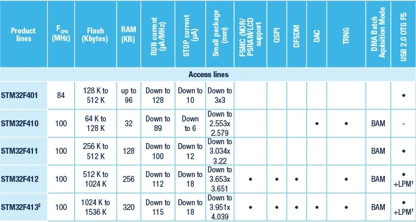

.. _stm32f401:

STM32F401
===============

* 关键词：``Cortex-M4`` ``84MHz``
* 资源库：`GitHub <https://github.com/SoCXin/STM32F401>`_

.. contents::
    :local:

Xin简介
-----------

STM32F401微控制器属于STM32 Dynamic Efficiency™器件范围。这些器件提供了运行模式下动态功耗和处理器性能之间的最佳平衡，同时在3 x 3 mm的小封装内集成了大量的增值特性。

该系列产品采用意法半导体90 nm工艺和ART加速器，具有动态功耗调整功能，能够在运行模式和从Flash存储器执行时实现低至128 µA/MHz的功耗。

.. image:: ./images/STM32F401.png
    :target: https://www.st.com/en/microcontrollers-microprocessors/stm32f401.html

规格参数
~~~~~~~~~~~

基本参数
^^^^^^^^^^^

* 供电电压：3.0 to 5.5 V
* 工作温度：-40 °C to 85 °C
* 封装规格：LQFP64
* 处理性能：105 :ref:`DMIPS`
* RAM容量：64 KB
* Flash容量：256 KB

特征参数
^^^^^^^^^^^

* 84 MHz :ref:`cortex_m4`
* 3路USART，速度高达10.5 Mbit/s
* 4路SPI，速度高达42 Mbit/s，3路I²C，1路SDIO
* 1个USB 2.0 OTG（全速）
* 2个全双工I²S，最高32-bit/192KHz
* 速度高达2.4 MSPS的12位ADC

芯片架构
~~~~~~~~~~~

.. image:: ./images/STM32F401s.png
    :target: https://www.st.com/en/microcontrollers-microprocessors/stm32f401.html

Xin选择
-----------
.. contents::
    :local:

型号对比
~~~~~~~~~

关键参数
^^^^^^^^^^^^^

.. list-table::
    :header-rows:  1

    * - :ref:`list`
      - Mark
      - RAM
      - Flash
      - UART
      - BLE
      - USB
      - Ethernet
    * - :ref:`stm32f401`
      -
      -
      -
      -
      -
      -
      -

Xin应用
-----------

.. contents::
    :local:

Marlin
~~~~~~~~~~~

方案简介
^^^^^^^^^^^^

