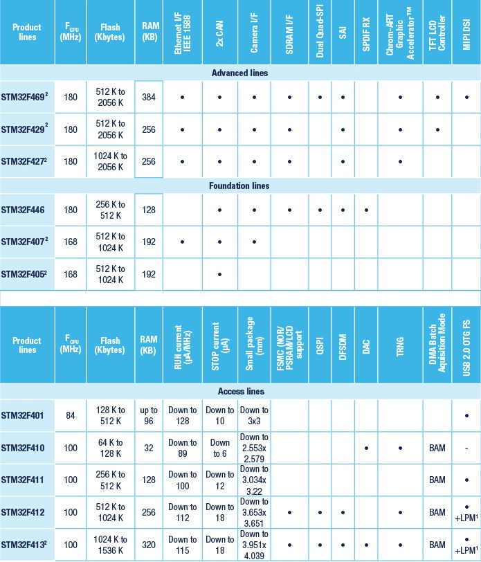

.. _st_main:

主流产品
================

.. image:: images/main.png
    :target: https://www.st.com/zh/microcontrollers-microprocessors/stm32-mainstream-mcus.html

.. toctree::
    :maxdepth: 1

    普及型:STM32F103 <STM32F103>
    增强型:STM32F207 <STM32F207>
    外设型:STM32F401 <STM32F401>
    全能型:STM32F407 <STM32F407>
    交互型:STM32F429 <STM32F429>
    最新ADC:STM32G431 <STM32G431>
    最多ADC:STM32G474 <STM32G474>

.. list-table::
    :header-rows:  1

    * - Xin
      - ADC
      - RAM
      - Flash
      - ADC-R
      - ADC-N
      - DAC-R
      - DAC-N
    * - :ref:`stm32g474`
      -
      -
      -
      -
      -
      -
      -
    * - :ref:`stm32g431`
      -
      -
      -
      -
      -
      -
      -

