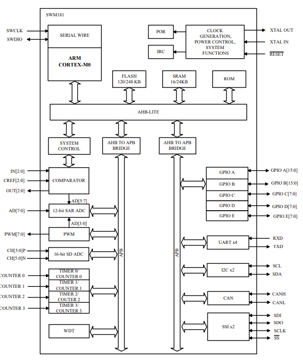

.. _swm181:

SWM181
===============

* `Synwit <https://www.synwit.cn/>`_ : ``Cortex-M0`` ``48MHz`` ``16bit ADC``
* `Tags <https://github.com/SoCXin/SWM181>`_ : :ref:`foc`

.. contents::
    :local:
    :depth: 1

Xin简介
-----------

.. image:: ./images/SWM181.jpg
    :target: https://huaxin2021.yswebportal.cc/col.jsp?id=120

.. contents::
    :local:

规格参数
~~~~~~~~~~~

基本参数
^^^^^^^^^^^

* 发布时间：
* 参考价格：
* 制程工艺：
* 供货周期：
* 处理性能：? :ref:`CoreMark` , :ref:`level1`
* 封装规格：QFN40/QFP48/QFP64
* 运行环境：-40°C to 85°C
* RAM容量： 16 KB 
* Flash容量：96-248KB

特征参数
^^^^^^^^^^^

* 48 MHz :ref:`cortex_m0` 
* SLCD 4*31
* 8个16位PWM
* 4个32位基本定时器
* 3个比较器
* I2C*2、SPI*2、UART*4、CAN*1

模拟性能
^^^^^^^^^^^

* 16-bit SigmaDelta ADC (16KSPS 6ch)
* 12-bit 8ch SAR ADC (1MSPS)

芯片架构
~~~~~~~~~~~

功耗参数
^^^^^^^^^^^

* 电压范围：2.3 to 3.6 V
* 功耗范围：

多种省电工作模式支持低功耗应用的需求

Xin选择
-----------

.. contents::
    :local:

品牌对比
~~~~~~~~~

型号对比
~~~~~~~~~

版本对比
~~~~~~~~~

.. image:: images/SWM181list.png
    :target: https://huaxin2021.yswebportal.cc/col.jsp?id=120

Xin应用
--------------
.. contents::
    :local:

电机控制
~~~~~~~~~~~~~

