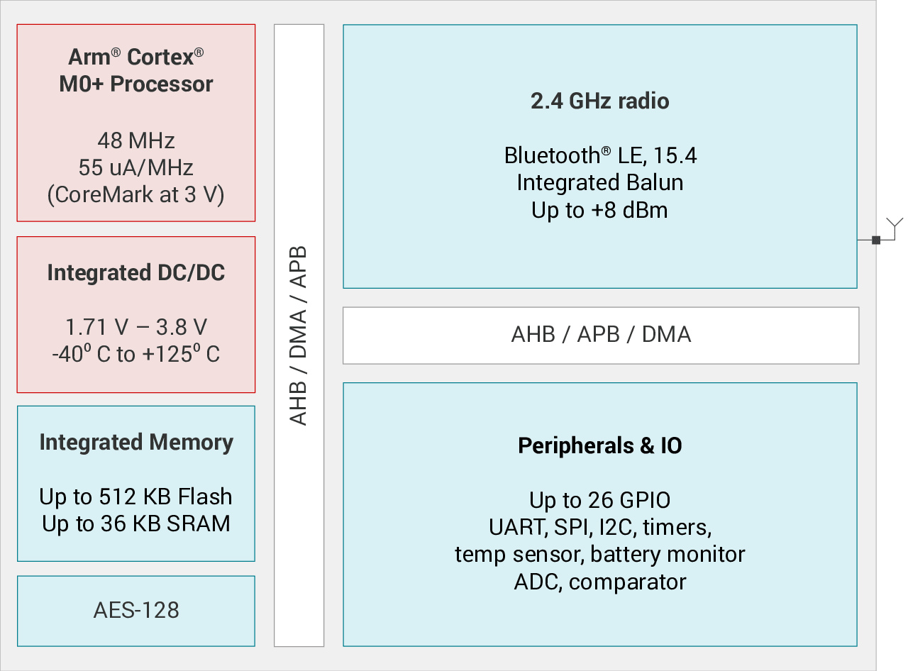

.. _cc2340:

CC2340
============

`ti <https://www.ti.com.cn>`_ : ``Cortex-M0`` ``SimpleLink`` ``BLE`` ``ZigBee``

.. contents::
    :local:
    :depth: 1

Xin简介
-----------

规格参数
~~~~~~~~~~~

基本参数
^^^^^^^^^^^

* 发布时间：
* 参考价格：$0.79 - $0.99
* 制程工艺：
* 供货周期：
* 处理性能：
* 封装规格：VQFN32/VQFN48
* 运行环境： –40°C to 125°C
* RAM容量：36 KB
* Flash容量： 512 KB

特征参数
^^^^^^^^^^^

* 48MHz :ref:`cortex_m0` (55uA/MHz)
* 集成平衡-非平衡变压器、ADC、UART、SPI、I2C

芯片架构
~~~~~~~~~~~~

功耗参数
^^^^^^^^^^^

* 工作电压：1.71V ~ 3.8V
* 待机电流 <830nA（RTC、RAM 保持）
* 复位/关断电流 <150nA
* 无线电 Rx、Tx 功率为 0dBm 时，电流 <5.3mA
* 1s CONN 间隔：~6uA

通信能力
~~~~~~~~~~~

支持 :ref:`ble` 5.0 、Zigbee、专有2.4GHz

BLE
^^^^^^^^^^^
``BLE`` ``–96dBm`` ``+8dBm`` ``ZigBee`` ``6LoWPAN``

* TX 输出功率：-20dBm 至 +8dBm
* RX 灵敏度：1Mbps 时为 -96Bm

Xin选择
-----------

.. contents::
    :local:

品牌对比
~~~~~~~~~~

系列对比
~~~~~~~~~~

版本对比
~~~~~~~~~~

