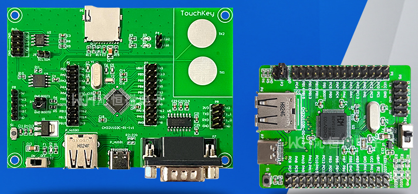

.. _ch32v103:

CH32V103
============

`WCH <http://www.wch.cn/products/CH32V103.html>`_ : ``RISC-V3A`` ``80MHz`` ``USB`` ``HarmonyOS``

.. contents::
    :local:
    :depth: 1

Xin简介
-----------

.. image:: ./images/CH32V103.png
    :target: http://www.wch.cn/products/CH32V103.html

`GitHub <https://github.com/SoCXin/CH32V103>`_

规格参数
~~~~~~~~~~~

基本参数
^^^^^^^^^^^

* 发布时间：
* 参考价格：
* 制程工艺：
* 供货周期：
* 处理性能：
* 封装规格：LQFP64M/LQFP48/QFN48
* 运行环境：-40°C to 85°C
* RAM容量：20 KB
* Flash容量：64 KB

特征参数
^^^^^^^^^^^

* 80 MHz :ref:`wch_riscv3a`
* 7通道DMA控制器；
* 16路TouchKey通道监测；
* 16路12位ADC转换通道；
* 7个定时器；
* 1个USB2.0主机/设备接口（全速和低速）；
* 2个IIC接口（支持SMBus/PMBus）；
* 3个USART接口；
* 2个SPI接口（支持Master和Slave模式）；
* 51个I/O口，所有的I/O口都可以映射到16个外部中断；
* CRC计算单元，96位芯片唯一ID；

芯片架构
~~~~~~~~~~~

.. image:: ./images/CH32V103s.png
    :target: http://www.wch.cn/products/CH32V103.html

* 上电/断电复位（POR/PDR）；
* 可编程电压监测器（PVD）；

功耗参数
^^^^^^^^^^^

* 供电范围：2.7V ~ 5.5V，GPIO同步供电电压；
* 多种低功耗模式：睡眠/停止/待机；

Xin选择
-----------

.. contents::
    :local:

品牌对比
~~~~~~~~~~

.. list-table::
    :header-rows:  1

    * - :ref:`vendor`
      - DMIPS
      - RAM
      - Flash
      - UART
      - SPI
      - USB
      - CAN
      - Interface
    * - :ref:`ch32v103`
      - 90
      - 20KB
      - 64/128KB
      - 3
      - 2
      - H/D
      - 2.0B
      - 9
    * - :ref:`gd32v103`
      - 90
      - 20KB
      - 64KB
      - 3
      - 2
      - H/D
      - 2.0B
      - 9

型号对比
~~~~~~~~~~

版本对比
~~~~~~~~~~

.. image:: ./images/CH32V103l.png
    :target: http://www.wch.cn/products/CH32V103.html

Xin应用
-----------

.. contents::
    :local:

开发板
~~~~~~~~~~

