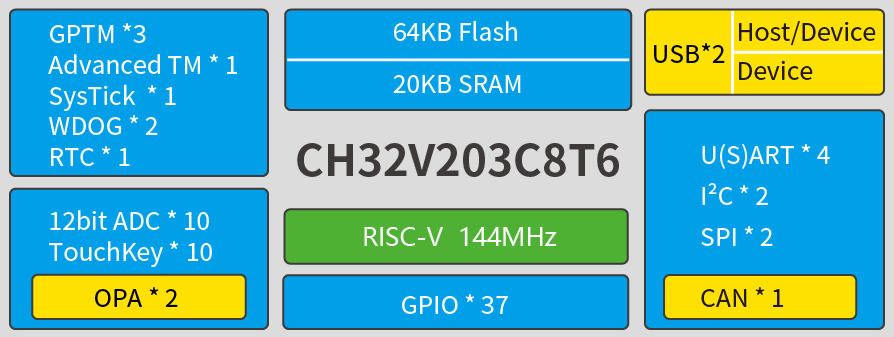

.. _ch32v203:

CH32V203
============

* `WCH <http://www.wch.cn/products/CH32V203>`_ : ``RISC-V4B`` ``青稞`` ``144MHz`` ``2x USB`` ``2x OPA`` ``HarmonyOS`` ``45uA/MHz``
* `Tags <https://github.com/SoCXin/CH32V203>`_ : :ref:`pop` / :ref:`low`

.. contents::
    :local:
    :depth: 1

Xin简介
-----------

规格参数
~~~~~~~~~~~

基本参数
^^^^^^^^^^^

* 发布时间：
* 参考价格： `￥2.71 <https://item.szlcsc.com/3483852.html>`_
* 制程工艺：
* 供货周期：
* 处理性能：
* 封装规格：:ref:`LQFP64`/:ref:`LQFP48`/QFN48/LQFP32/QFN28/TSSOP20
* 运行环境：-40°C to 85°C
* RAM容量：20 KB
* Flash容量：64 KB

特征参数
^^^^^^^^^^^

* 80 MHz :ref:`wch_riscv4b`
* 7通道DMA控制器；
* 16路TouchKey通道监测；
* 16路12位ADC转换通道；
* 7个定时器；
* 1个USB2.0主机/设备接口（全速和低速）；
* 2个IIC接口（支持SMBus/PMBus）；
* 3个USART接口；
* 2个SPI接口（支持Master和Slave模式）；
* 51个I/O口，所有的I/O口都可以映射到16个外部中断；
* CRC计算单元，96位芯片唯一ID；

芯片架构
~~~~~~~~~~~

.. image:: ./images/CH32V103s.png
    :target: http://www.wch.cn/products/CH32V203.html

* 上电/断电复位（POR/PDR）；
* 可编程电压监测器（PVD）；

功耗参数
^^^^^^^^^^^
``45uA/MHz``

* 供电电压：2.5/3.3V，GPIO单元独立供电,多种低功耗模式：睡眠、停止、待机
* 运行模式低至 44.65uA/MHz
* 睡眠模式低至 17.90uA/MHz

Xin选择
-----------

.. contents::
    :local:
    :depth: 1

品牌对比
~~~~~~~~~~

.. list-table::
    :header-rows:  1

    * - :ref:`vendor`
      - :ref:`architecture`
      - :ref:`frequency`
      - :ref:`sram`/:ref:`flash`
      - :ref:`usb`/:ref:`can`
      - :ref:`peripherals`
      - :ref:`package`
    * - :ref:`ch32v203`
      - :ref:`wch_riscv4b`
      - 144 MHz
      - 20KB/64KB
      - 2/1
      - U4/P2/C2
      - :ref:`LQFP64`
    * - :ref:`ch32v103`
      - :ref:`wch_riscv3a`
      - 80 MHz
      - 20KB/128KB
      - 2/1
      - U4/P2/C2
      - :ref:`LQFP64`
    * - :ref:`gd32v103`
     - :ref:`riscv`
      - 108 MHz
      - 20KB/64KB
      -
      -
      -

型号对比
~~~~~~~~~~

.. _ch32v103:

CH32V103
^^^^^^^^^^^
``RISC-V3A`` ``80MHz`` ``USB`` ``HarmonyOS``

.. image:: ./images/CH32V103.png
    :target: http://www.wch.cn/products/CH32V103.html

* 80 MHz :ref:`wch_riscv3a`
* 7通道DMA控制器；
* 16路TouchKey通道监测；
* 16路12位ADC转换通道；
* 7个定时器；
* 1个USB2.0主机/设备接口（全速和低速）；
* 2个IIC接口（支持SMBus/PMBus）；
* 3个USART接口；
* 2个SPI接口（支持Master和Slave模式）；
* 51个I/O口，所有的I/O口都可以映射到16个外部中断；
* CRC计算单元，96位芯片唯一ID；

.. image:: ./images/CH32V103l.png
    :target: http://www.wch.cn/products/CH32V103.html

版本对比
~~~~~~~~~~

.. image:: ./images/CH32V203l.png
    :target: http://www.wch.cn/products/CH32V203.html

Xin应用
-----------

.. contents::
    :local:

开发板
~~~~~~~~~~

